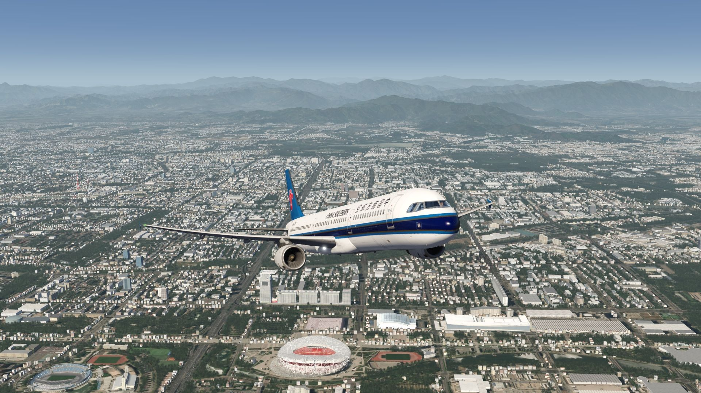
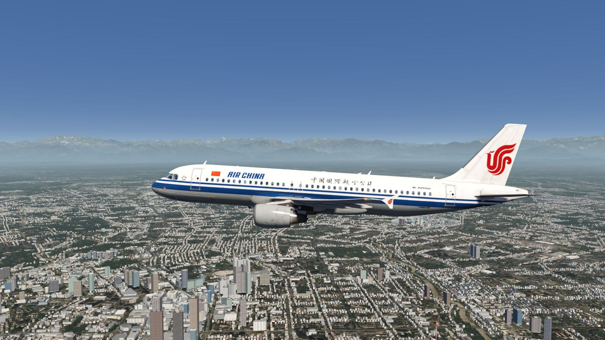
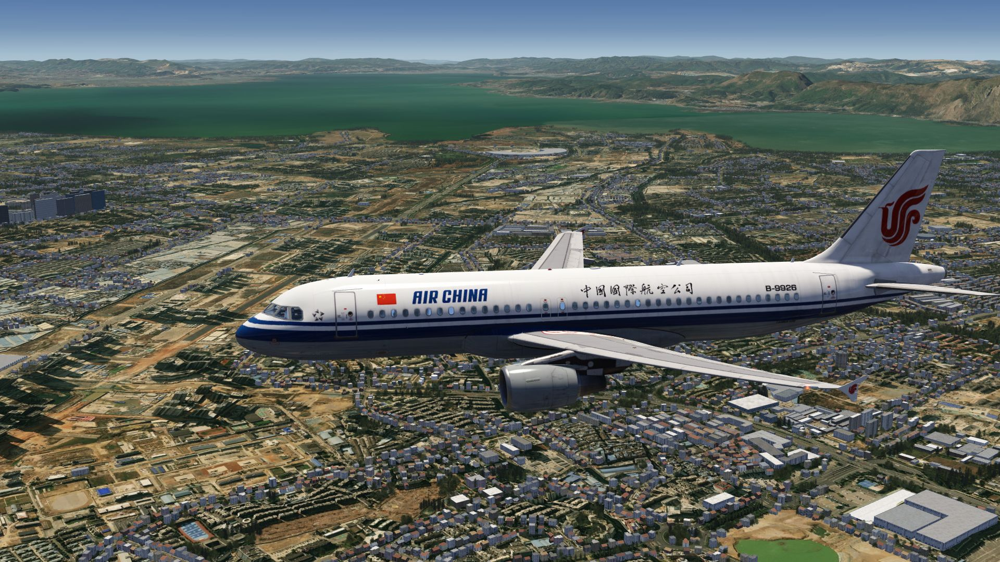

# China

<a class="scenery-card" href="../scenery/cn_beijing.html">

<h2>Beijing Area Scenery</h2>

FS4 Desktop
FSG Mobile

Photo Scenery
POI's
Elevation

v1.0

</a>

<a class="scenery-card" href="../scenery/cn_chengdu.html">

<h2>Chengdu Photo Scenery</h2>

FS4 Desktop
FSG Mobile

Photo Scenery
Elevation

v1.0

</a>

<a class="scenery-card" href="../scenery/cn_kunming.html">

<h2>Kunming Photo Scenery</h2>

FS4 Desktop
FSG Mobile

Photo Scenery
Elevation

v1.0

</a>

