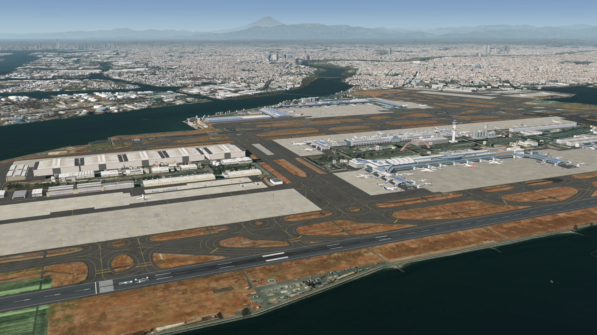
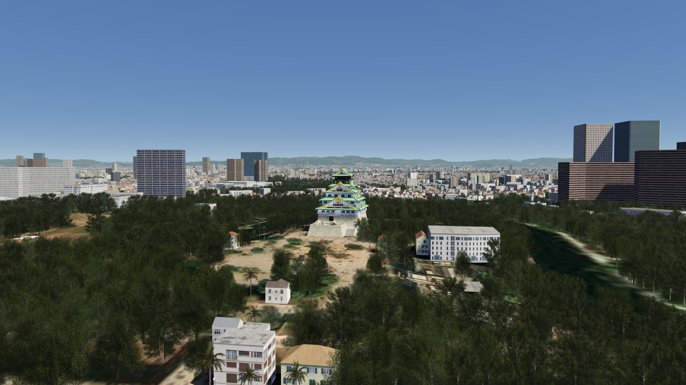

# Japan

<a class="scenery-card" href="../scenery/jp_tokyo.html">

<h2>Tokyo Extended Area Scenery (Incl. Mt Fuji)</h2>

FS4 Desktop
FSG Mobile

Photo Scenery
POI's
Elevation

v1.0

</a>

<a class="scenery-card" href="../scenery/jp_osakabay.html">

<h2>Osaka Bay Scenery (Incl. Kansai Airport Area)</h2>

FS4 Desktop
FSG Mobile

Photo Scenery
Airports
POI's
Elevation

v1.0

</a>

