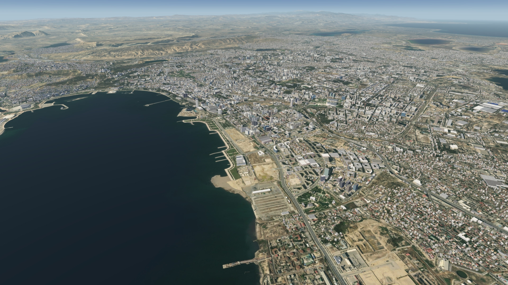
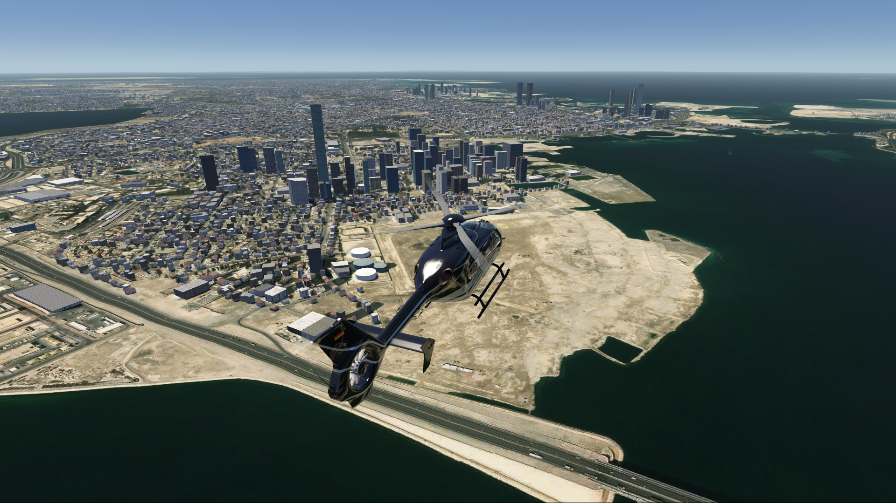
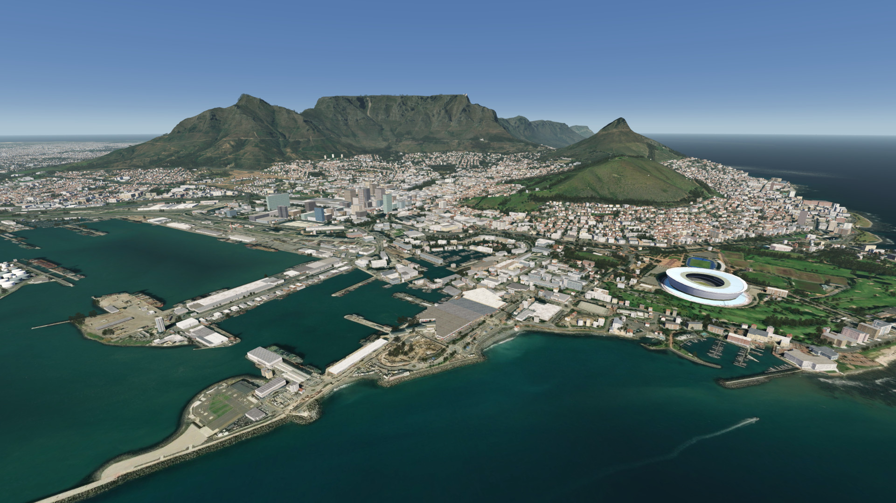

# by @chrispriv ©

High quality freeware addons for:

- Aerofly FS4
- Aerofly FS Global (Android)

<a class="country-card" href="countries/ae.html">
  

  

    <h2>🇦🇪 United Arab Emirates</h2>
    
1 Scenery

  

</a>

<a class="country-card" href="countries/aq.html">
  

  

    <h2>🇦🇶 Antarctica</h2>
    
1 Scenery

  

</a>

<a class="country-card" href="countries/ar.html">
  

  

    <h2>🇦🇷 Argentina</h2>
    
1 Scenery

  

</a>

<a class="country-card" href="countries/az.html">
  

  

    <h2>🇦🇿 Azerbaijan</h2>
    
2 Sceneries

  

</a>

<a class="country-card" href="countries/bh.html">
  

  

    <h2>🇧🇭 Bahrain</h2>
    
1 Scenery

  

</a>

<a class="country-card" href="countries/cn.html">
  

  

    <h2>🇨🇳 China</h2>
    
3 Sceneries

  

</a>

<a class="country-card" href="countries/gr.html">
  

  

    <h2>🇬🇷 Greece</h2>
    
1 Scenery (6 Regions)

  

</a>

<a class="country-card" href="countries/hk.html">
  

  

    <h2>🇭🇰/🇨🇳 Hong Kong</h2>
    
1 Scenery

  

</a>

<a class="country-card" href="countries/id.html">
  

  

    <h2>🇮🇩 Indonesia</h2>
    
2 Sceneries (4 Regions)

  

</a>

<a class="country-card" href="countries/mu.html">
  

  

    <h2>🇲🇺 Mauritius</h2>
    
1 Scenery

  

</a>

<a class="country-card" href="countries/om.html">
  

  

    <h2>🇴🇲 Oman</h2>
    
1 Scenery

  

</a>

<a class="country-card" href="countries/pf.html">
  

  

    <h2>🇵🇫 French Polynesia</h2>
    
1 Scenery

  

</a>

<a class="country-card" href="countries/re.html">
  

  

    <h2>🇷🇪 La Reunion</h2>
    
1 Scenery

  

</a>

<a class="country-card" href="countries/qa.html">
  

  

    <h2>🇶🇦 Qatar</h2>
    
1 Scenery

  

</a>

<a class="country-card" href="countries/th.html">
  

  

    <h2>🇹🇭 Thailand</h2>
    
1 Scenery

  

</a>

<a class="country-card" href="countries/tr.html">
  

  

    <h2>🇹🇷 Turkey</h2>
    
2 Sceneries (4 Regions)

  

</a>

<a class="country-card" href="countries/za.html">
  

  

    <h2>🇿🇦 South Africa</h2>
    
2 Sceneries

  

</a>

<a class="country-card" href="countries/zw.html">
  

  

    <h2>🇿🇼 Zimbabwe</h2>
    
1 Scenery

  

</a>

