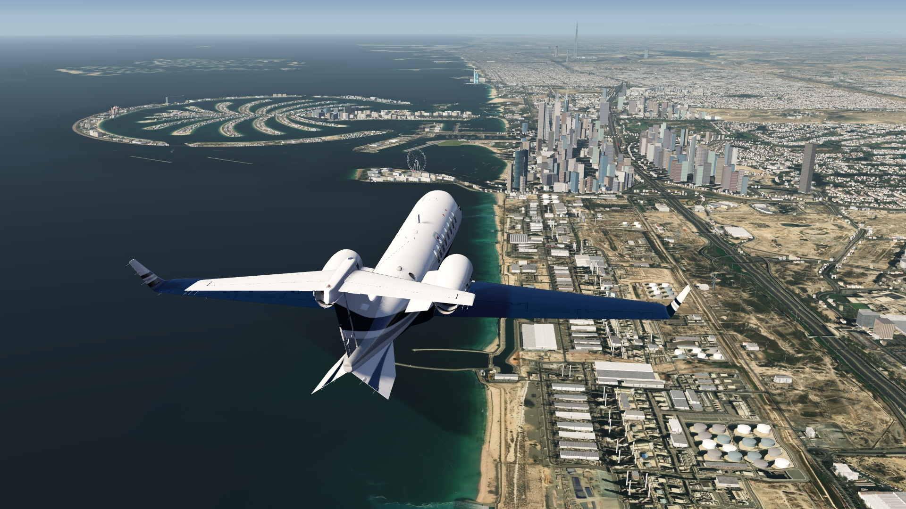
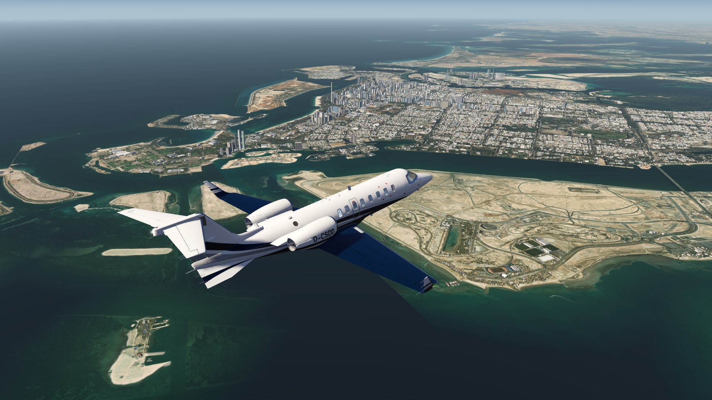
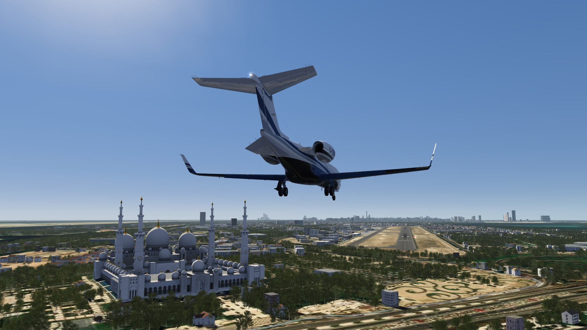
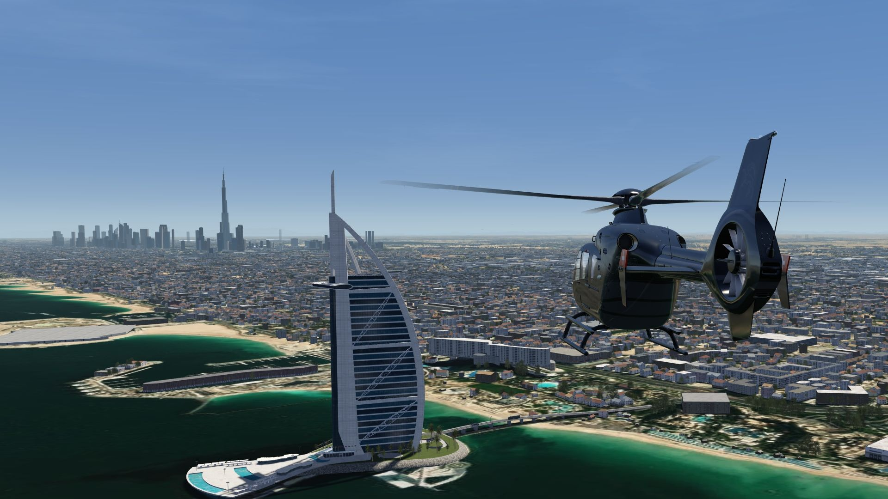
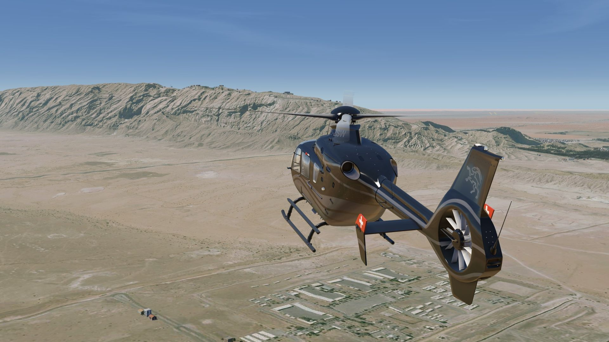
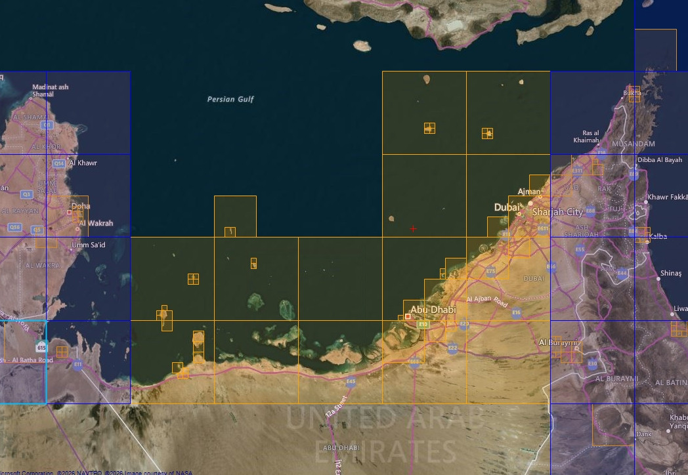

# Dubai Photo Scenery

## Description

Photo scenery in HD for Dubai area and Abu Dhabi, covering a large part of the United Arab Emirates. 

There are 10 airports included (most with aprons, taxiways and objects). 

There is also an elevation fix for Dubai and Abu Dhabi City.

## Note

Version 1.2 has been updated to work together with add. photo sceneries of the Gulf States (Qatar, Bahrain and Oman in progress). 

If you have an older version of the scenery installed, delete it and replace it with the new version.

FS4 Desktop
FSG Mobile

Photo Scenery
Airports
Elevation

v1.2

---

# Preview Images

  <a href="#!" class="lightbox-close">&times;</a>

  

  <a href="#!" class="lightbox-close">&times;</a>

  

  <a href="#!" class="lightbox-close">&times;</a>

  

  <a href="#!" class="lightbox-close">&times;</a>

  

---

# Coverage

  <a href="#!" class="lightbox-close">&times;</a>

  

---

# FS4 Desktop Downloads (zip)

<a class="download-button" href="https://drive.google.com/file/d/1E6tLJgDSzNg0fwh2HKwNXmHZTNFnaIPM/view?usp=drive_link">
Download Images
</a>

<a class="download-button" href="https://drive.google.com/file/d/1CY9oL2FQBmf-9VBWPp4YdXpqEacdHyGy/view?usp=drive_link">
Download Data FS4
</a>

---

# FSG Mobile Downloads (tme)

<a class="download-button" href="https://drive.google.com/file/d/1mX06Jvx6ZfhlaV_ICsI95XLxmzTKdB7o/view?usp=drive_link">
Download Images
</a>

<a class="download-button" href="https://drive.google.com/file/d/11ulIVkPi1BNHUotDfLpD3uF9pBBvrwWH/view?usp=drive_link">
Download Data FSG
</a>

---

# References

- ArcGIS Maps © 
- OpenTopography - Copernicus Global 30m data © 

---

# Credits

- nickhod for AeroScenery (creating photo-sceneries)

---

# Installation

- [FS4 Desktop Installation](../install/fs4.html)
- [FSG Mobile Installation](../install/fsg.html)

---

# License

- [License Information](../license/license.html)