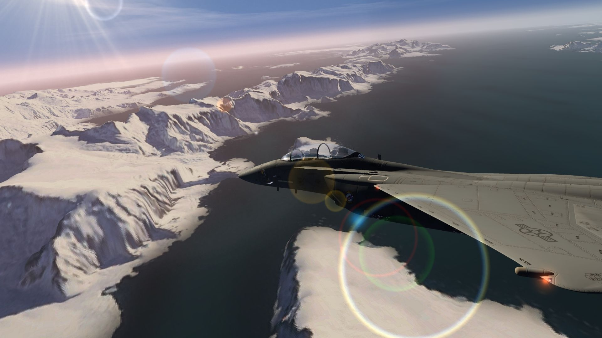
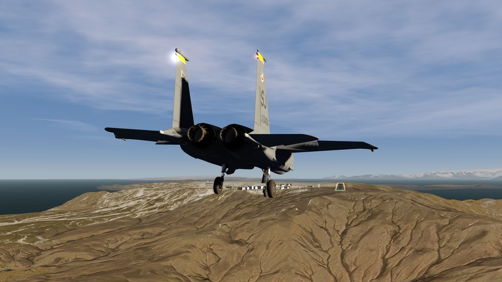
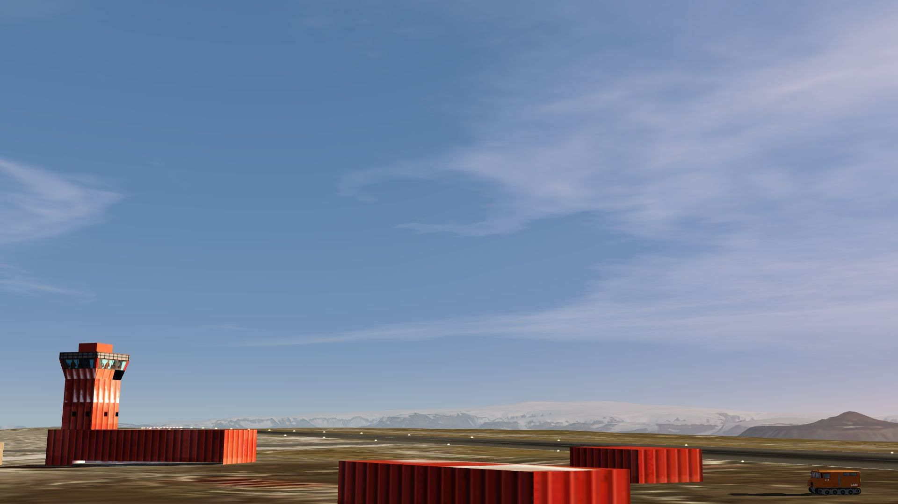
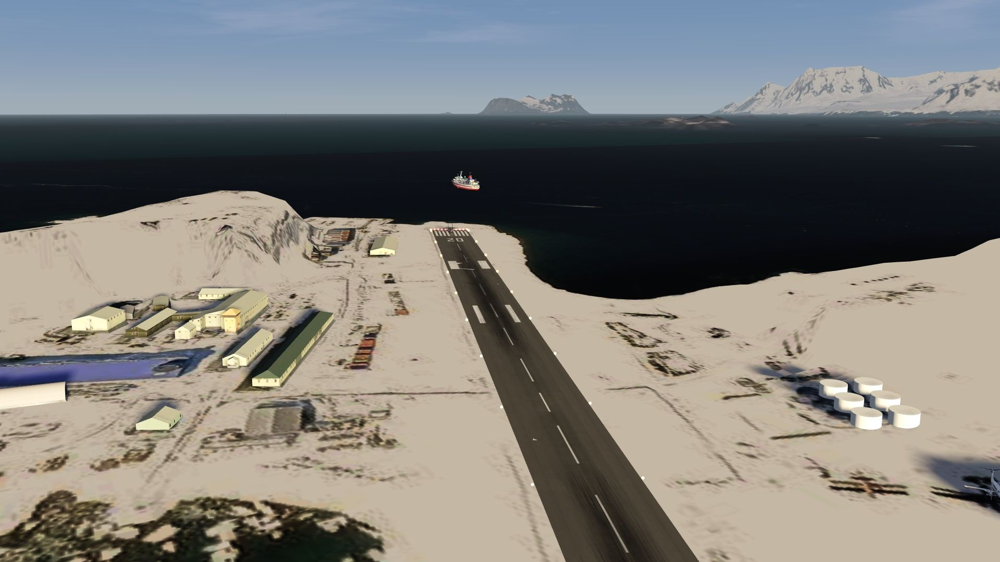
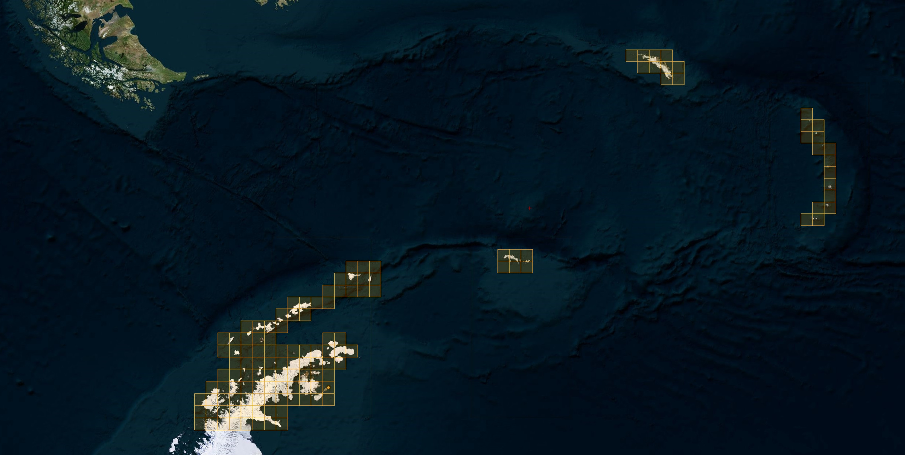

# Fly in the Antarctica

## Description

Explore and enjoy Antarctica on FSG (by default not covered by global data streaming).

There is a wide coverage with low resolution of 19.1m/p, including the South Georgia and all Sandwich Islands (flight distance up to 3'000 km). 

SCRM Isle Rey Jore-Martin Base, SAWB Base Marimbio and EGAR Rothera Research Station have a higher resolution and also special objects.

FS4 Desktop
FSG Mobile

Photo Scenery
Airports
POI's
Elevation Mesh

v1.0

---

# Preview Images

  <a href="#!" class="lightbox-close">&times;</a>

  

  <a href="#!" class="lightbox-close">&times;</a>

  

  <a href="#!" class="lightbox-close">&times;</a>

  

  <a href="#!" class="lightbox-close">&times;</a>

  

---

# Coverage

  <a href="#!" class="lightbox-close">&times;</a>

  

---

# FS4 Desktop Downloads (zip)

<a class="download-button" href="https://drive.google.com/file/d/1wtsben2KY6TESCvRFJ0iaQ3R9pGfmt7g/view?usp=drive_link">
Download Images
</a>

<a class="download-button" href="https://drive.google.com/file/d/1R6DPQhmYXLluoEGnioY_wlqeLC0mjga5/view?usp=drive_link">
Download Data FS4
</a>

---

# FSG Mobile Downloads (tme)

<a class="download-button" href="https://drive.google.com/file/d/152aKcMD_wTEXyBf9-QCKLzReErqmobGM/view?usp=drive_link">
Download Images
</a>

<a class="download-button" href="https://drive.google.com/file/d/1MDenegR3lJvs-Od4N0Qy-9-TMiTi5KRE/view?usp=drive_link">
Download Data FSG
</a>

---

# References

- Bing Maps © 
- OpenTopography - Copernicus Global 30m data © 
- SketchUp 3D Warehouse (3dwarehouse.sketchup.com)

---

# Credits

- nickhod for AeroScenery (creating photo-sceneries)
- Arno Gerretsen for ModelConverterX (converting-tool)
- to all the authors of the models used

---

# Installation

- [FS4 Desktop Installation](../install/fs4.html)
- [FSG Mobile Installation](../install/fsg.html)

---

# License

- [License Information](../license/license.html)