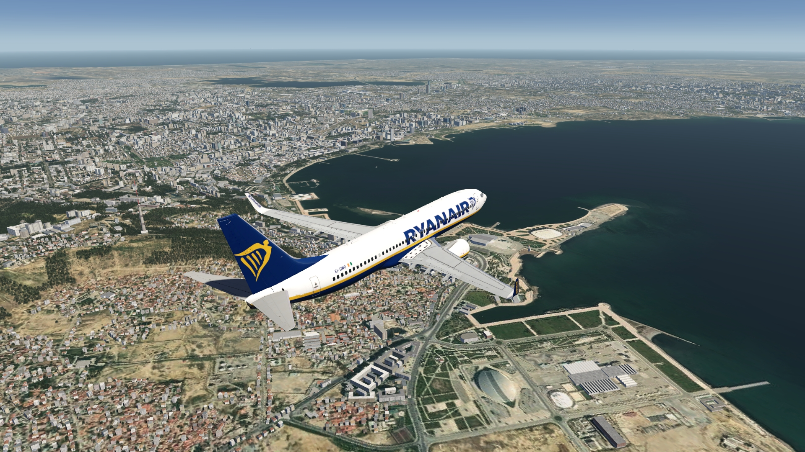
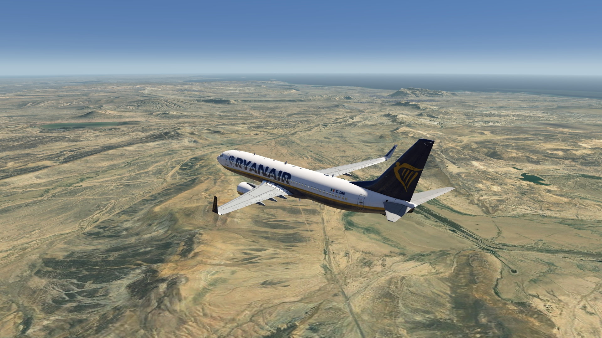
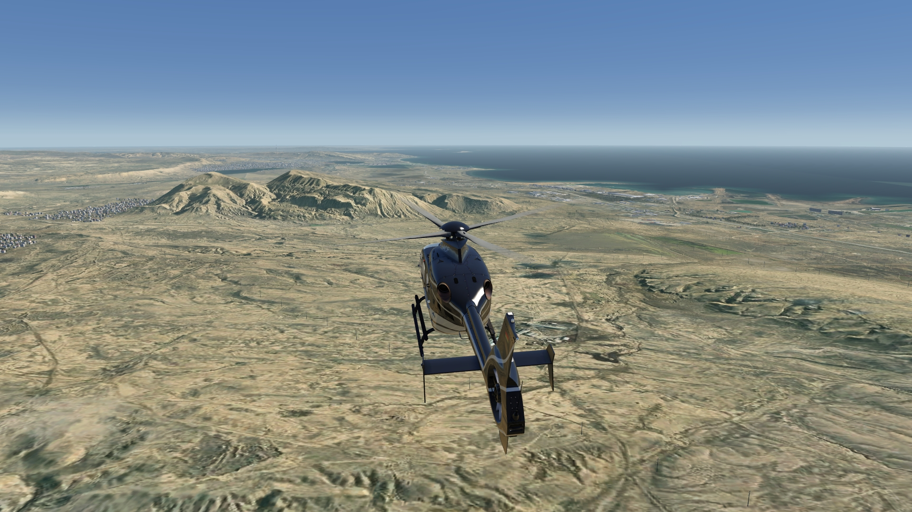
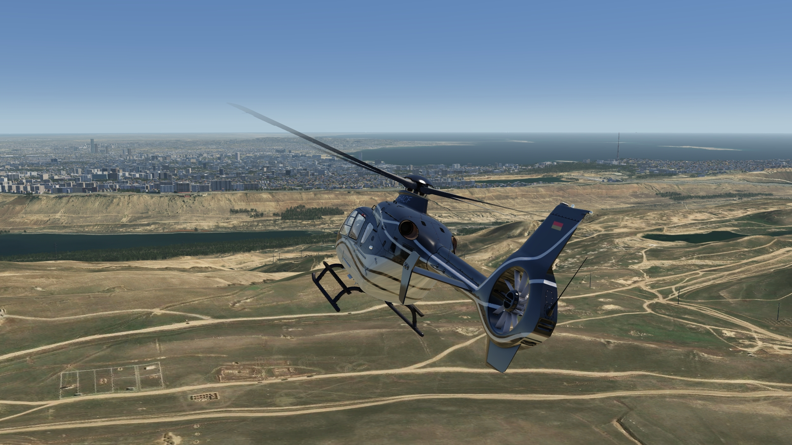
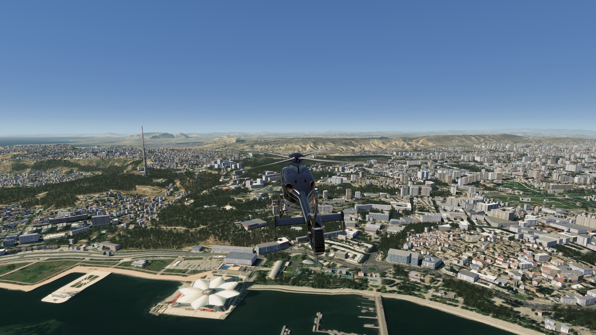
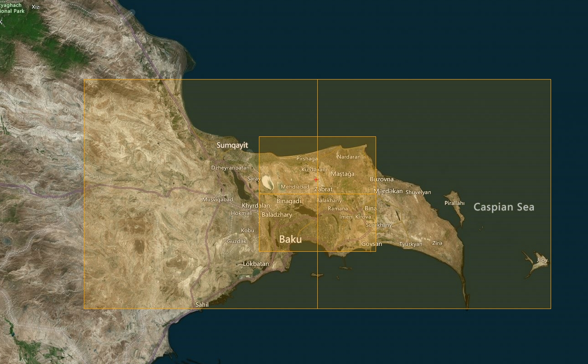

# Johannesburg Photo Scenery

## Description

Photo scenery covering Baku town and the surrounding area.

## Note
To add actually missing pushback parking positions to UBBB Bako airport, you can install the add-on created by @Wingberry. It includes approximately 150 airports worldwide.

FS4 Desktop
FSG Mobile

Photo Scenery

v1.0

---

# Preview Images

  <a href="#!" class="lightbox-close">&times;</a>

  

  <a href="#!" class="lightbox-close">&times;</a>

  

  <a href="#!" class="lightbox-close">&times;</a>

  

  <a href="#!" class="lightbox-close">&times;</a>

  

---

# Coverage

  <a href="#!" class="lightbox-close">&times;</a>

  

---

# FS4 Desktop Downloads (zip)

<a class="download-button" href="https://drive.google.com/file/d/1zp_taAzYKqbOpqyvNLPr6VlEAA4tbuCv/view?usp=drive_link">
Download Images
</a>

<a class="download-button" href="https://drive.google.com/file/d/1ku_-84UnYqSGEI20oV3rFmEvams3JIja/view?usp=drive_link">
Download Airport Pushbacks (by @Wingberry)
</a>

---

# FSG Mobile Downloads (tme)

<a class="download-button" href="https://drive.google.com/file/d/1dC7hAThDtM4CTOgQ2RKzVtV_yv6MfFZ0/view?usp=drive_link">
Download Images
</a>

<a class="download-button" href="https://drive.google.com/file/d/1jYWX_NTUNu5iXeJVvqHD-mKuKEUqMCNR/view?usp=drive_link">
Download Airport Pushbacks (by @Wingberry)
</a>

---

# References

- ArcGIS Maps © 
- OpenTopography - ALOS World 3D 30m data © 
- SketchUp 3D Warehouse (3dwarehouse.sketchup.com)

---

# Credits

- nickhod for AeroScenery (creating photo-sceneries)
- Arno Gerretsen for ModelConverterX (converting-tool)
- to all the authors of the models used
- @Wingberry for his additional pushback add-on

---

# Installation

- [FS4 Desktop Installation](../install/fs4.html)
- [FSG Mobile Installation](../install/fsg.html)

---

# License

- [License Information](../license/license.html)