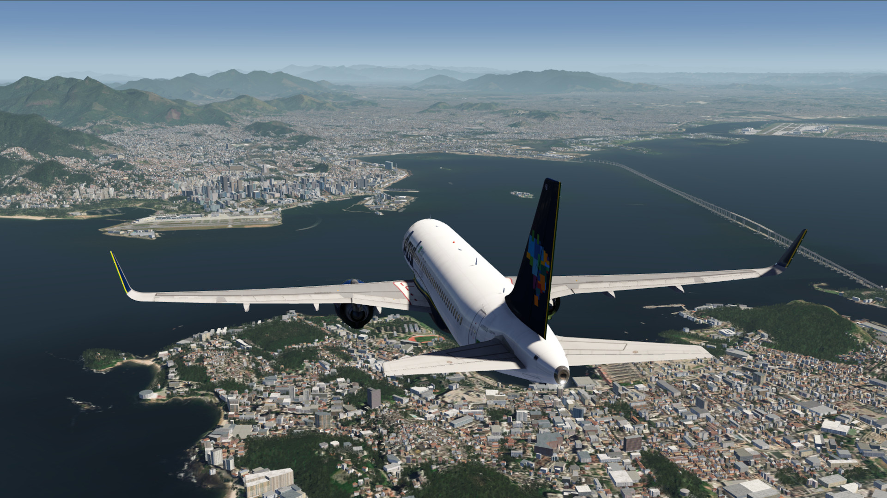
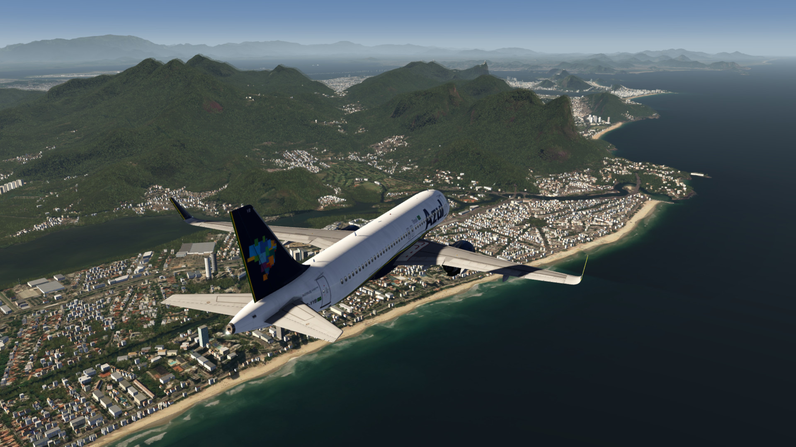
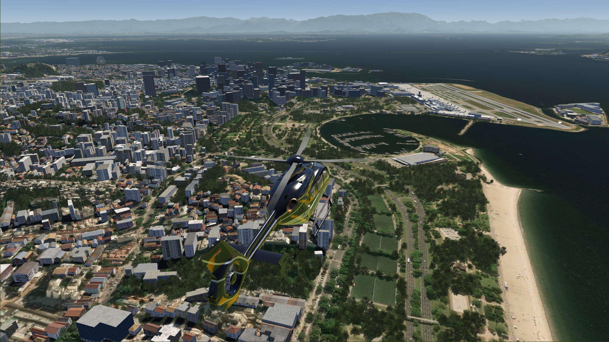
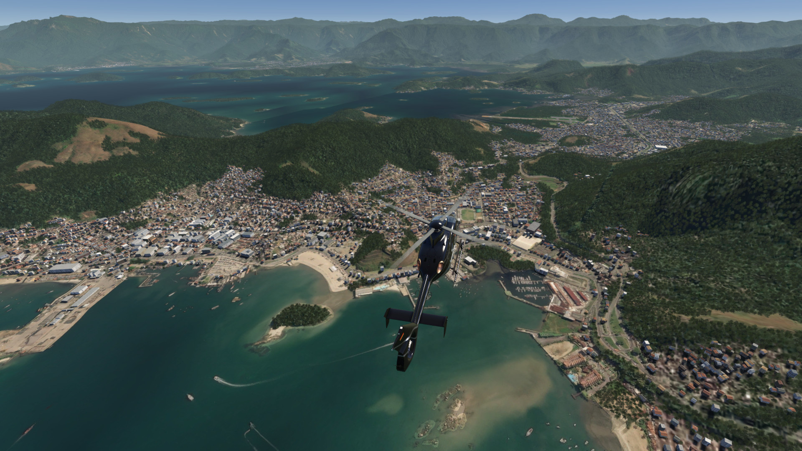
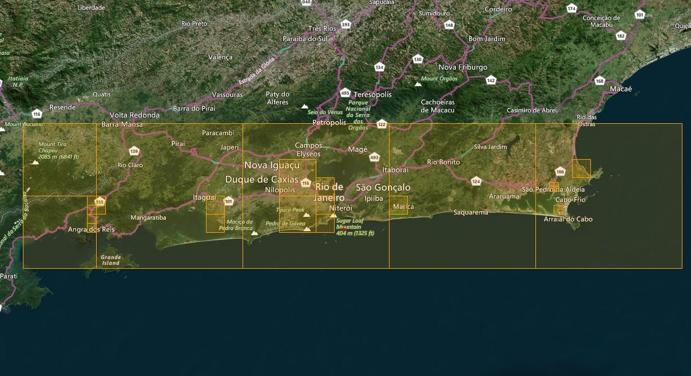

# Rio de Janeiro Extended Area Scenery

## Description

Photo scenery covering extended Rio de Janeiro town area, starting from Angra dos Reis in the west and extending to Umberto Modiano in the east.

In addition to IPAC's streamed airports, SDAG Angra dos Reis and SBSC Rio de Janeiro-Santa Cruz airports are also included.

FS4 Desktop
FSG Mobile

Photo Scenery
Airports

v1.0

---

# Preview Images

  <a href="#!" class="lightbox-close">&times;</a>

  

  <a href="#!" class="lightbox-close">&times;</a>

  

  <a href="#!" class="lightbox-close">&times;</a>

  

  <a href="#!" class="lightbox-close">&times;</a>

  

---

# Coverage

  <a href="#!" class="lightbox-close">&times;</a>

  

---

# FS4 Desktop Downloads (zip)

<a class="download-button" href="https://drive.google.com/file/d/1b-c_I2zQFM8D6WpYIaHx5f4R7tW7cXy_/view?usp=drive_link">
Download Images
</a>

<a class="download-button" href="https://drive.google.com/file/d/1-0NSl64zArMKuZd_7H4JKKiYTTajMgGh/view?usp=drive_link">
Download Data FS4
</a>

---

# FSG Mobile Downloads (tme)

<a class="download-button" href="https://drive.google.com/file/d/17769lavP6X2Bt9JMQXHNx2X755lT4DK6/view?usp=drive_link">
Download Images
</a>

<a class="download-button" href="https://drive.google.com/file/d/1EHZ3tPivGO4GgsgfTf_apVUf-oohAhMI/view?usp=drive_link">
Download Data FSG
</a>

---

# References

- ArcGIS Maps © 

---

# Credits

- nickhod for AeroScenery (creating photo-sceneries)

---

# Installation

- [FS4 Desktop Installation](../install/fs4.html)
- [FSG Mobile Installation](../install/fsg.html)

---

# License

- [License Information](../license/license.html)