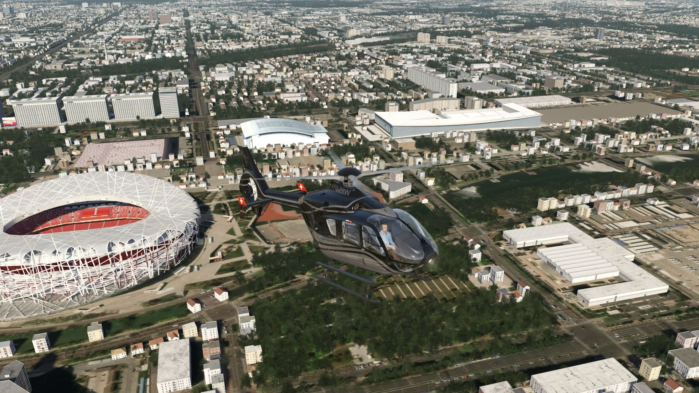
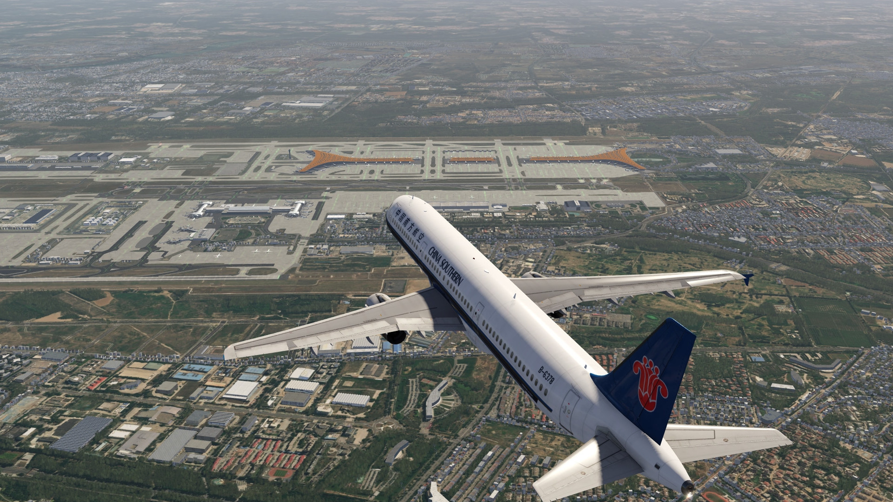
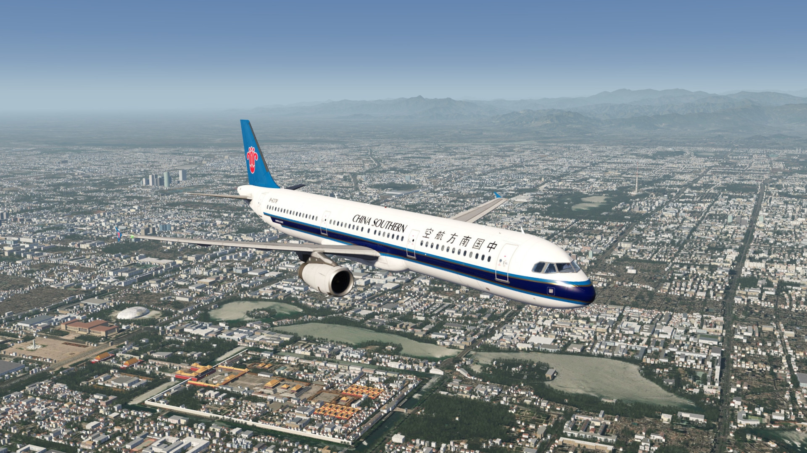
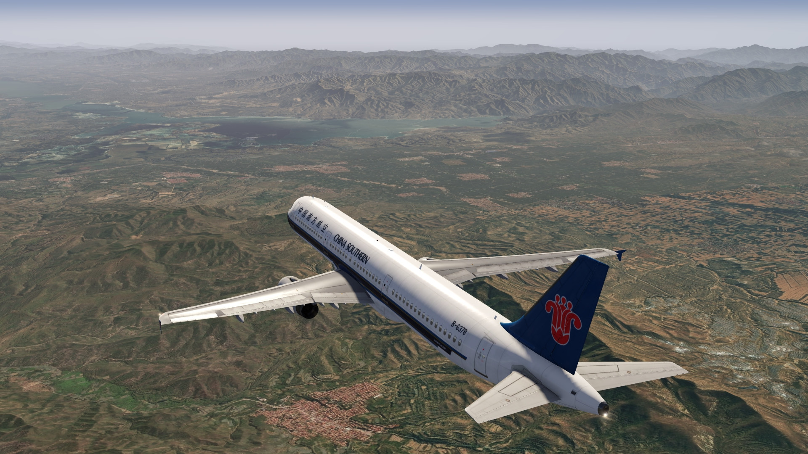
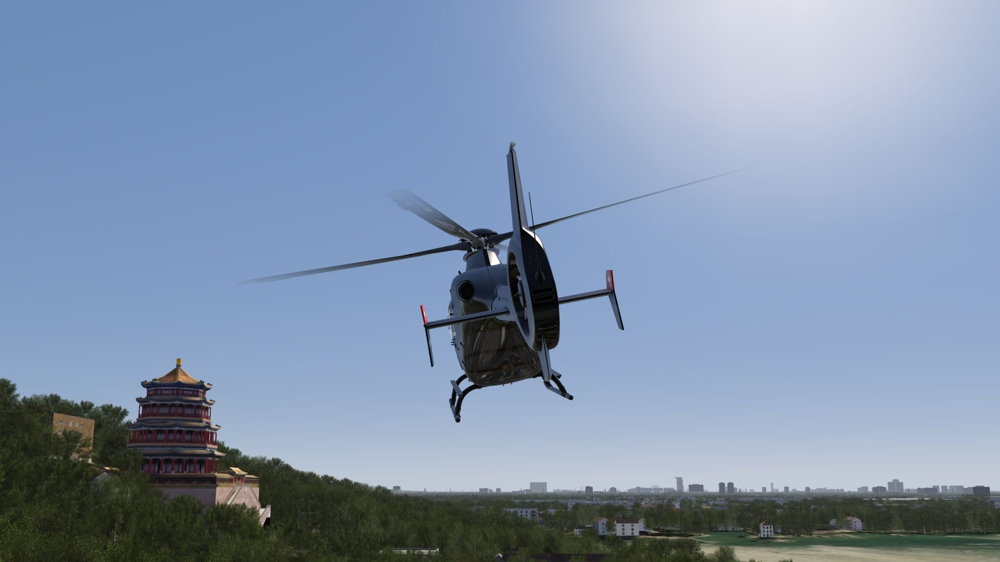
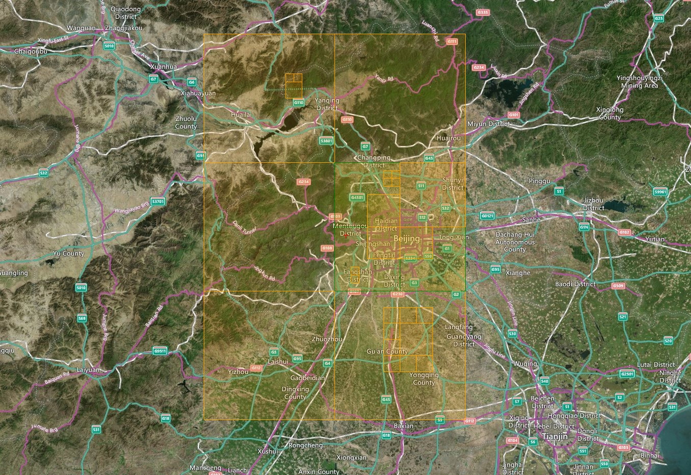

# Beijing Area Scenery

## Description

Photo scenery in HD covering the town of Beijng and its surroundings. 

There are also some POI's to discover in the town. 

An elevation fix was made especially for the airport area.

FS4 Desktop
FSG Mobile

Photo Scenery
POI's
Elevation Mesh

v1.1

---

# Preview Images

  <a href="#!" class="lightbox-close">&times;</a>

  

  <a href="#!" class="lightbox-close">&times;</a>

  

  <a href="#!" class="lightbox-close">&times;</a>

  

  <a href="#!" class="lightbox-close">&times;</a>

  

---

# Coverage

  <a href="#!" class="lightbox-close">&times;</a>

  

---

# FS4 Desktop Downloads (zip)

<a class="download-button" href="https://drive.google.com/file/d/1sRHkg56mcb34gI31Lm5hn2jwSGQ_9tsq/view?usp=drive_link">
Download Images
</a>

<a class="download-button" href="https://drive.google.com/file/d/1L5NjjyRGNpsw5ZFe6t8_-Z4m6nD0ufrf/view?usp=drive_link">
Download Data FS4
</a>

---

# FSG Mobile Downloads (tme)

<a class="download-button" href="https://drive.google.com/file/d/1pEODqhCHmJeOQFlf_nyt25IzrgEgNhxc/view?usp=drive_link">
Download Images
</a>

<a class="download-button" href="https://drive.google.com/file/d/1U8MvhX3lzBUalWC-9b7ks-ZcsVfABWW2/view?usp=drive_link">
Download Data FSG
</a>

---

# References

- ArcGIS Maps © 
- OpenTopography - Copernicus Global 30m data © 
- SketchUp 3D Warehouse (3dwarehouse.sketchup.com)

---

# Credits

- nickhod for AeroScenery (creating photo-sceneries)
- Arno Gerretsen for ModelConverterX (converting-tool)
- to all the authors of the models used

---

# Installation

- [FS4 Desktop Installation](../install/fs4.html)
- [FSG Mobile Installation](../install/fsg.html)

---

# License

- [License Information](../license/license.html)