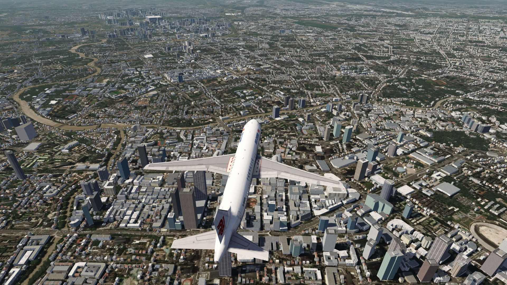
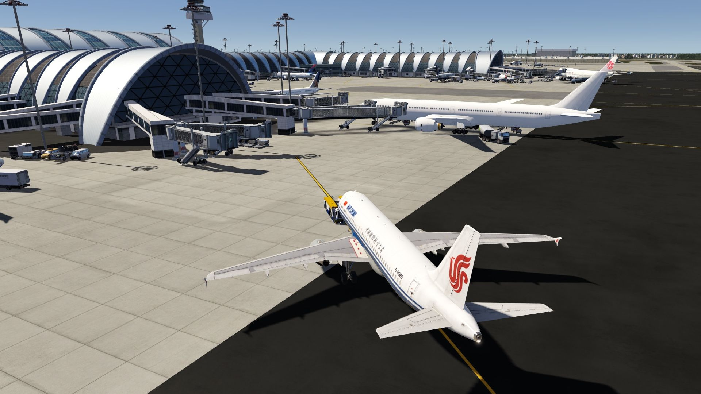
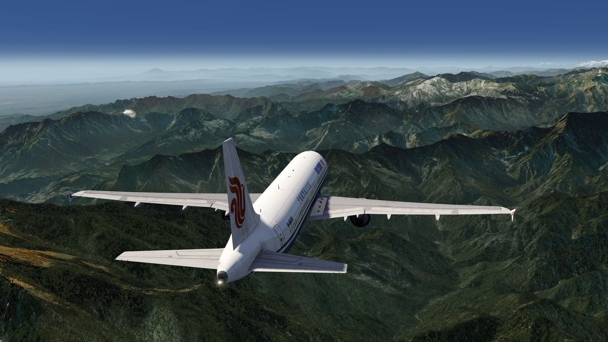
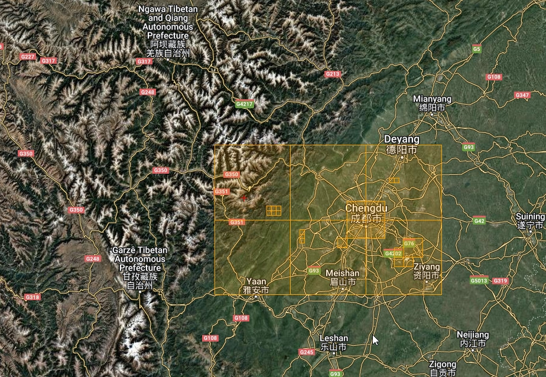

# Chengdu Photo Scenery

## Description

Photo scenery in HD covering the town of Chengdu and its surroundings, incl. the mountains in the west. 

An elevation fix was made especially for the airport area.

FS4 Desktop
FSG Mobile

Photo Scenery
Elevation

v1.0

---

# Preview Images

  <a href="#!" class="lightbox-close">&times;</a>

  

  <a href="#!" class="lightbox-close">&times;</a>

  

  <a href="#!" class="lightbox-close">&times;</a>

  

  <a href="#!" class="lightbox-close">&times;</a>

  

---

# Coverage

  <a href="#!" class="lightbox-close">&times;</a>

  

---

# FS4 Desktop Downloads (zip)

<a class="download-button" href="https://drive.google.com/file/d/1P5PqEiVPiTuX3LUQ2_VKrcTVXt6sycbi/view?usp=drive_link">
Download Images
</a>

<a class="download-button" href="https://drive.google.com/file/d/1MX0cuXDVdjL2G2GaFOOQWHJ4FnrFoU6Z/view?usp=drive_link">
Download Data FS4
</a>

---

# FSG Mobile Downloads (tme)

<a class="download-button" href="https://drive.google.com/file/d/15kXTAu53YvSN4aro-KIu-aixRzt-MzMq/view?usp=drive_link">
Download Images
</a>

<a class="download-button" href="https://drive.google.com/file/d/1NBl8-zMgRU5H86eaw-YcSRGlwlmDhyM5/view?usp=drive_link">
Download Data FSG
</a>

---

# References

- ArcGIS Maps © 
- OpenTopography - Copernicus Global 30m data © 

---

# Credits

- nickhod for AeroScenery (creating photo-sceneries)

---

# Installation

- [FS4 Desktop Installation](../install/fs4.html)
- [FSG Mobile Installation](../install/fsg.html)

---

# License

- [License Information](../license/license.html)