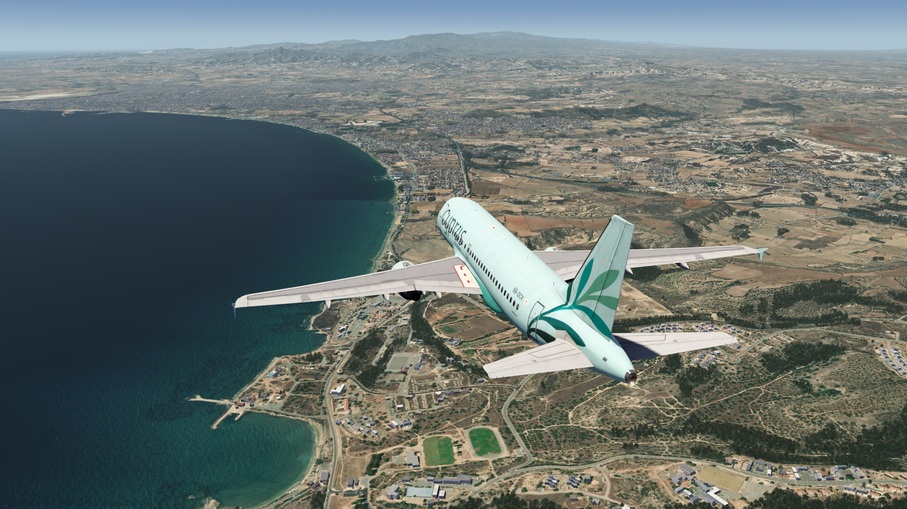
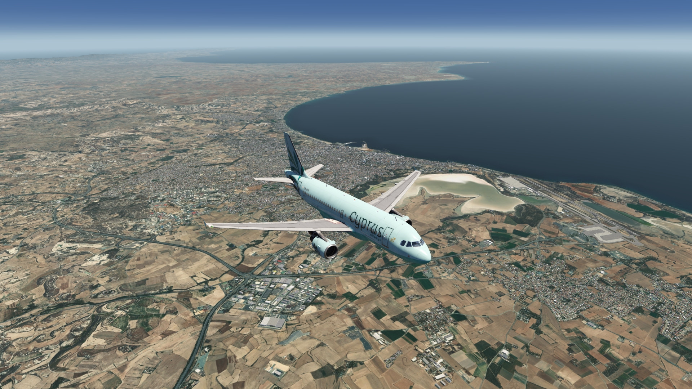
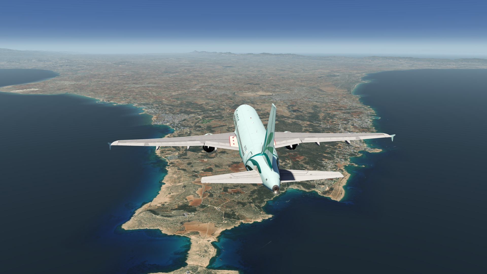
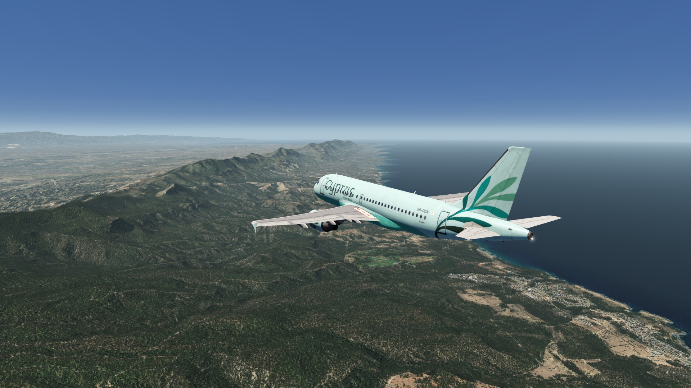
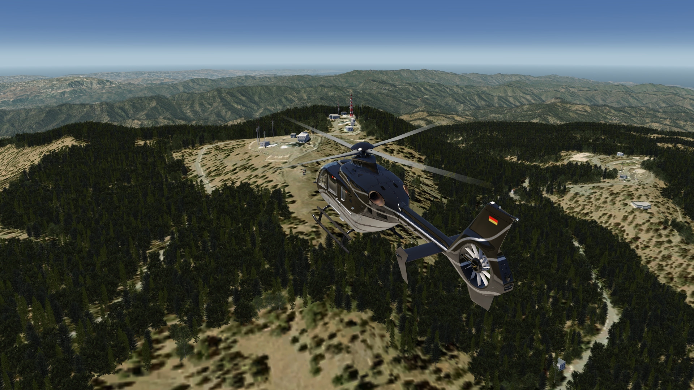
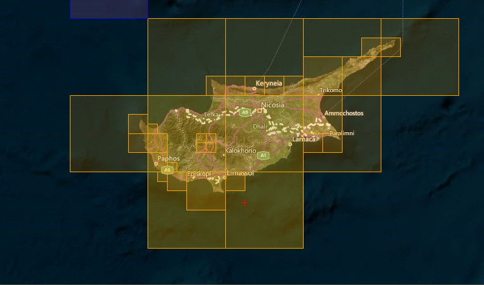

# Cyprus Island Photo Scenery

## Description

HD photo scenery covering the entire island of Cyprus, including both the Cypriot and Turkish parts of the island. 

A helipad has been added at the foot of Mt. Olympus so that it can be located more easily. 

There is also an enhanced elevation mesh covering the whole island.

FS4 Desktop
FSG Mobile

Photo Scenery
Airports
Elevation

v1.0

---

# Preview Images

  <a href="#!" class="lightbox-close">&times;</a>

  

  <a href="#!" class="lightbox-close">&times;</a>

  

  <a href="#!" class="lightbox-close">&times;</a>

  

  <a href="#!" class="lightbox-close">&times;</a>

  

---

# Coverage

  <a href="#!" class="lightbox-close">&times;</a>

  

---

# FS4 Desktop Downloads (zip)

<a class="download-button" href="https://drive.google.com/file/d/1SqGl1LYZII8cta22OeDODwVn0cq3dFhL/view?usp=drive_link">
Download Images (3.3 GB)
</a>

<a class="download-button" href="https://drive.google.com/file/d/1MPqnaCbIG_gJCnvfLJL__tzu2jLAzcsN/view?usp=drive_link">
Download Data FS4 (7.7 MB)
</a>

---

# FSG Mobile Downloads (tme)

<a class="download-button" href="https://drive.google.com/file/d/1Znf_vUCWLNUwzM2FCujEsPnorlMjYMgu/view?usp=drive_link">
Download Images (1.49 GB)
</a>

<a class="download-button" href="https://drive.google.com/file/d/1be_A48qMLVngtxohGbgNmsn18uPY7S00/view?usp=drive_link">
Download Data FSG (7.6 MB)
</a>

---

# References

- ArcGIS Maps © 
- OpenTopography - Copernicus Global 30m data © 

---

# Credits

- nickhod for AeroScenery (creating photo-sceneries)

---

# Installation

- [FS4 Desktop Installation](../install/fs4.html)
- [FSG Mobile Installation](../install/fsg.html)

---

# License

- [License Information](../license/license.html)