# Aegean Islands Scenery

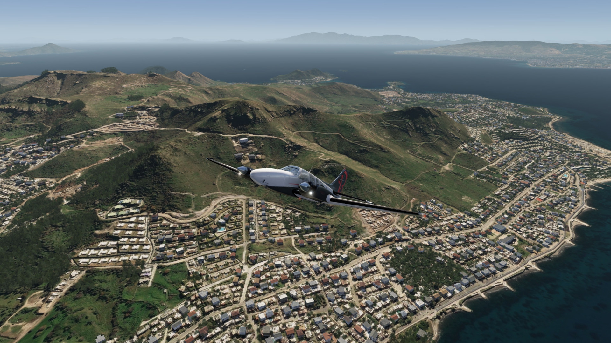

## Description

Photo scenery in HD covering all islands of the Greek Aegean Sea with a large coverage. Make a trip to all this sunny islands. 

An elevation fix was made especially for some costal and airport areas. The airports LGPL Astypalaia, LGSM Samos and LGPA Paros have been added.

## Included Regions

### Part 1
- Kos
- Kalymnos
- Leros
- Astypalaia

### Part 2
- Samos
- Chios
- Ikaria

### Part 3
- Rhodes
- Karpathos

### Part 4
- Santorini
- Milos

### Part 5
- Mykonos
- Syros
- Naxos
- Paros

### Part 6
- Crete

## Sceneries Included
Former FS2 Samos Airport Scenery from brunnobellic (only for FS4 Desktop)

FS4 Desktop
FSG Mobile

Photo Scenery
Airports
POIs
Elevation

v1.0

---

# Preview Images

<a href="#preview1">
  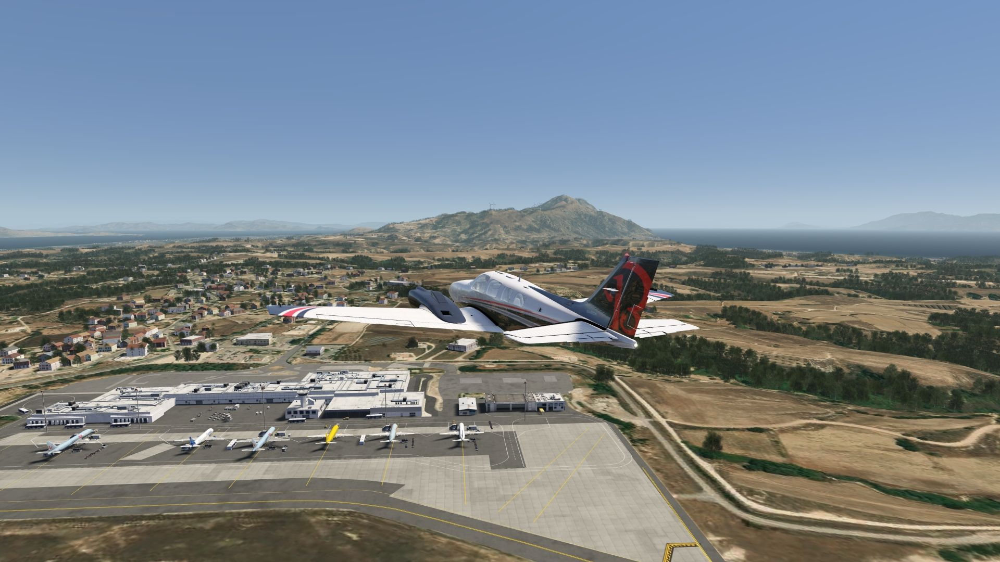
</a>

<a href="#preview2">
  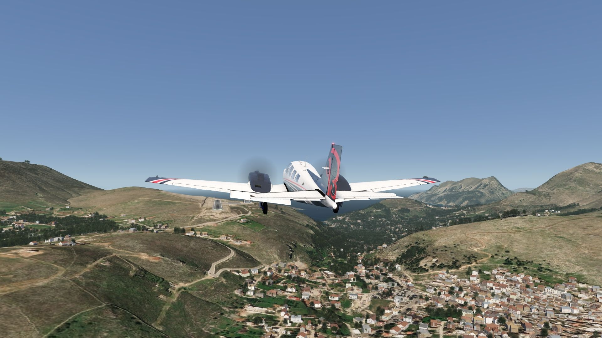
</a>

<a href="#preview3">
  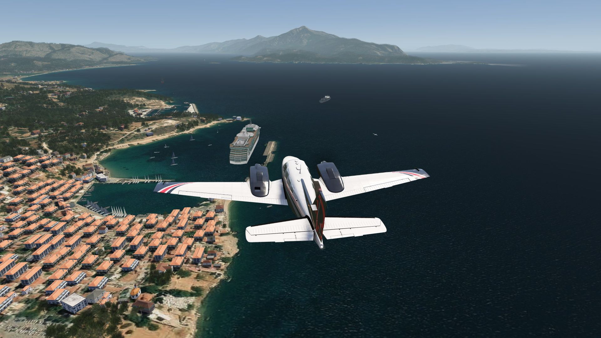
</a>

<a href="#preview4">
  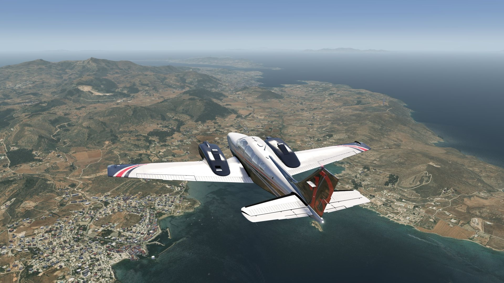
</a>

  <a href="#!" class="lightbox-close">&times;</a>

  

  <a href="#!" class="lightbox-close">&times;</a>

  

  <a href="#!" class="lightbox-close">&times;</a>

  

  <a href="#!" class="lightbox-close">&times;</a>

  

---

# Coverage

<a href="#coverage1">
  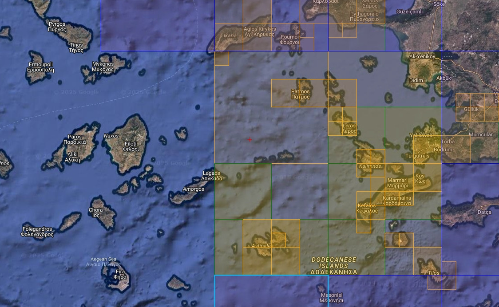
</a>

<a href="#coverage2">
  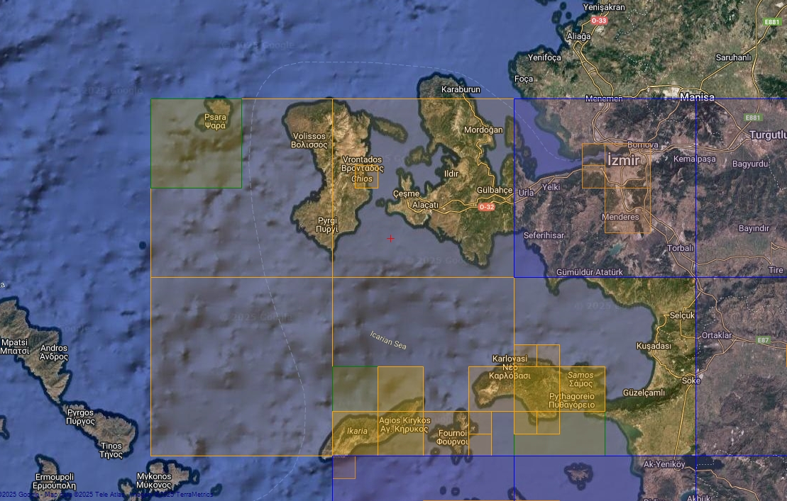
</a>

<a href="#coverage3">
  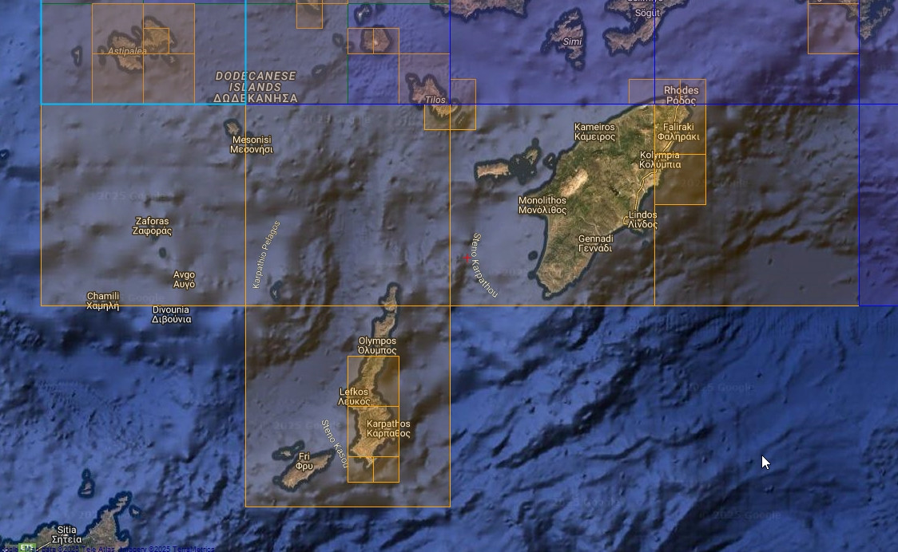
</a>

  <a href="#!" class="lightbox-close">&times;</a>

  

  <a href="#!" class="lightbox-close">&times;</a>

  

  <a href="#!" class="lightbox-close">&times;</a>

  

  <a href="#!" class="lightbox-close">&times;</a>

  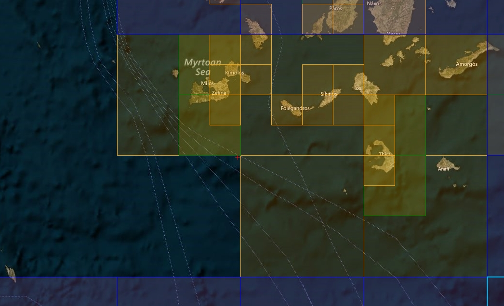

  <a href="#!" class="lightbox-close">&times;</a>

  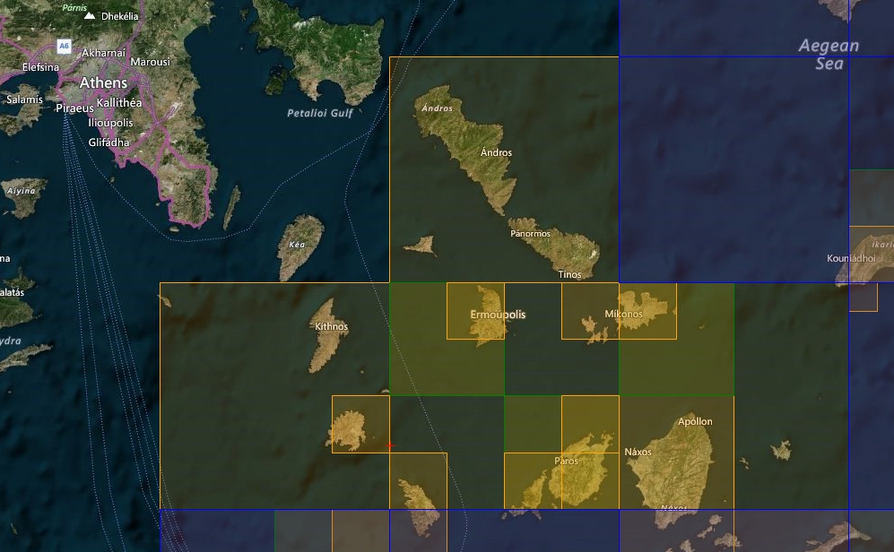

  <a href="#!" class="lightbox-close">&times;</a>

  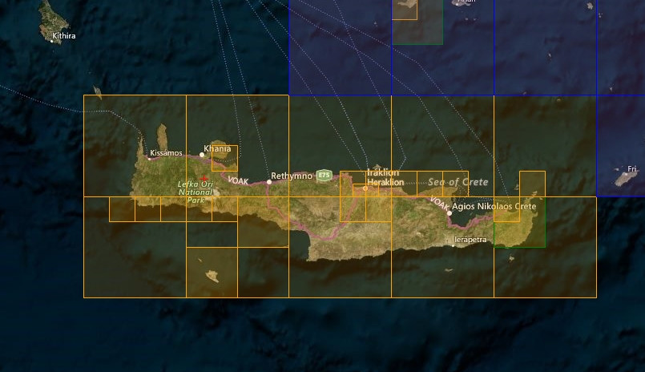

---

# FS4 Desktop Downloads (zip)

<a class="download-button" href="https://drive.google.com/file/d/1XvkuqWI-crxTg6K2nrlSL48YVhrjWB-Z/view?usp=drive_link">
Download Images - Part 1
</a>

<a class="download-button" href="https://drive.google.com/file/d/1kwldrZldE72mfluGGoY8KTDIyFMu939e/view?usp=drive_link">
Download Images - Part 2
</a>

<a class="download-button" href="https://drive.google.com/file/d/1H96UnxRUL5cRTzpkOFaYd5R8PfsvSN2u/view?usp=drive_link">
Download Images - Part 3
</a>

<a class="download-button" href="https://drive.google.com/file/d/1THi0TMSFQ0S7ndSjApk4nJLoPB_xxMl5/view?usp=drive_link">
Download Images - Part 4
</a>

<a class="download-button" href="https://drive.google.com/file/d/11UjW2LctO48YrYdcLZfFwoKTGb4jnqGA/view?usp=drive_link">
Download Images - Part 5
</a>

<a class="download-button" href="https://drive.google.com/file/d/11MGp1C94-ZFma2fT7sQvOezS_uqw08YD/view?usp=drive_link">
Download Images - Part 6
</a>

<a class="download-button" href="https://drive.google.com/file/d/1sOLdPdM1z1GBcp2l0Z34Pr1-H1sAickE/view?usp=drive_link">
Download Data FS4
</a>

---

# FSG Mobile Downloads (tme)

<a class="download-button" href="https://drive.google.com/file/d/1mwb9NEcZnlAAr4AtrVo-RvdSy3J1KI8P/view?usp=drive_link">
Download Images - Part 1
</a>

<a class="download-button" href="https://drive.google.com/file/d/1innQcqWJIXSGIw-eTFFwnY9josvvf7Wf/view?usp=drive_link">
Download Images - Part 2
</a>

<a class="download-button" href="https://drive.google.com/file/d/1PPdCspTRHuCtb6FGRSGletZr2dTpqs4V/view?usp=drive_link">
Download Images - Part 3
</a>

<a class="download-button" href="https://drive.google.com/file/d/193SGmODGDV7iZnuqMggd1O-piLelJB8M/view?usp=drive_link">
Download Images - Part 4
</a>

<a class="download-button" href="https://drive.google.com/file/d/1X-DgLpMueWrdZ7UpvKyn0q4Kc0J0VY-B/view?usp=drive_link">
Download Images - Part 5
</a>

<a class="download-button" href="https://drive.google.com/file/d/1T_ZmuaDXGORx9dSknqGp42cTb8LiWNer/view?usp=drive_link">
Download Images - Part 6
</a>

<a class="download-button" href="https://drive.google.com/file/d/13ljN5pWIXFcC7bVDtiYGqscXES9z4H4Q/view?usp=drive_link">
Download Data FSG
</a>

---

# References

- ArcGIS Maps © 
- OpenTopography - Copernicus Global 30m data © 
- SketchUp 3D Warehouse (3dwarehouse.sketchup.com)

---

# Credits

- nickhod for AeroScenery (creating photo-sceneries)
- Arno Gerretsen for ModelConverterX (converting-tool)
- brunnobellic for his initial Samos FS2 Scenery
- to all the authors of the models used

---

# Installation

- [FS4 Desktop Installation](../install/fs4.html)
- [FSG Mobile Installation](../install/fsg.html)

---

# License

- [License Information](../license/license.html)