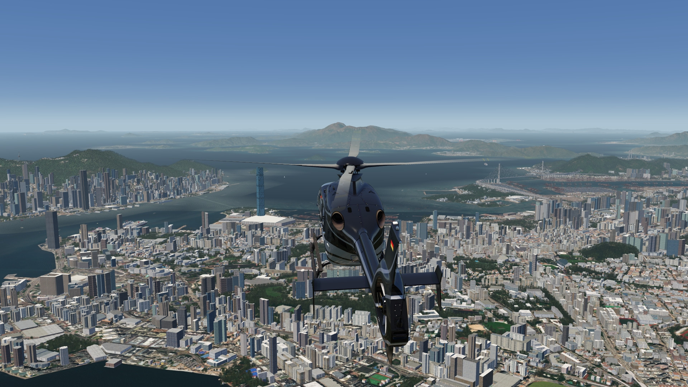
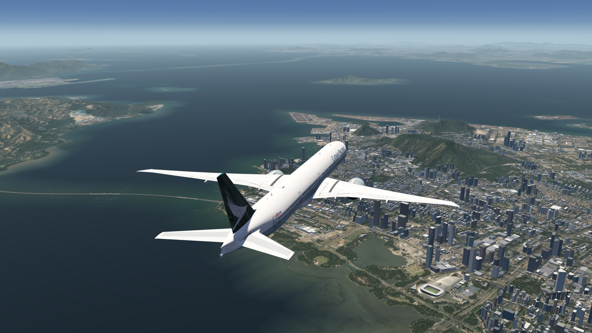
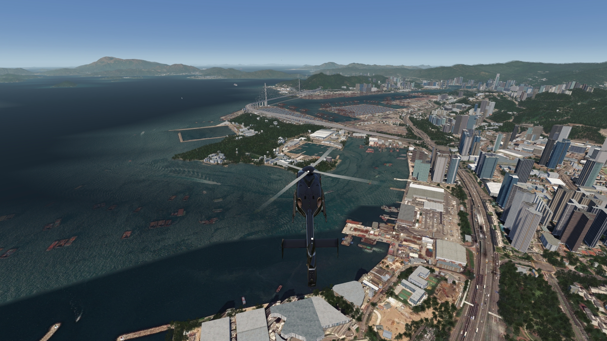
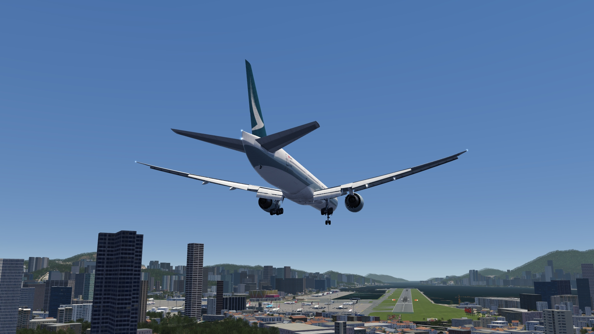
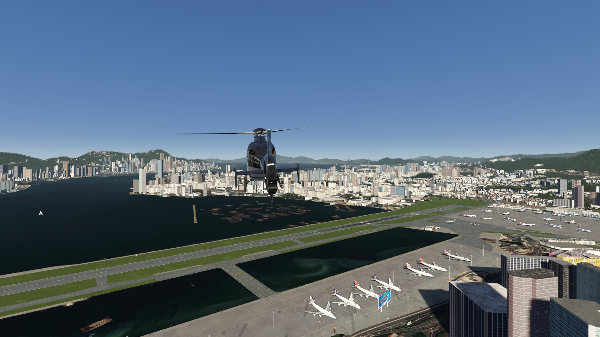
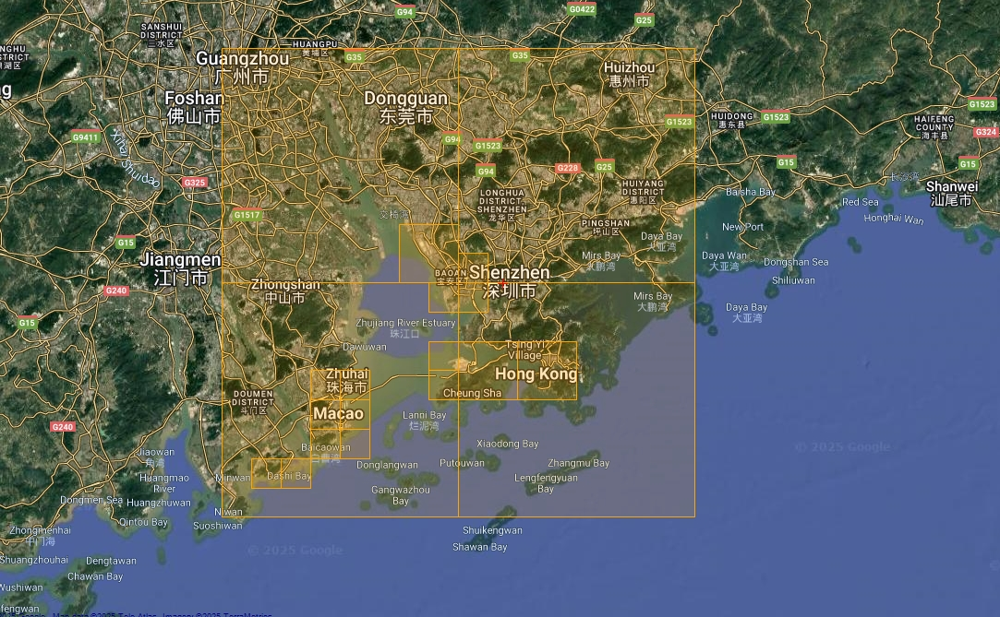

# Hong Kong, Macao & Shenzhen Area Scenery (incl. Kai Tak airport)

## Description

This scene covers the surrounding of Hong Kong, as well as a very wide area including Macao in the west and Shenzhen in the north. 

Automatic water masking is also applied to the entire area, and an elevation fix is applied to Hong Kong city and the airports areas.

The famous former Kai Tak Airport and additional POIs are also included. 

## Sceneries Included

For FS4 the following 3rd party freeware sceneries are also integrated in this package:
- Hong Kong: bridges / moving cars / harbor / (moving) ships 
- Hong Kong: 1x airport and 26x heliports

FS4 Desktop
FSG Mobile

Photo Scenery
Airports
POIs
Elevation

v1.1

---

# Preview Images

  <a href="#!" class="lightbox-close">&times;</a>

  

  <a href="#!" class="lightbox-close">&times;</a>

  

  <a href="#!" class="lightbox-close">&times;</a>

  

  <a href="#!" class="lightbox-close">&times;</a>

  

---

# Coverage

  <a href="#!" class="lightbox-close">&times;</a>

  

---

# FS4 Desktop Downloads (zip)

<a class="download-button" href="https://drive.google.com/file/d/13GJSlpD6WnxAGVdrnHv1yhKgvniyGydD/view?usp=drive_link">
Download Images (2.64 GB)
</a>

<a class="download-button" href="https://drive.google.com/file/d/17vkMHelgdc0gLa2ELzFU9RwWoju82PXM/view?usp=drive_link">
Download Data FS4 (88.3 MB)
</a>

<a class="download-button" href="https://drive.google.com/file/d/19ewDOZ40NYXznbJr-9iVtXsS8rF9OrDO/view?usp=drive_link">
Download Kai Tak Airport (optional)
</a>

---

# FSG Mobile Downloads (tme)

<a class="download-button" href="https://drive.google.com/file/d/1ki_fZs_9dn2DpOGlWu4kUiCWrTd4XdCS/view?usp=drive_link">
Download Images (1.62 GB)
</a>

<a class="download-button" href="https://drive.google.com/file/d/1bgW9Q84lVZrL2zRop6sfVANKjbBNdbsL/view?usp=drive_link">
Download Data FSG (14.4 MB)
</a>

<a class="download-button" href="https://drive.google.com/file/d/1UG_NfAlsitFlmmTf7GsWQvzvazoDdQKh/view?usp=drive_link">
Download Kai Tak Airport (optional)
</a>

---

# References

- ArcGIS Maps ©
- OpenTopography - Copernicus Global 30m data © 
- SketchUp 3D Warehouse (3dwarehouse.sketchup.com)

---

# Credits

- nickhod for AeroScenery (creating photo-sceneries)
- Arno Gerretsen for ModelConverterX (converting-tool)
- brunnobellic for initial Kai Tak airport and objects on FS2
- Apfelflieger for Kai Tak, objects and add. airports on FS4
- to all the authors of the models used

---

# Installation

- [FS4 Desktop Installation](../install/fs4.html)
- [FSG Mobile Installation](../install/fsg.html)

---

# License

- [License Information](../license/license.html)