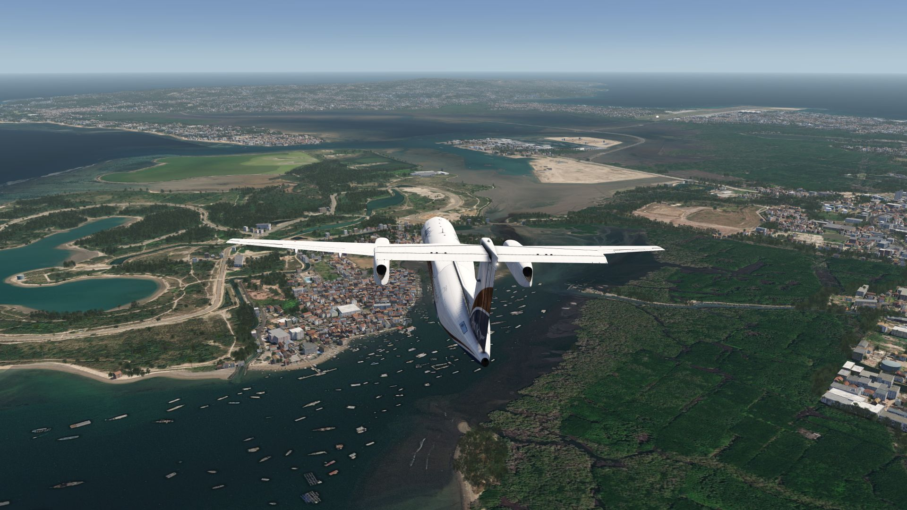
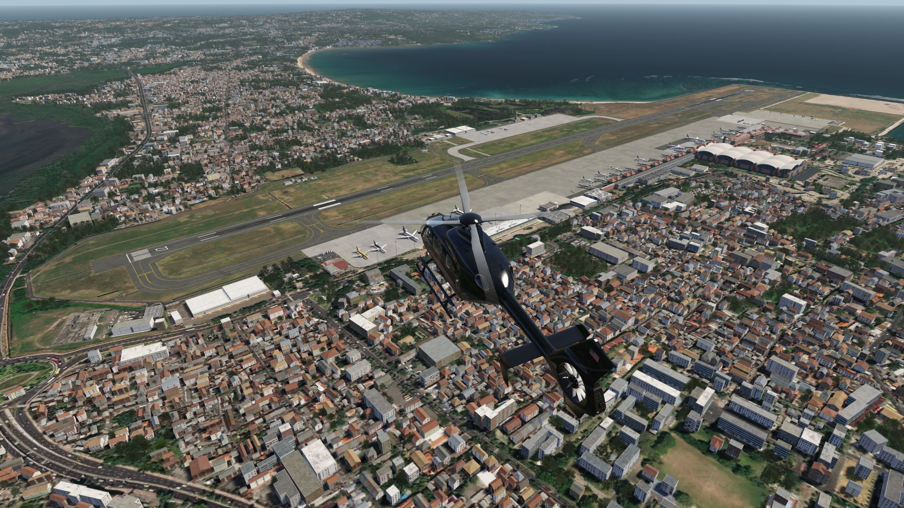
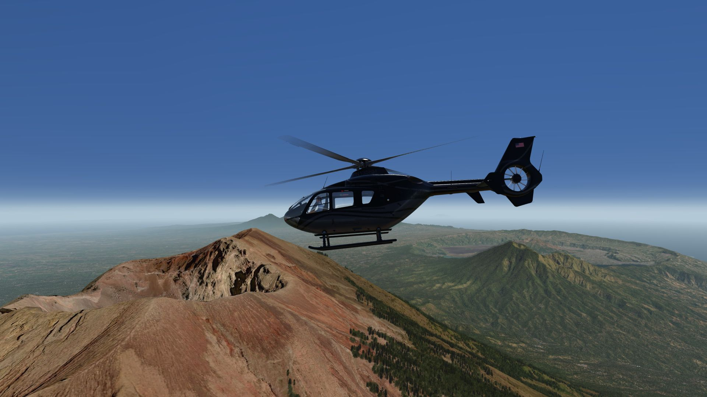
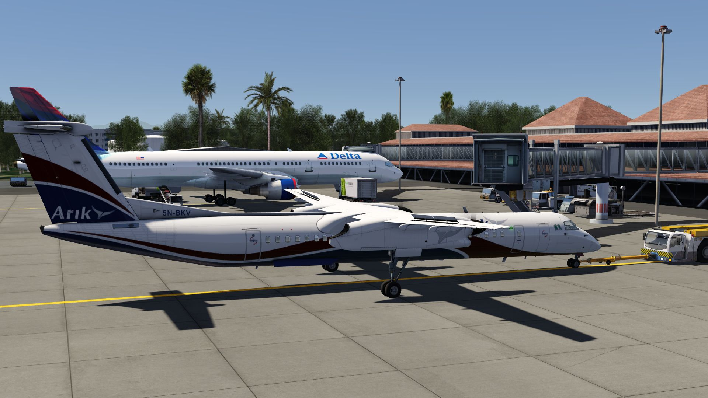
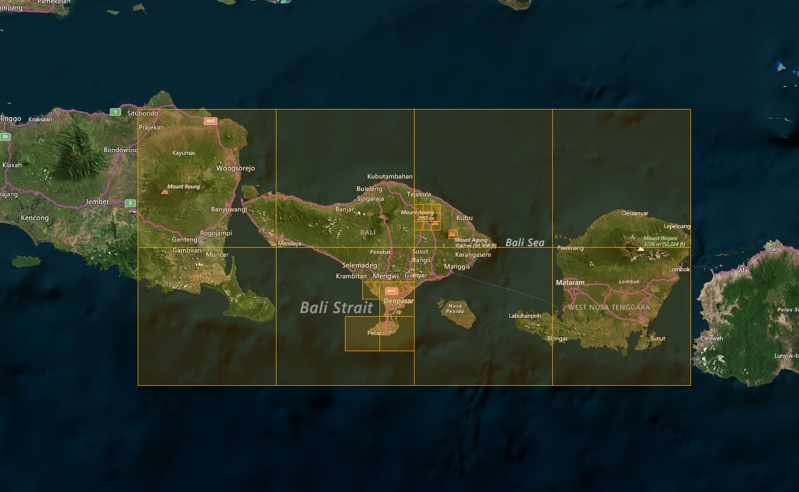

# Bali Photo Scenery

## Description

Photo scenery in HD covering the islands of Bali, Lombok & eastern part of Java. 

An elevation fix was made especially for the airport area as well as vulcans. WADE Lieutenant Colonel Wisnu Airfield is also included in addition to IPAC's airports.

FS4 Desktop
FSG Mobile

Photo Scenery
Airports
Elevation Mesh

v1.0

---

# Preview Images

  <a href="#!" class="lightbox-close">&times;</a>

  

  <a href="#!" class="lightbox-close">&times;</a>

  

  <a href="#!" class="lightbox-close">&times;</a>

  

  <a href="#!" class="lightbox-close">&times;</a>

  

---

# Coverage

  <a href="#!" class="lightbox-close">&times;</a>

  

---

# FS4 Desktop Downloads (zip)

<a class="download-button" href="https://drive.google.com/file/d/10UMBgkeGuZe4fJB0Tf8ojR4WjNJ8BDhk/view?usp=drive_link">
Download Images
</a>

<a class="download-button" href="https://drive.google.com/file/d/1gebc8MzG4p_dbtuQjRXCuyOKZPS-T78a/view?usp=drive_link">
Download Data FS4
</a>

---

# FSG Mobile Downloads (tme)

<a class="download-button" href="https://drive.google.com/file/d/1fw4U-z_wuUvRVZmxi1i5dKlPNbkYj0kb/view?usp=drive_link">
Download Images
</a>

<a class="download-button" href="https://drive.google.com/file/d/1vxl3meltonS28MNkyI9Ey7ptuA-Y1p6s/view?usp=drive_link">
Download Data FSG
</a>

---

# References

- Bing Maps © 
- OpenTopography - Copernicus Global 30m data © 

---

# Credits

- nickhod for AeroScenery (creating photo-sceneries)

---

# Installation

- [FS4 Desktop Installation](../install/fs4.html)
- [FSG Mobile Installation](../install/fsg.html)

---

# License

- [License Information](../license/index.html)