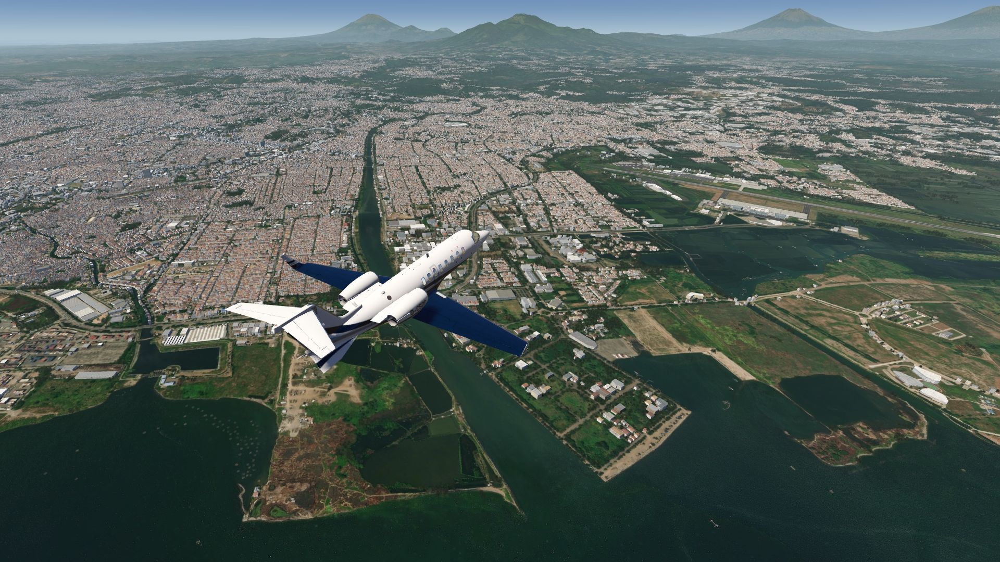
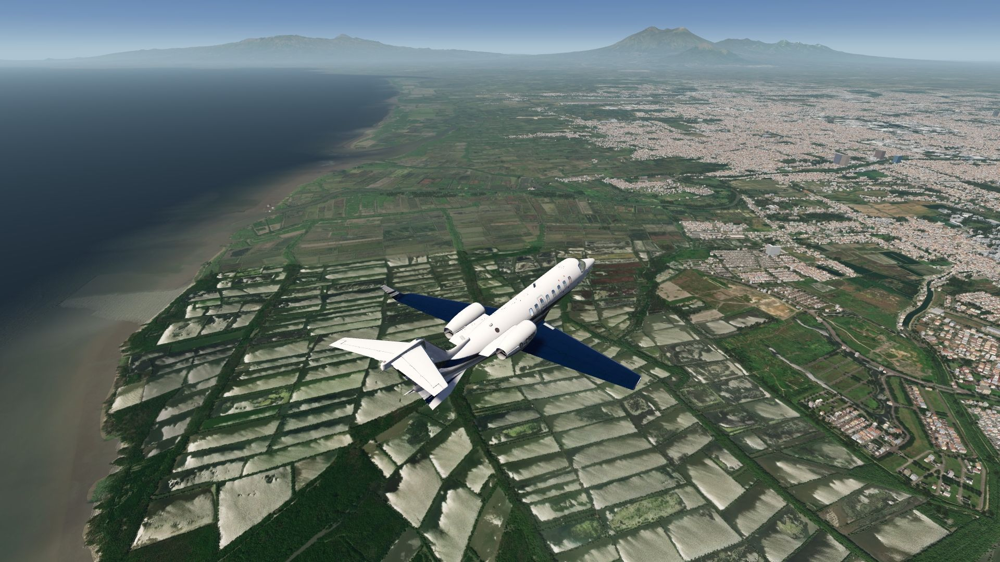
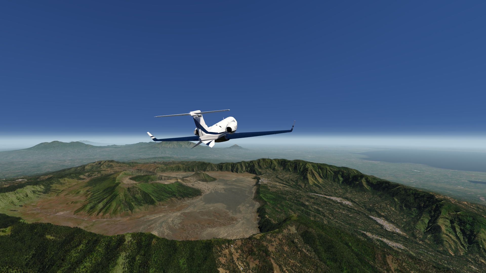
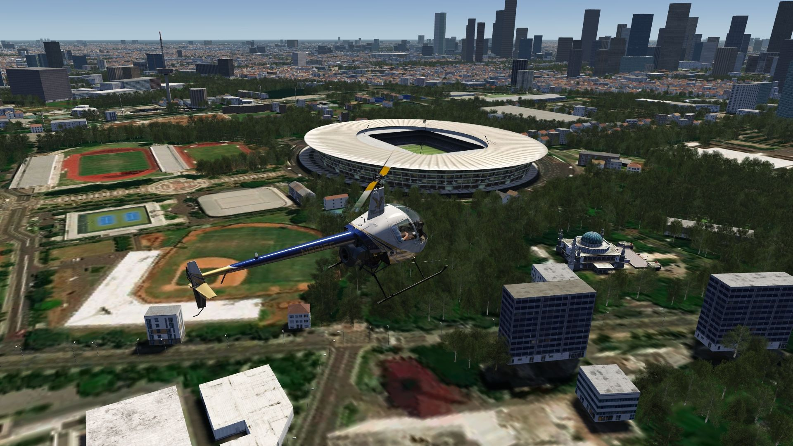
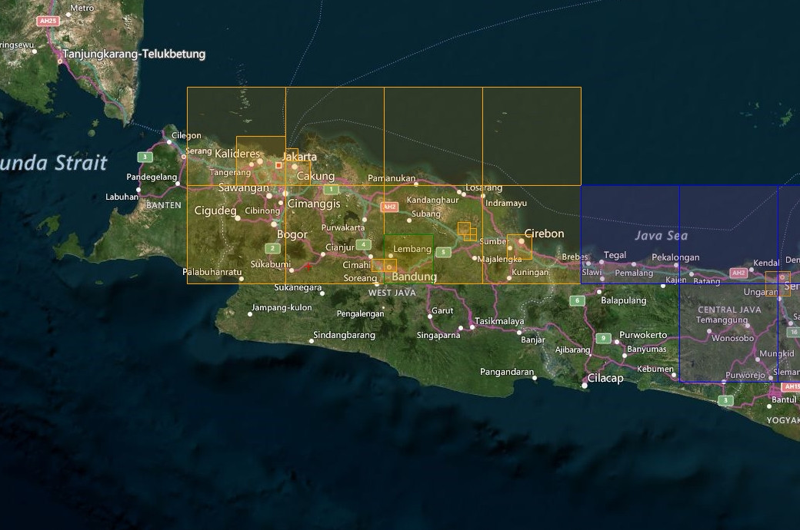
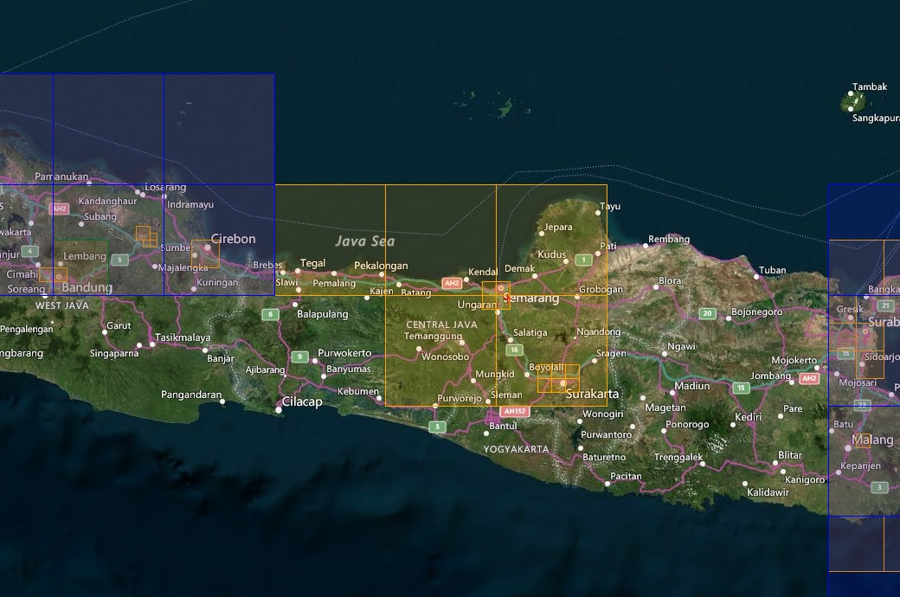
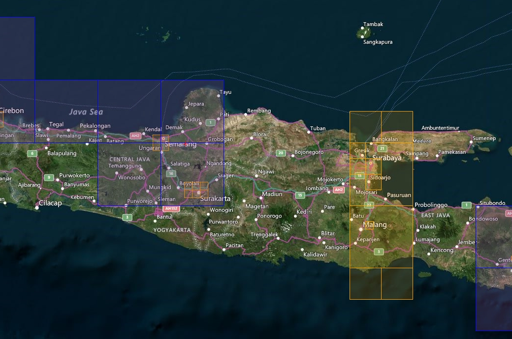

# Java Island Photo Scenery

## Description

Photo scenery covering a large part of Java island, particularly the capital city of Jakarta in the west, as well as many other cities such as Badung, Cirebon, Semarang, Surakarta in the middle and Surabaya and Malang in the east and their airports. 

Discover the island's many volcanoes as you fly from town to town.

It also has a few POIs in Jakarta, Bandung and Surabaya. An elevation fix was made especially for Jakarta airport and town.

## Included Regions

### Part 1
- Jakarta
- Bandung
- Cirebon

### Part 2
- Semarang
- Surakarta

### Part 3
- Surabaya
- Malang

FS4 Desktop
FSG Mobile

Photo Scenery
POIs
Elevation Mesh

v1.0

---

# Preview Images

  <a href="#!" class="lightbox-close">&times;</a>

  

  <a href="#!" class="lightbox-close">&times;</a>

  

  <a href="#!" class="lightbox-close">&times;</a>

  

  <a href="#!" class="lightbox-close">&times;</a>

  

---

# Coverage

  <a href="#!" class="lightbox-close">&times;</a>

  

  <a href="#!" class="lightbox-close">&times;</a>

  

  <a href="#!" class="lightbox-close">&times;</a>

  

---

# FS4 Desktop Downloads (zip)

<a class="download-button" href="https://drive.google.com/file/d/1bXJHYrp3s_fztXMzNvLoSZ29j2QZLoWi/view?usp=drive_link">
Download Images - Part 1
</a>

<a class="download-button" href="https://drive.google.com/file/d/1GUJCcM3DHBptf641xKdq9CTc0mUJYsoj/view?usp=drive_link">
Download Images - Part 2
</a>

<a class="download-button" href="https://drive.google.com/file/d/1lm5h7vOmzpJLxU0q8G4lGlp5-O6BOv6S/view?usp=drive_link">
Download Images - Part 3
</a>

<a class="download-button" href="https://drive.google.com/file/d/1gebc8MzG4p_dbtuQjRXCuyOKZPS-T78a/view?usp=drive_link">
Download Data FS4
</a>

---

# FSG Mobile Downloads (tme)

<a class="download-button" href="https://drive.google.com/file/d/1cMV32AgiAEY9KJFjZGhhDL4Uzh3Svpbh/view?usp=drive_link">
Download Images - Part 1
</a>

<a class="download-button" href="https://drive.google.com/file/d/1E5qy3WZg2R7YYnoYMYEj9mJUjN7YBsVn/view?usp=drive_link">
Download Images - Part 2
</a>

<a class="download-button" href="https://drive.google.com/file/d/1UEUJuJCnAnEwocFZ5_FD8AbFduTtiuhX/view?usp=drive_link">
Download Images - Part 3
</a>

<a class="download-button" href="https://drive.google.com/file/d/1jfU7uQev5NlNnaJexGiN3PlZ48yOBatD/view?usp=drive_link">
Download Data FSG
</a>

---

# References

- ArcGIS Maps © 
- OpenTopography - Copernicus Global 30m data © 
- SketchUp 3D Warehouse (3dwarehouse.sketchup.com)

---

# Credits

- nickhod for AeroScenery (creating photo-sceneries)
- Arno Gerretsen for ModelConverterX (converting-tool)
- to all the authors of the models used

---

# Installation

- [FS4 Desktop Installation](../install/fs4.html)
- [FSG Mobile Installation](../install/fsg.html)

---

# License

- [License Information](../license/license.html)