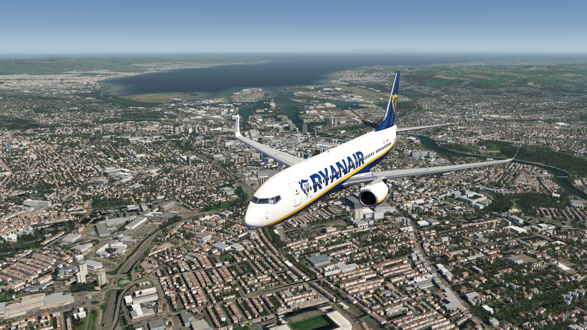
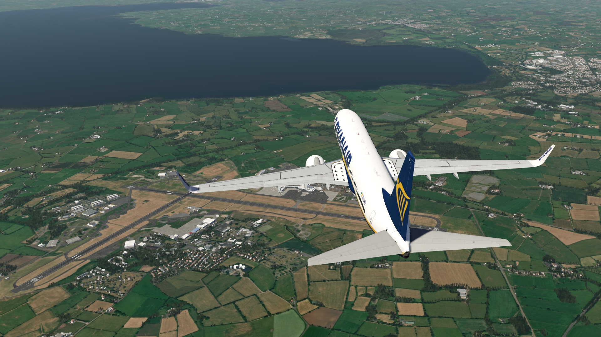
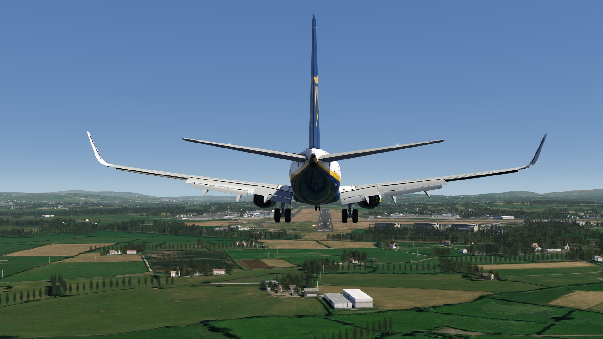
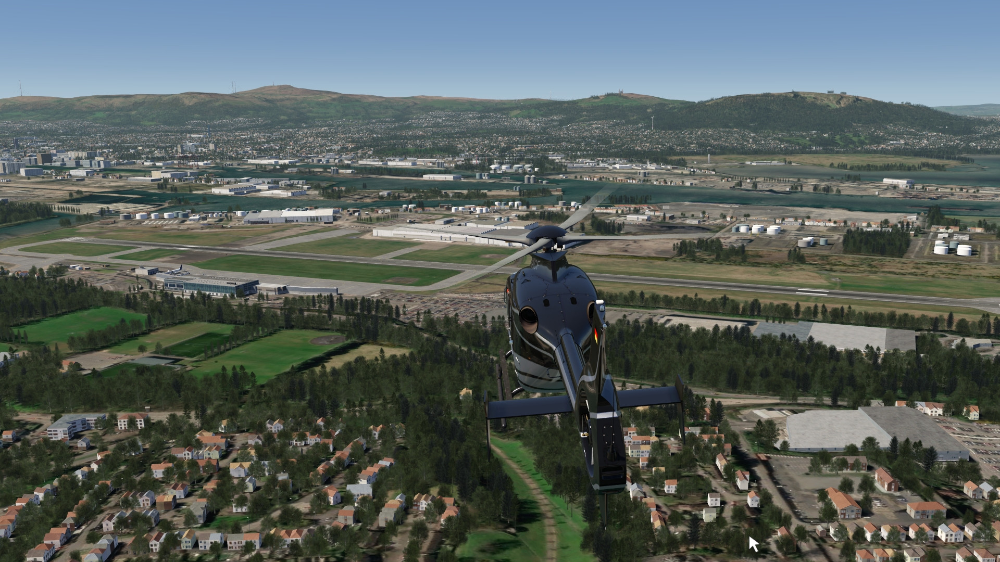
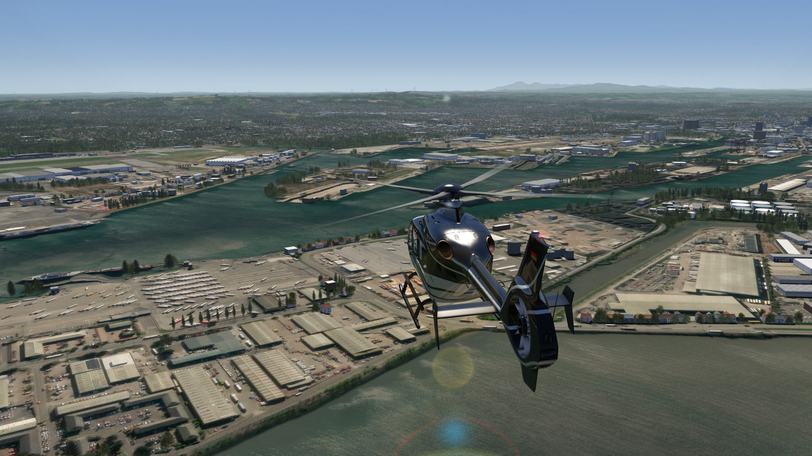
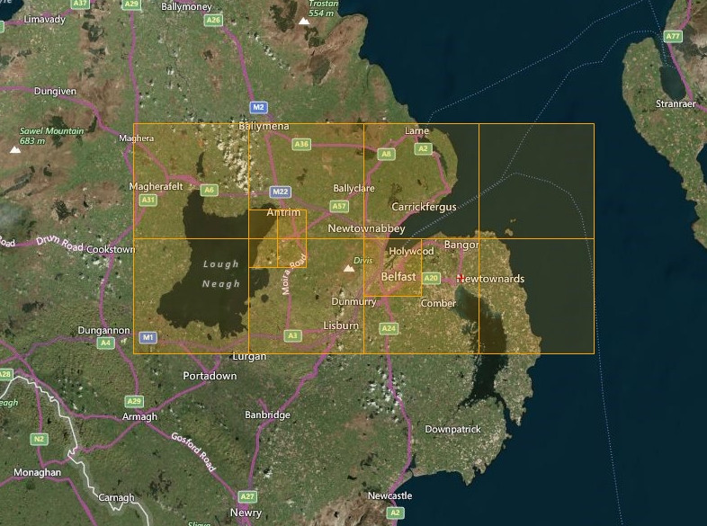

# Belfast Photo Scenery

## Description

Photo scenery in HD featuring the city of Belfast and its two main airports EGAC Belfast City as well as EGGA Belfast Intl. in Northern Ireland.

## Note
To add currently missing pushback parking positions to EGAC Belfast City airport, install the add-on created by @Wingberry. It includes approximately 150 airports worldwide (EGAC Belfast City has been added).

FS4 Desktop
FSG Mobile

Photo Scenery
Elevation

v1.0

---

# Preview Images

  <a href="#!" class="lightbox-close">&times;</a>

  

  <a href="#!" class="lightbox-close">&times;</a>

  

  <a href="#!" class="lightbox-close">&times;</a>

  

  <a href="#!" class="lightbox-close">&times;</a>

  

---

# Coverage

  <a href="#!" class="lightbox-close">&times;</a>

  

---

# FS4 Desktop Downloads (zip)

<a class="download-button" href="https://drive.google.com/file/d/1wP6Tr-3kyjRlQvoEGglKs8NREhbeiCwv/view?usp=drive_link">
Download Images (524.8 MB)
</a>

<a class="download-button" href="https://drive.google.com/file/d/1ZCznjkgSLHn2vcsxRaSzmI3WHBLT0KCT/view?usp=drive_link">
Download Data FS4 (967 KB)
</a>

<a class="download-button" href="https://drive.google.com/file/d/1ku_-84UnYqSGEI20oV3rFmEvams3JIja/view?usp=drive_link">
Download Airport Pushbacks (by @Wingberry)
</a>

---

# FSG Mobile Downloads (tme)

<a class="download-button" href="https://drive.google.com/file/d/1zpYdpg6bSlRbi9T4NaLjjadyYE-rR2DL/view?usp=drive_link">
Download Images (308.6 MB)
</a>

<a class="download-button" href="https://drive.google.com/file/d/13YyurWgNtA4UGppPPdEpdSMp2rreEAN_/view?usp=drive_link">
Download Data FSG (810 KB)
</a>

<a class="download-button" href="https://drive.google.com/file/d/1jYWX_NTUNu5iXeJVvqHD-mKuKEUqMCNR/view?usp=drive_link">
Download Airport Pushbacks (by @Wingberry)
</a>

---

# References

- ArcGIS Maps © 
- OpenTopography - Copernicus Global 30m data © 

---

# Credits

- nickhod for AeroScenery (creating photo-sceneries)

---

# Installation

- [FS4 Desktop Installation](../install/fs4.html)
- [FSG Mobile Installation](../install/fsg.html)

---

# License

- [License Information](../license/license.html)