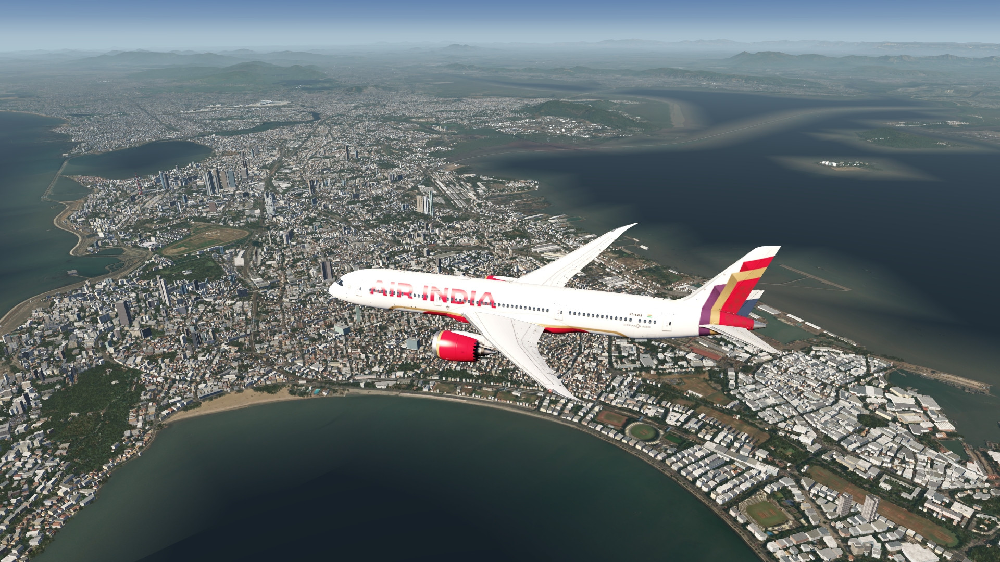
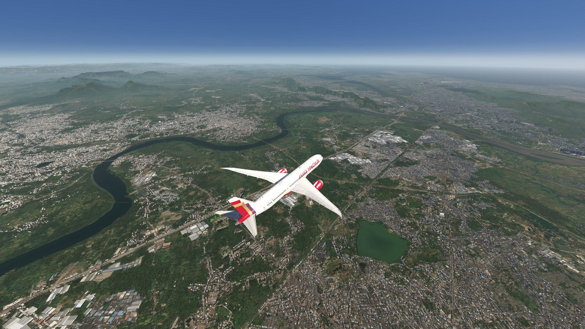
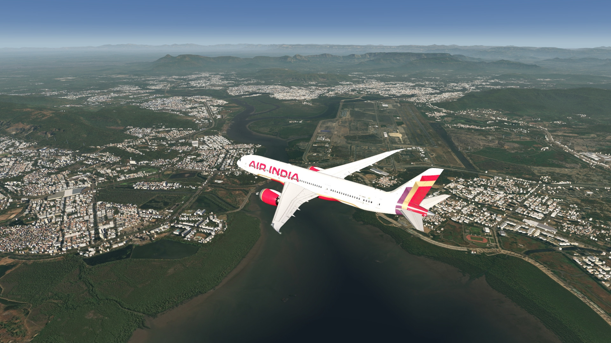
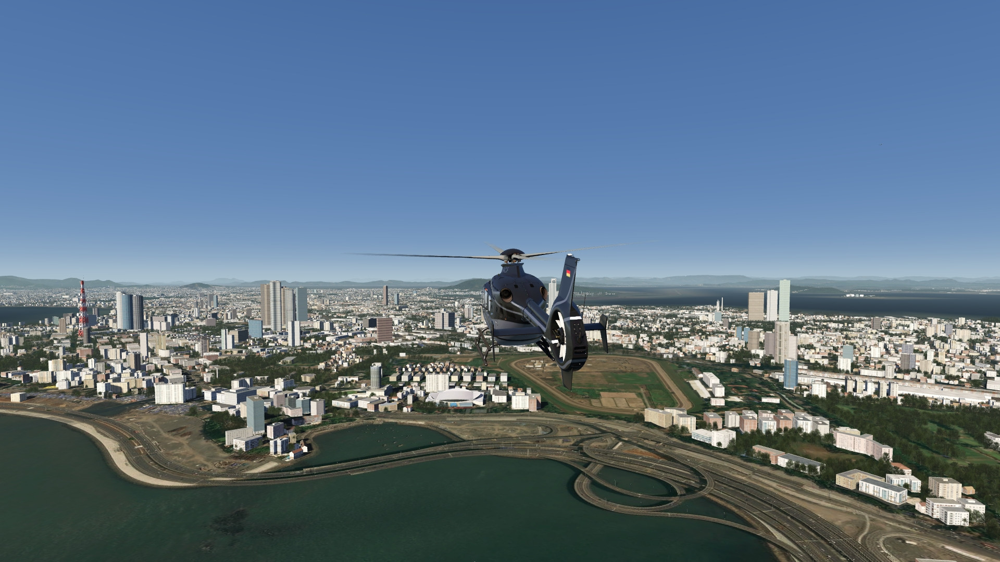
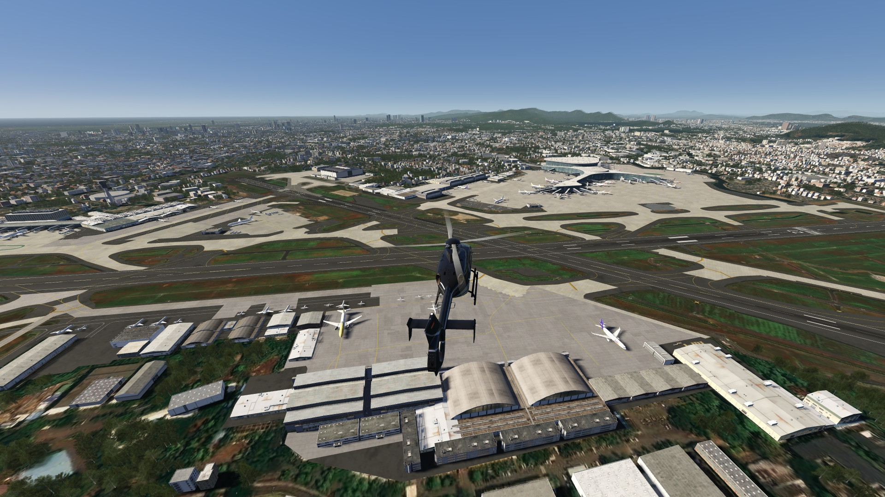
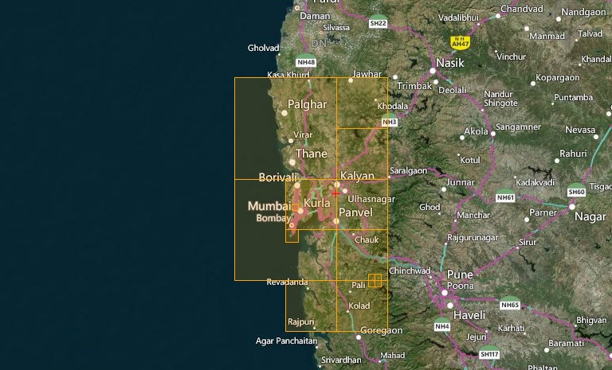

# Mumbai Photo Scenery

## Description

HD photo scenery covering Mumbai and the surrounding area. 

There are also some POI's added to the scenery. 

FS4 Desktop
FSG Mobile

Photo Scenery
POI's
Elevation

v1.0

---

# Preview Images

  <a href="#!" class="lightbox-close">&times;</a>

  

  <a href="#!" class="lightbox-close">&times;</a>

  

  <a href="#!" class="lightbox-close">&times;</a>

  

  <a href="#!" class="lightbox-close">&times;</a>

  

---

# Coverage

  <a href="#!" class="lightbox-close">&times;</a>

  

---

# FS4 Desktop Downloads (zip)

<a class="download-button" href="https://drive.google.com/file/d/13MoXPZrDLn0vGRfpfUhiv_qBIOPuPLle/view?usp=drive_link">
Download Images (1.05 GB)
</a>

<a class="download-button" href="https://drive.google.com/file/d/1RT_0dgSIVpAHa0xkQkWFnXcb_XaFYyql/view?usp=drive_link">
Download Data FS4 (10.3 MB)
</a>

---

# FSG Mobile Downloads (tme)

<a class="download-button" href="https://drive.google.com/file/d/10naVEG90ou5Zszce3oypYN1vfMcuyVI7/view?usp=drive_link">
Download Images (557.8 MB)
</a>

<a class="download-button" href="https://drive.google.com/file/d/1e5YfdPRttBuKy4Z5sAsnrBZa35AeuyE0/view?usp=drive_link">
Download Data FSG (21.1 MB)
</a>

---

# References

- ArcGIS Maps © 
- Carto Basemaps - OpenStreetMap © 
- OpenTopography - Copernicus Global 30m data © 
- SketchUp 3D Warehouse (3dwarehouse.sketchup.com)

---

# Credits

- nickhod for AeroScenery (creating photo-sceneries)

---

# Installation

- [FS4 Desktop Installation](../install/fs4.html)
- [FSG Mobile Installation](../install/fsg.html)

---

# License

- [License Information](../license/license.html)