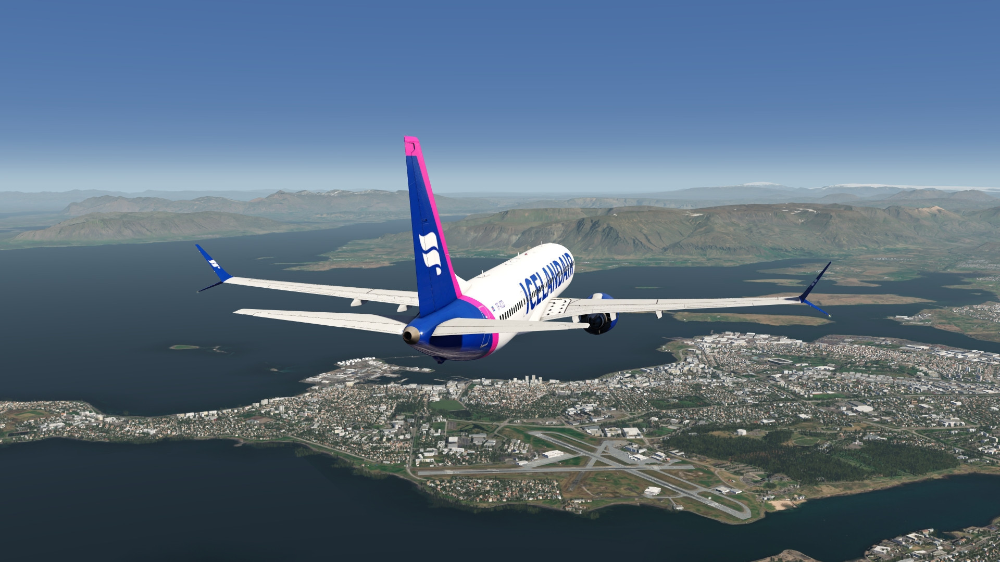
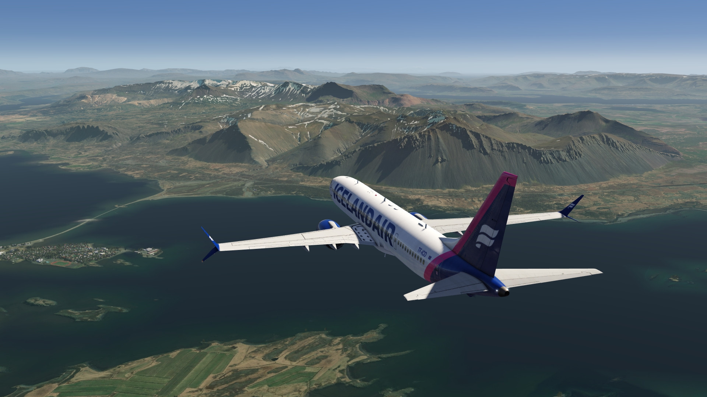
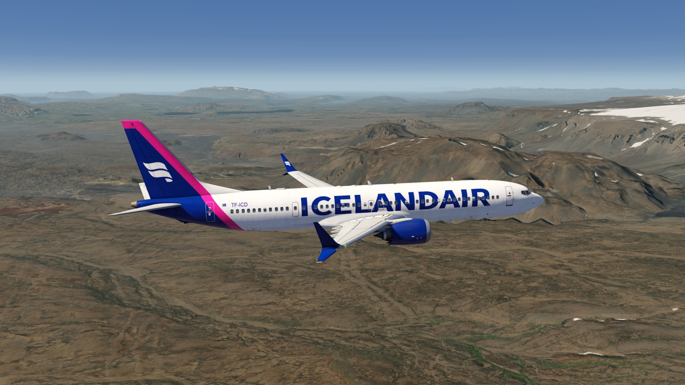
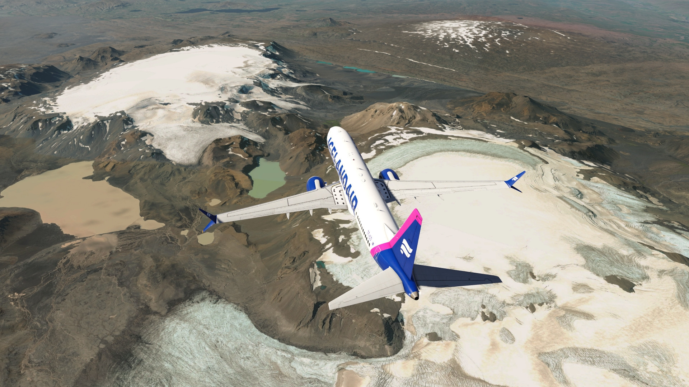
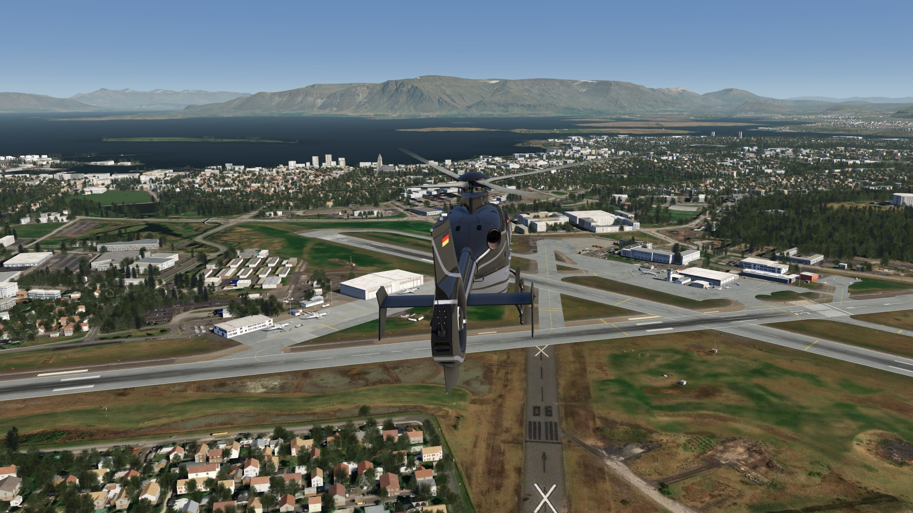
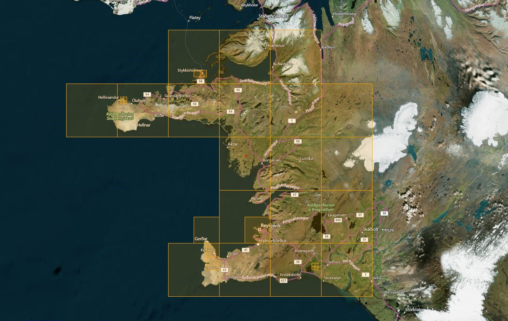

# Reykjavik Extended Area Photo Scenery

## Description

.... (work in progress)

FS4 Desktop
FSG Mobile

Photo Scenery
Elevation

v1.0

---

# Preview Images

  <a href="#!" class="lightbox-close">&times;</a>

  

  <a href="#!" class="lightbox-close">&times;</a>

  

  <a href="#!" class="lightbox-close">&times;</a>

  

  <a href="#!" class="lightbox-close">&times;</a>

  

---

# Coverage

  <a href="#!" class="lightbox-close">&times;</a>

  

---

# FS4 Desktop Downloads (zip)

<a class="download-button" href="">
Download Images (2.77 GB)
</a>

<a class="download-button" href="">
Download Data FS4 (510 KB)
</a>

---

# FSG Mobile Downloads (tme)

<a class="download-button" href="">
Download Images (2.44 GB)
</a>

<a class="download-button" href="">
Download Data FSG (241 KB)
</a>

---

# References

- ArcGIS Maps © 
- OpenTopography - Copernicus Global 30m data © 

---

# Credits

- nickhod for AeroScenery (creating photo-sceneries)

---

# Installation

- [FS4 Desktop Installation](../install/fs4.html)
- [FSG Mobile Installation](../install/fsg.html)

---

# License

- [License Information](../license/license.html)