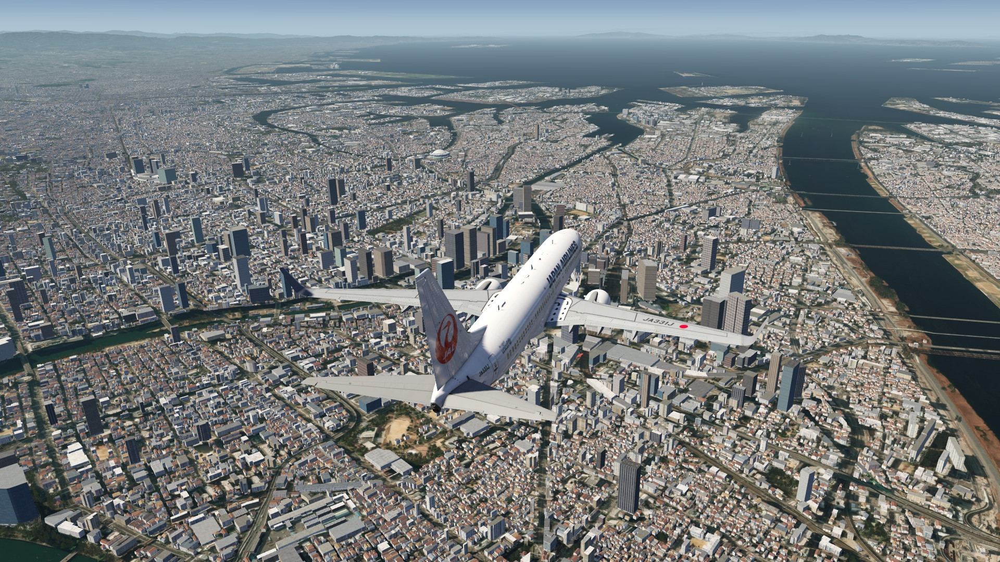
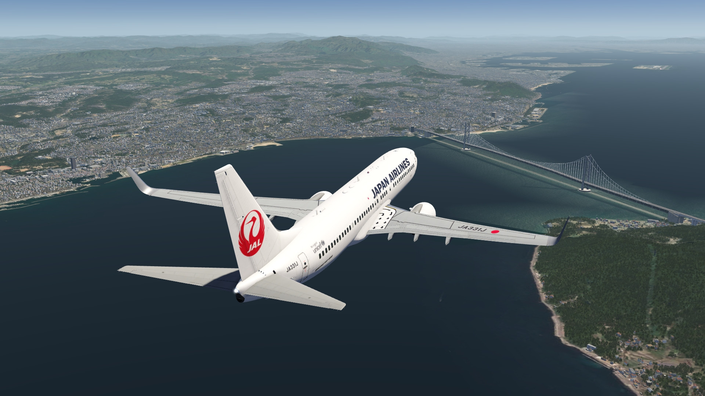
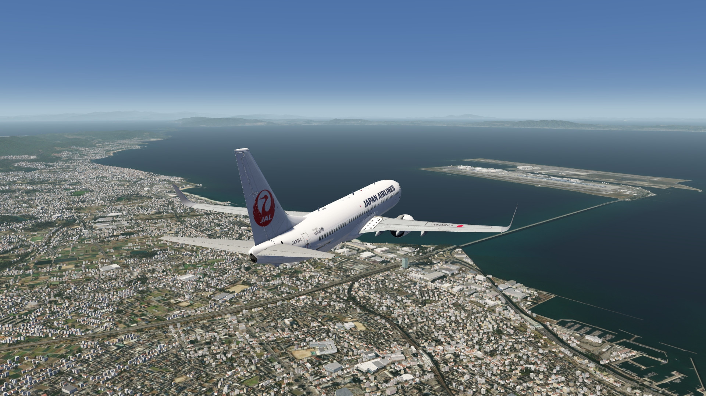
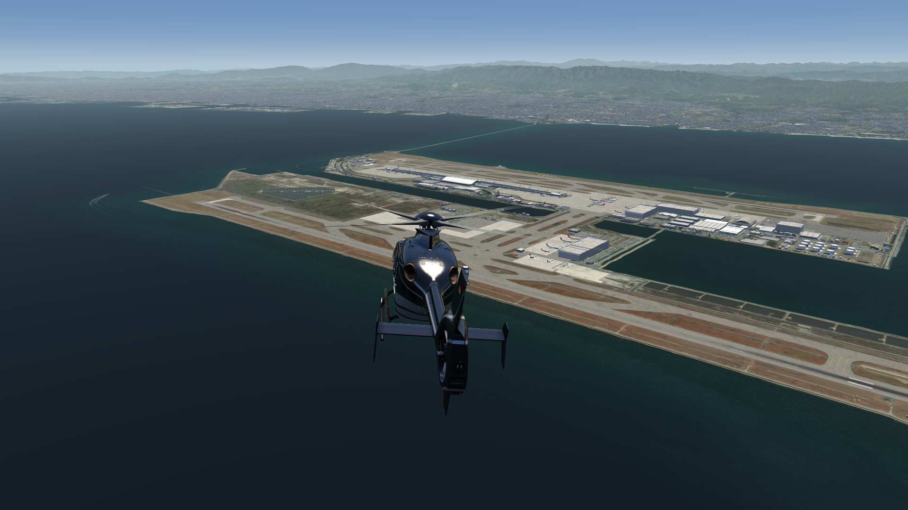
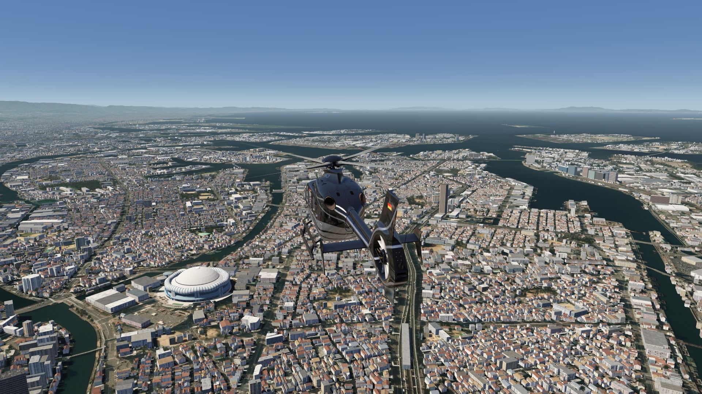
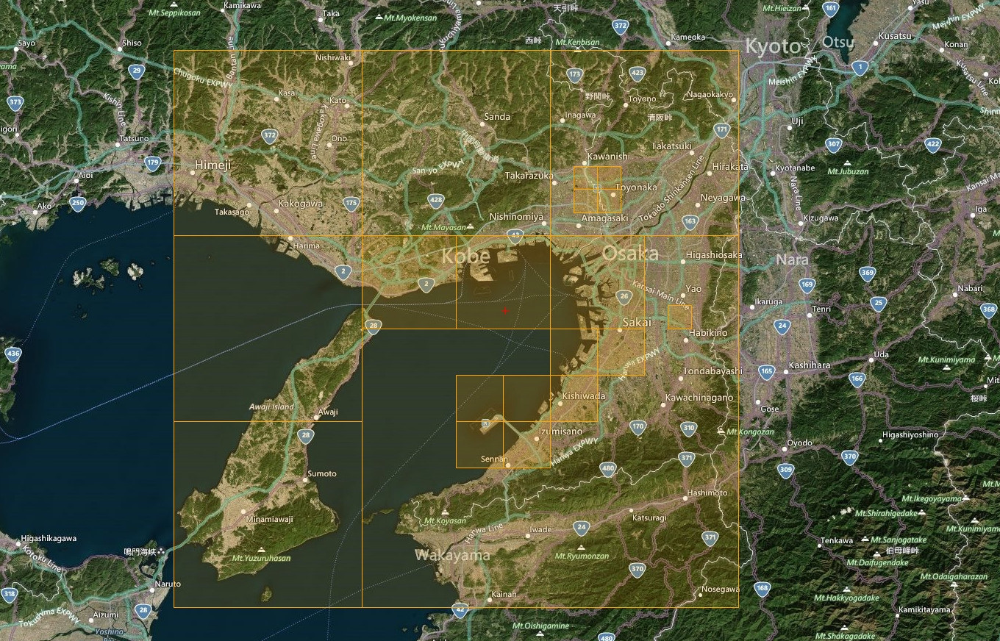

# Osaka Bay Scenery (Incl. Kansai Airport Area) 

## Description

HD photo scenery covering the entire Osaka Bay area, including the cities of Osaka, Kobe and Wakayama as well as the missing ground texture for Kansai Intl. Airport.

Some POIs have been added to the scenery. Alos an elevation was fixed for some areas and the helipad implemented at Sakai City Hall.

FS4 Desktop
FSG Mobile

Photo Scenery
Airports
POI's
Elevation

v1.0

---

# Preview Images

  <a href="#!" class="lightbox-close">&times;</a>

  

  <a href="#!" class="lightbox-close">&times;</a>

  

  <a href="#!" class="lightbox-close">&times;</a>

  

  <a href="#!" class="lightbox-close">&times;</a>

  

---

# Coverage

  <a href="#!" class="lightbox-close">&times;</a>

  

---

# FS4 Desktop Downloads (zip)

<a class="download-button" href="https://drive.google.com/file/d/1loCFgoNLEMD1PeU2Iduh77wWd6pPQrKB/view?usp=drive_link">
Download Images (736.3 MB)
</a>

<a class="download-button" href="https://drive.google.com/file/d/1MJr_dG8PuJ3qp2X1kH7KmytvoFBEuqRe/view?usp=drive_link">
Download Data FS4 (8.2 MB)
</a>

---

# FSG Mobile Downloads (tme)

<a class="download-button" href="https://drive.google.com/file/d/1LSkz3AFJLvpQr8zP-fqgf38Rxasa9g6c/view?usp=drive_link">
Download Images (425.2 MB)
</a>

<a class="download-button" href="https://drive.google.com/file/d/1D_lquv2sh5dgUNOmIJg_wEiHEDBXEaE2/view?usp=drive_link">
Download Data FSG (7.7 MB)
</a>

---

# References

- ArcGIS Maps © 
- OpenTopography - Copernicus Global 30m data © 
- SketchUp 3D Warehouse (3dwarehouse.sketchup.com)

---

# Credits

- nickhod for AeroScenery (creating photo-sceneries)
- Arno Gerretsen for ModelConverterX (converting-tool)
- to all the authors of the models used

---

# Installation

- [FS4 Desktop Installation](../install/fs4.html)
- [FSG Mobile Installation](../install/fsg.html)

---

# License

- [License Information](../license/license.html)