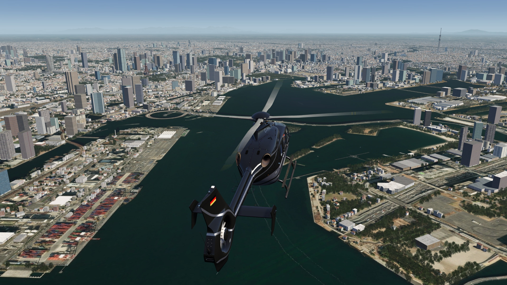
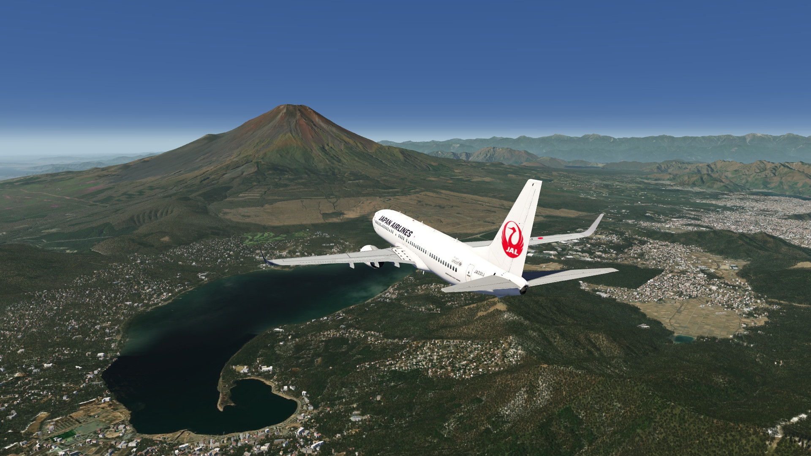
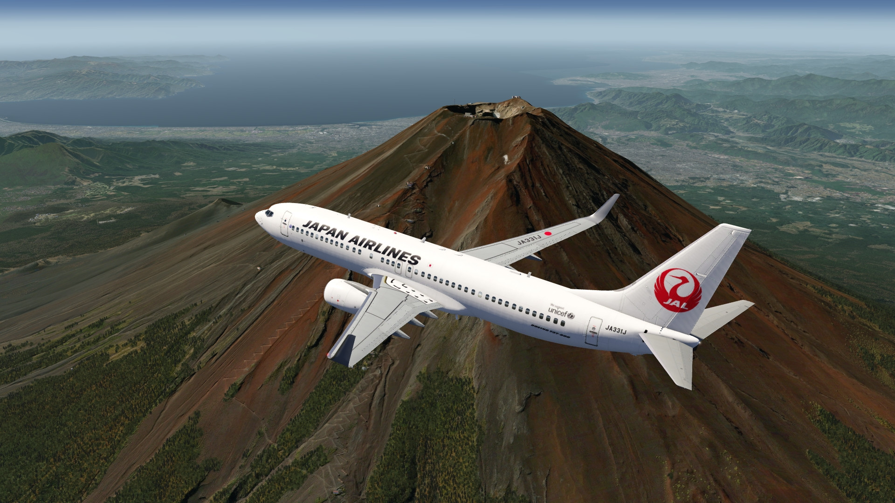
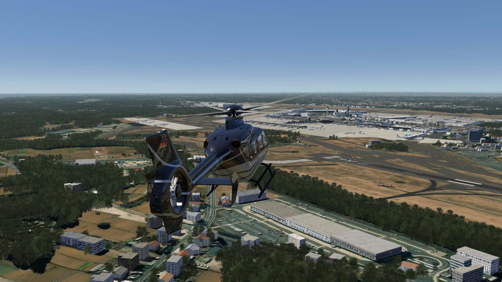
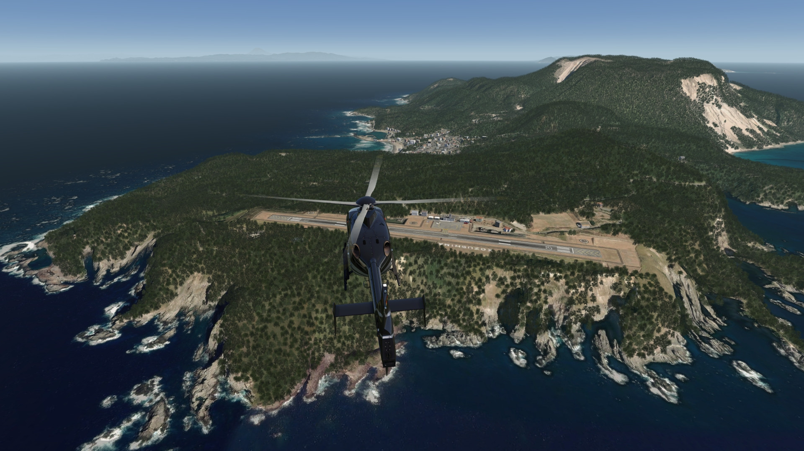
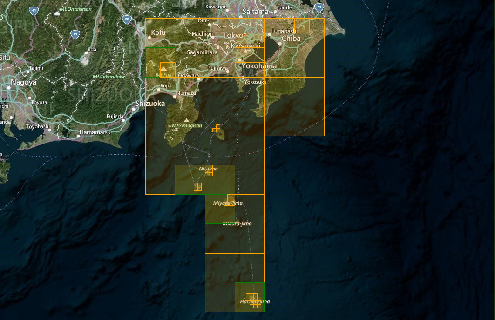

# Tokyo Extended Area Scenery (Incl. Mt Fuji)

## Description

High resolution photo scenery covering enlarged area of Tokyo city in Japan. The scenery includes the famous Mt. Fuji, located in the west of the city, extends to Narita International Airport in the east and features all the islands in the south waiting to be explored.

Some POIs have been added to the city. Also elevation was fixed for the town, Mt. Fuji and southern islands. In addition to IPACS streamed airports, RJTO Oshima airport and RJAN Niijima Airport (runway only) airports are also included.

FS4 Desktop
FSG Mobile

Photo Scenery
Airports
POI's
Elevation

v1.0

---

# Preview Images

  <a href="#!" class="lightbox-close">&times;</a>

  

  <a href="#!" class="lightbox-close">&times;</a>

  

  <a href="#!" class="lightbox-close">&times;</a>

  

  <a href="#!" class="lightbox-close">&times;</a>

  

---

# Coverage

  <a href="#!" class="lightbox-close">&times;</a>

  

---

# FS4 Desktop Downloads (zip)

<a class="download-button" href="https://drive.google.com/file/d/14EoGd8FvljuwBCgLl2JyfONWBsvv5u2i/view?usp=drive_link">
Download Images (1.66 GB)
</a>

<a class="download-button" href="https://drive.google.com/file/d/1tU_v3cR3HNNLPqGF21F1pE-LOy8HXXHf/view?usp=drive_link">
Download Data FS4 (12.3 MB)
</a>

---

# FSG Mobile Downloads (tme)

<a class="download-button" href="https://drive.google.com/file/d/1MxLInHh-WLdOAIvRRr7G7qptbmurOF4K/view?usp=drive_link">
Download Images (1.02 GB)
</a>

<a class="download-button" href="https://drive.google.com/file/d/1X5F6sysAiB_R7akzX-c9FTISPNKa8AXI/view?usp=drive_link">
Download Data FSG (12.9 MB)
</a>

---

# References

- ArcGIS Maps © 
- OpenTopography - Copernicus Global 30m data © 
- SketchUp 3D Warehouse (3dwarehouse.sketchup.com)

---

# Credits

- nickhod for AeroScenery (creating photo-sceneries)
- Arno Gerretsen for ModelConverterX (converting-tool)
- to all the authors of the models used
- @Pilot boy for RJTO Oshima airport

---

# Installation

- [FS4 Desktop Installation](../install/fs4.html)
- [FSG Mobile Installation](../install/fsg.html)

---

# License

- [License Information](../license/license.html)