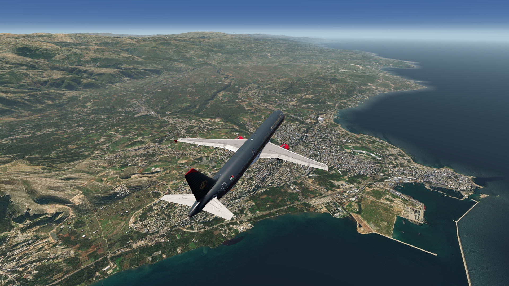
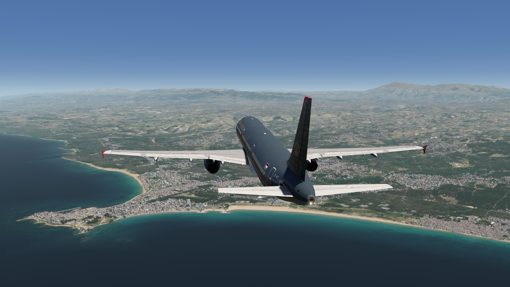
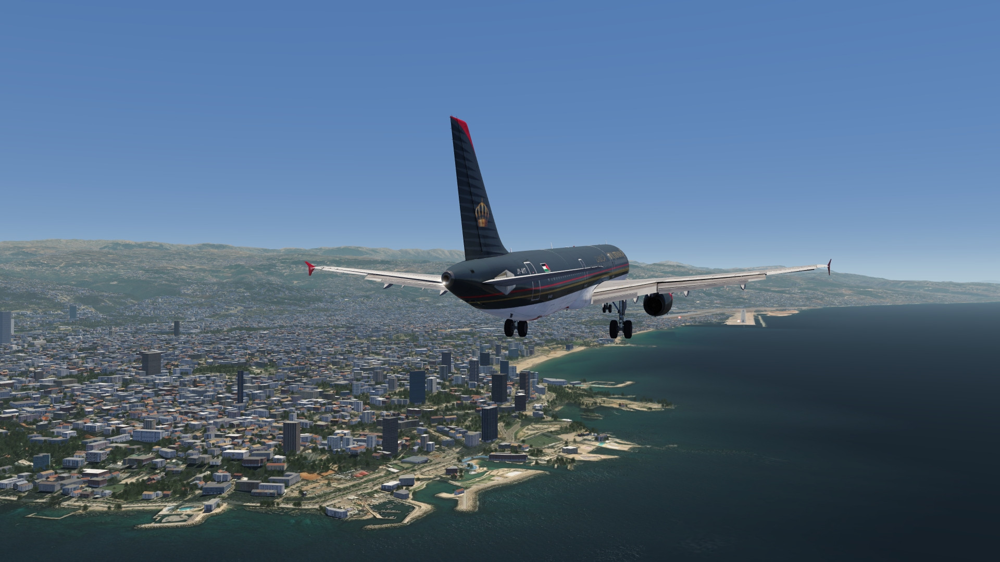
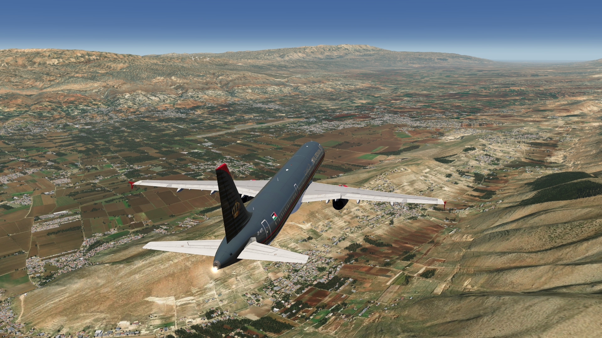
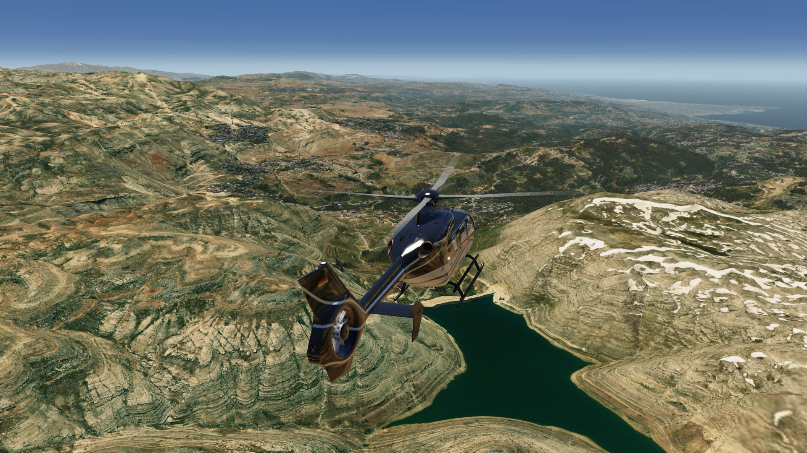
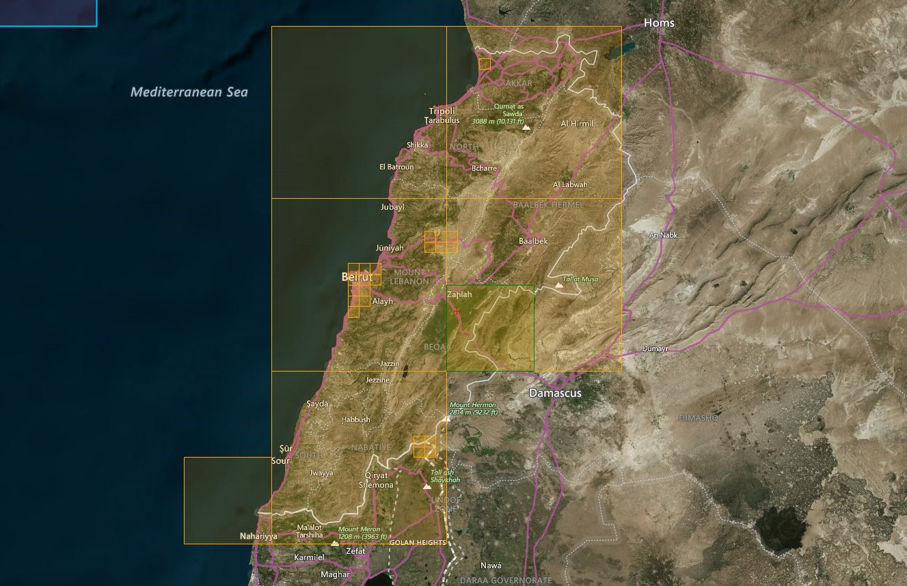

# Beirut Enlarged Area Photo Scenery

## Description

HD photoscenery of Beirut, the capital, with enlarged coverage, covering most parts of Lebanon.

The elevation data currently still missing in AeroFly are also included as a temporary scenery fix.

FS4 Desktop
FSG Mobile

Photo Scenery
Airports
Elevation

v1.0

---

# Preview Images

  <a href="#!" class="lightbox-close">&times;</a>

  

  <a href="#!" class="lightbox-close">&times;</a>

  

  <a href="#!" class="lightbox-close">&times;</a>

  

  <a href="#!" class="lightbox-close">&times;</a>

  

---

# Coverage

  <a href="#!" class="lightbox-close">&times;</a>

  

---

# FS4 Desktop Downloads (zip)

<a class="download-button" href="https://drive.google.com/file/d/1djsw9qIBnTv58C0fhTyMY1_oFEI1nYJ1/view?usp=drive_link">
Download Images (870.3 MB)
</a>

<a class="download-button" href="https://drive.google.com/file/d/1ZL1eA3VBN_ikExLrX82fUxnHSjwdhspT/view?usp=drive_link">
Download Data FS4 (7.9 MB)
</a>

---

# FSG Mobile Downloads (tme)

<a class="download-button" href="https://drive.google.com/file/d/1v5AX-npK1Nfr2Fx7ipnnbqpHc_ssaw1A/view?usp=drive_link">
Download Images (722.2 MB)
</a>

<a class="download-button" href="https://drive.google.com/file/d/16A-7ofCq4JeHaKSCOoHSRy0QpXJZVtIX/view?usp=drive_link">
Download Data FSG (7.6 MB)
</a>

---

# References

- Bing Maps © 
- OpenTopography - Copernicus Global 30m data © 

---

# Credits

- nickhod for AeroScenery (creating photo-sceneries)

---

# Installation

- [FS4 Desktop Installation](../install/fs4.html)
- [FSG Mobile Installation](../install/fsg.html)

---

# License

- [License Information](../license/license.html)