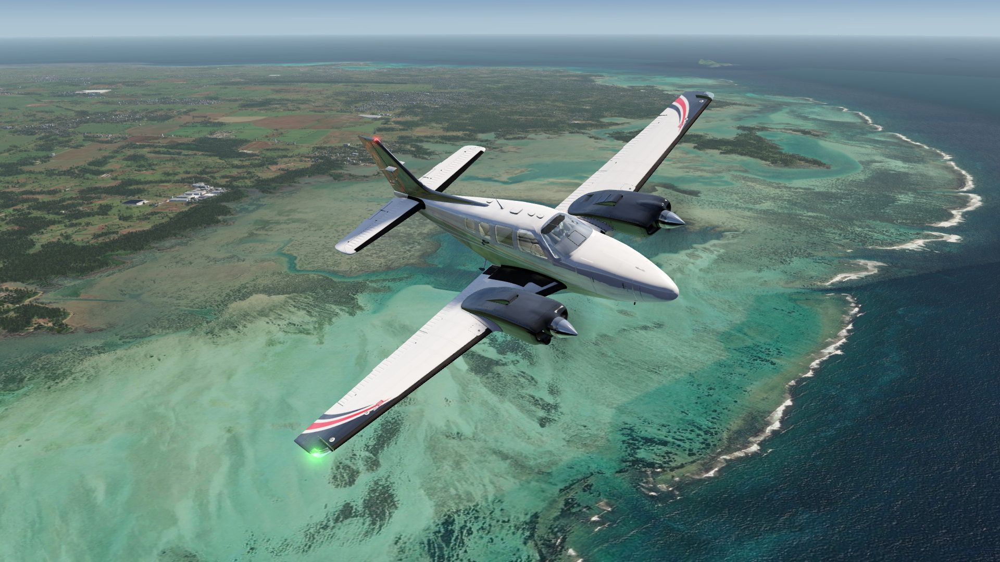
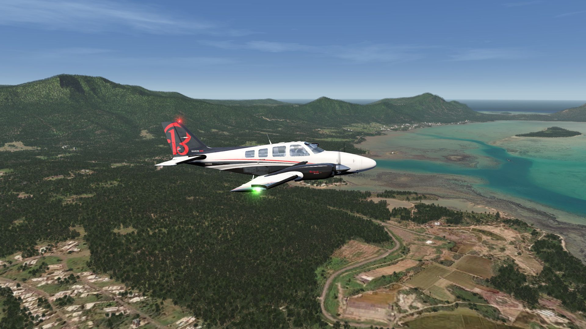
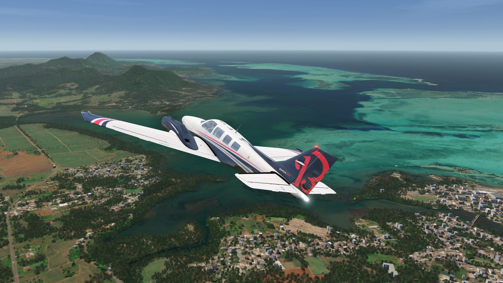
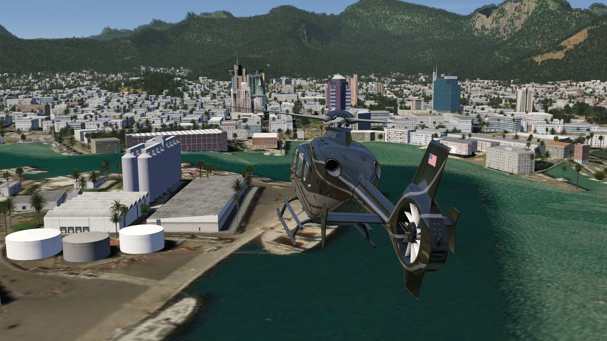
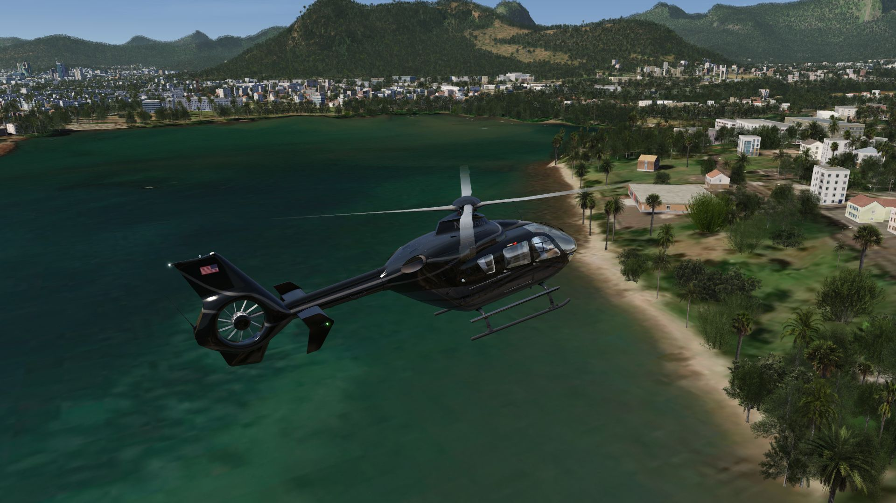
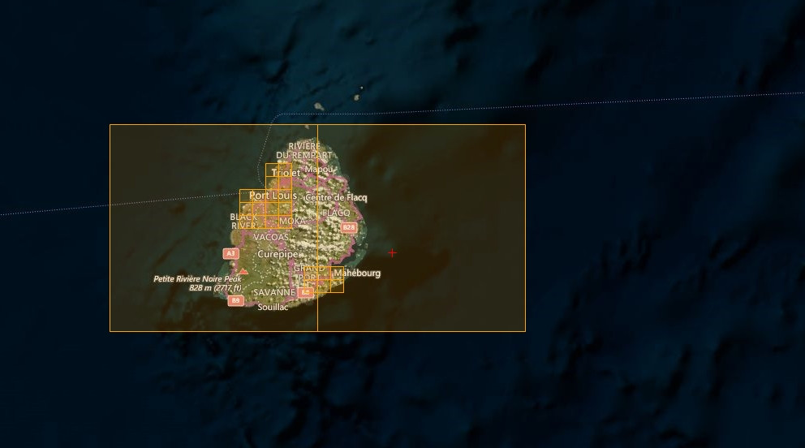
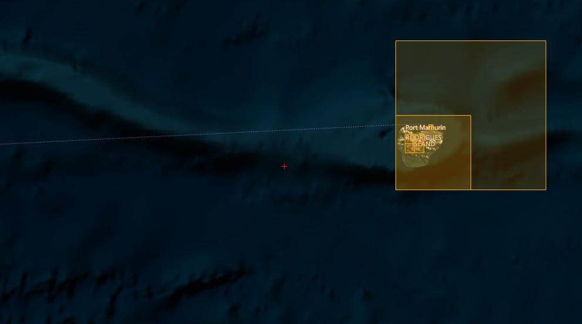

# Mauritius Islands Scenery

## Description

Photo scenery covering Mauritius and Rodrigues islands also belonging to Mauritius including the main town Port Louis with POIs. 

Also the two airports FIMP and FIMR are included with taxiways, aprons and 3D objects.

FS4 Desktop
FSG Mobile

Photo Scenery
Airports
POI's
Elevation Mesh

---

# Preview Images

  <a href="#!" class="lightbox-close">&times;</a>

  

  <a href="#!" class="lightbox-close">&times;</a>

  

  <a href="#!" class="lightbox-close">&times;</a>

  

  <a href="#!" class="lightbox-close">&times;</a>

  

---

# Coverage

  <a href="#!" class="lightbox-close">&times;</a>

  

  <a href="#!" class="lightbox-close">&times;</a>

  

---

# FS4 Desktop Downloads (zip)

<a class="download-button" href="https://drive.google.com/file/d/1V-wjyMJxWaUoItO4lrKJfpDRb5yYcGRf/view?usp=drive_link">
Download Images
</a>

<a class="download-button" href="https://drive.google.com/file/d/1W-4pT3uMp6mQNc37hd5qF1v0HGpPAKsp/view?usp=drive_link">
Download Data FS4
</a>

---

# FSG Mobile Downloads (tme)

<a class="download-button" href="https://drive.google.com/file/d/1oNY-RgrF-qi_mfKsvoHr1kDEDzYCDUp6/view?usp=drive_link">
Download Images
</a>

<a class="download-button" href="https://drive.google.com/file/d/1LBKxKBXIPOSvw5JIMkP9fRtFteiU8kxh/view?usp=drive_link">
Download Data FSG
</a>

---

# References

- ArcGIS Maps © 
- OpenTopography - Copernicus Global 30m data © 
- SketchUp 3D Warehouse (3dwarehouse.sketchup.com)

---

# Credits

- nickhod for AeroScenery (creating photo-sceneries)
- Arno Gerretsen for ModelConverterX (converting-tool)
- to all the authors of the models used

---

# Installation

- [FS4 Desktop Installation](../install/fs4.html)
- [FSG Mobile Installation](../install/fsg.html)

---

# License

- [License Information](../license/index.html)