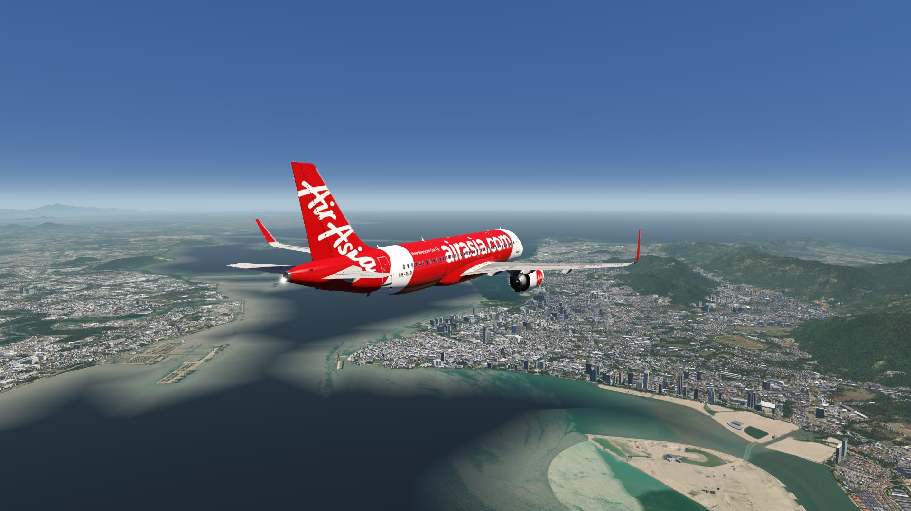
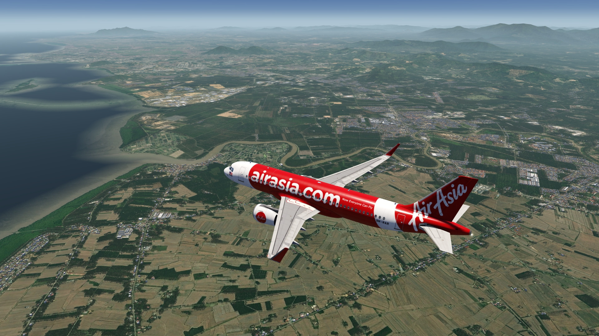
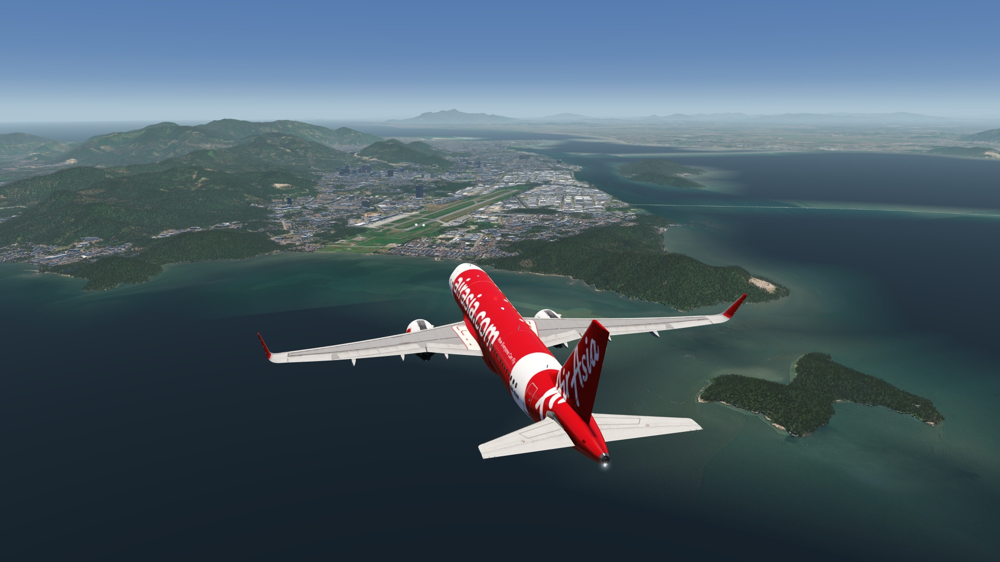
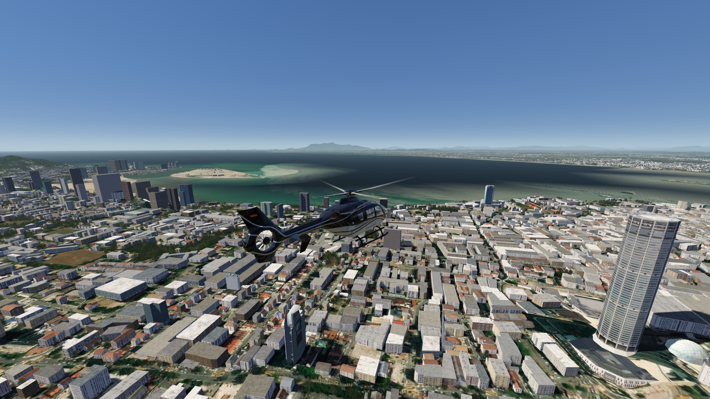
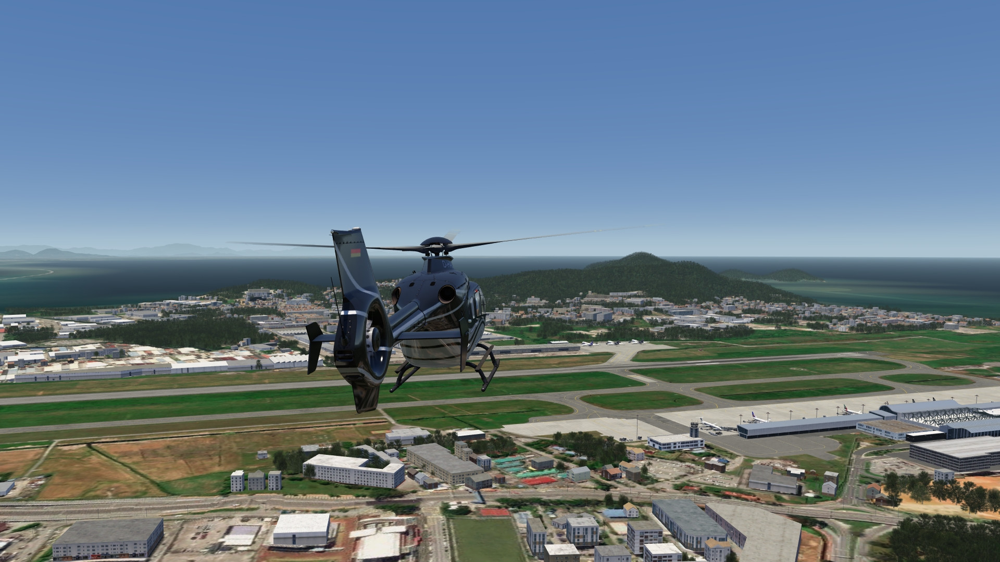
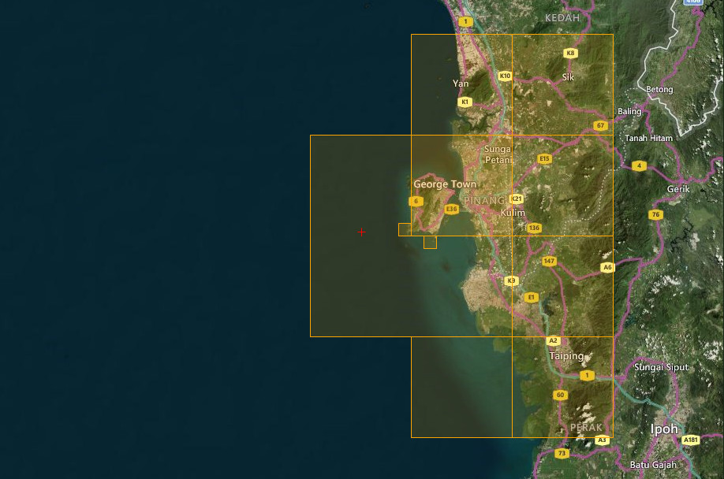

# Penang Photo Scenery

## Description

Photo scenery covering Penang Island, its capital George Town and the surrounding area. 

POI's have been added in George Town, and the elevation data for the city and the Mengkuang Dam have been corrected.

FS4 Desktop
FSG Mobile

Photo Scenery
POI's
Elevation

v1.0

---

# Preview Images

  <a href="#!" class="lightbox-close">&times;</a>

  

  <a href="#!" class="lightbox-close">&times;</a>

  

  <a href="#!" class="lightbox-close">&times;</a>

  

  <a href="#!" class="lightbox-close">&times;</a>

  

---

# Coverage

  <a href="#!" class="lightbox-close">&times;</a>

  

---

# FS4 Desktop Downloads (zip)

<a class="download-button" href="https://drive.google.com/file/d/1hStJelpymUlA-qETeGLHXSPZ6pXhfvQ2/view?usp=drive_link">
Download Images (802.9 MB)
</a>

<a class="download-button" href="https://drive.google.com/file/d/1lwBCsy3hN0Xfktu86vF8qtd-Owlq2Obr/view?usp=drive_link">
Download Data FS4 (9.4 MB)
</a>

---

# FSG Mobile Downloads (tme)

<a class="download-button" href="https://drive.google.com/file/d/11FsiO0kdmKDdSdsDBFJtPPFSiSvQbW5_/view?usp=drive_link">
Download Images (385.7 MB)
</a>

<a class="download-button" href="https://drive.google.com/file/d/1DRuIximEJAnJ2MVyJ8miPSBDwEeXmHT4/view?usp=drive_link">
Download Data FSG (9.1 MB)
</a>

---

# References

- Bing Maps © 

---

# Credits

- nickhod for AeroScenery (creating photo-sceneries)

---

# Installation

- [FS4 Desktop Installation](../install/fs4.html)
- [FSG Mobile Installation](../install/fsg.html)

---

# License

- [License Information](../license/license.html)