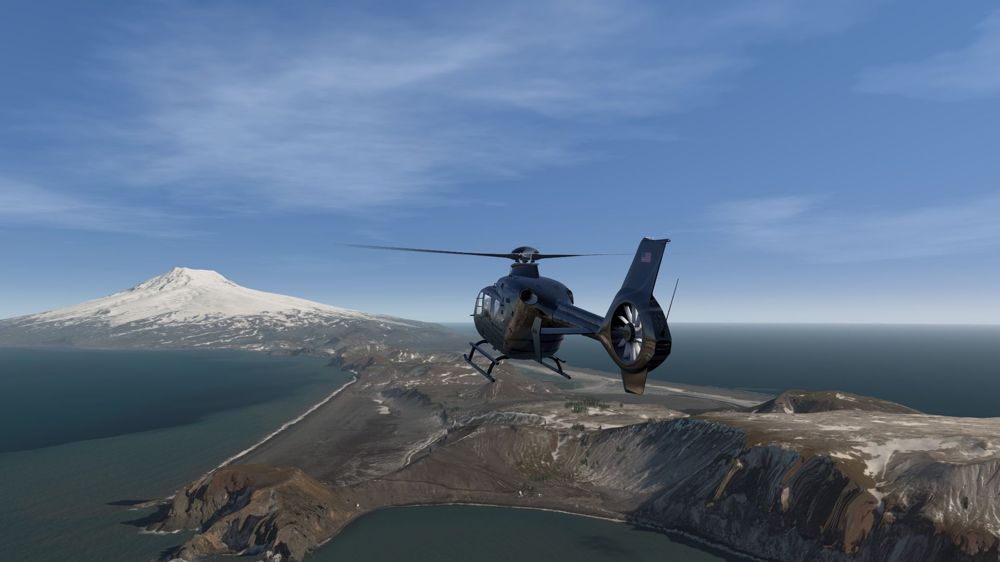
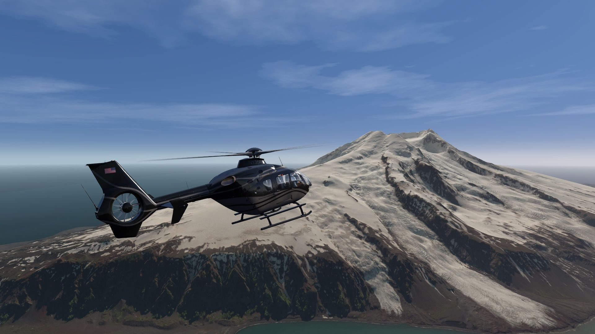
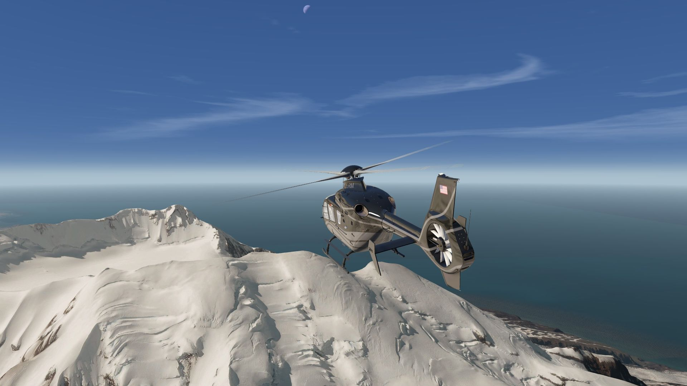
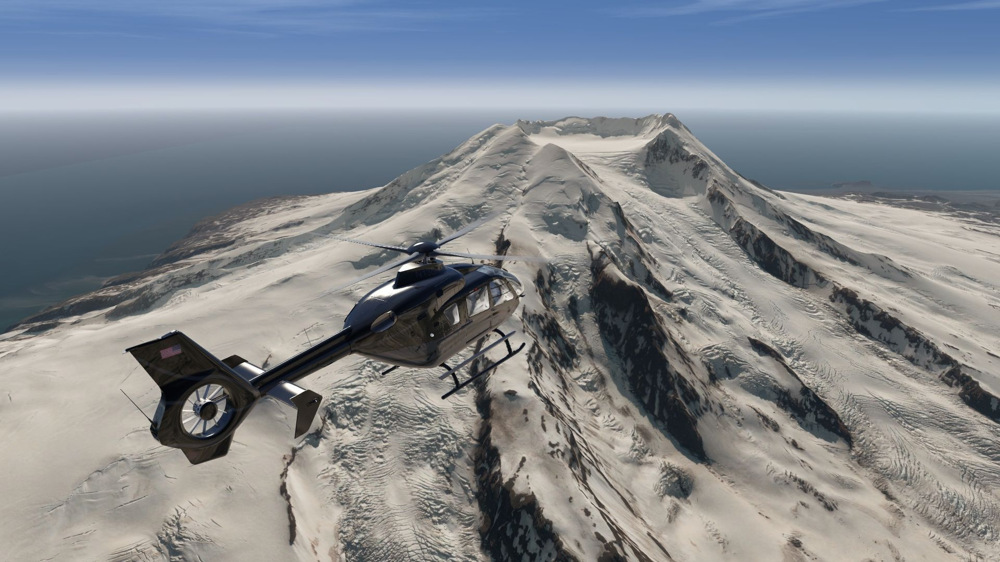
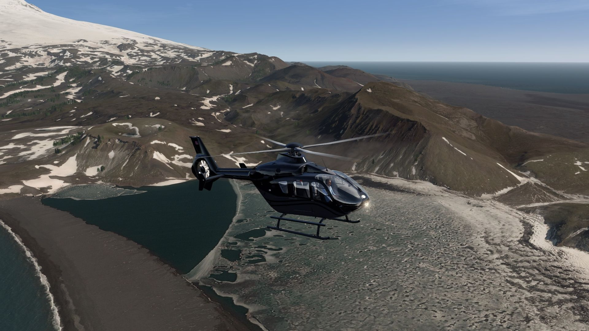
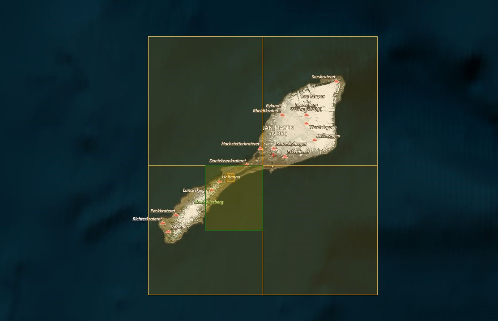

# Jan Mayen Island Photo Scenery

## Description

Photo scenery covering Jan Mayen island being part of Norway. Take a trip to the high north to this stunning and snow covered volcanic island. 

There is also an enhanced elevation mesh covering the whole island.

FS4 Desktop
FSG Mobile

Photo Scenery
Elevation

v1.1

---

# Preview Images

  <a href="#!" class="lightbox-close">&times;</a>

  

  <a href="#!" class="lightbox-close">&times;</a>

  

  <a href="#!" class="lightbox-close">&times;</a>

  

  <a href="#!" class="lightbox-close">&times;</a>

  

---

# Coverage

  <a href="#!" class="lightbox-close">&times;</a>

  

---

# FS4 Desktop Downloads (zip)

<a class="download-button" href="">
Download Images (337.3 MB)
</a>

<a class="download-button" href="">
Download Data FS4 (1.9 MB)
</a>

---

# FSG Mobile Downloads (tme)

<a class="download-button" href="">
Download Images (328.9 MB)
</a>

<a class="download-button" href="">
Download Data FSG (1.9 MB)
</a>

---

# References

- Bing Maps © 
- OpenTopography - Copernicus Global 30m data © 

---

# Credits

- nickhod for AeroScenery (creating photo-sceneries)

---

# Installation

- [FS4 Desktop Installation](../install/fs4.html)
- [FSG Mobile Installation](../install/fsg.html)

---

# License

- [License Information](../license/license.html)