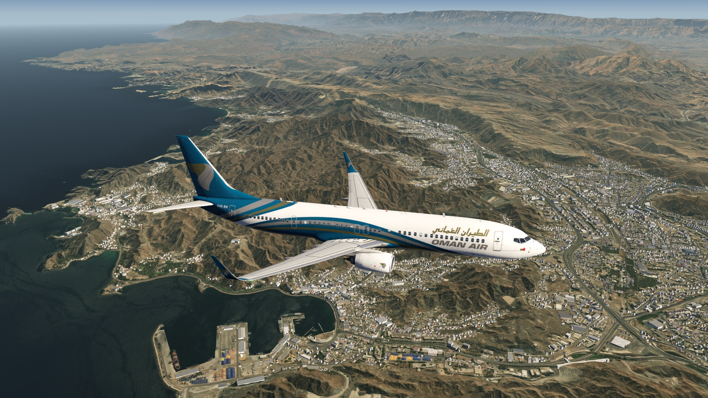
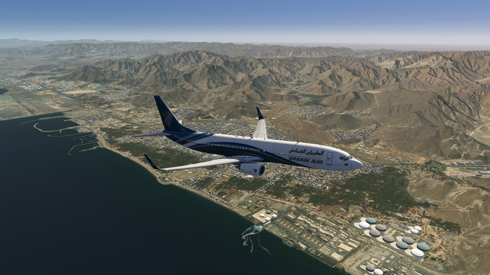
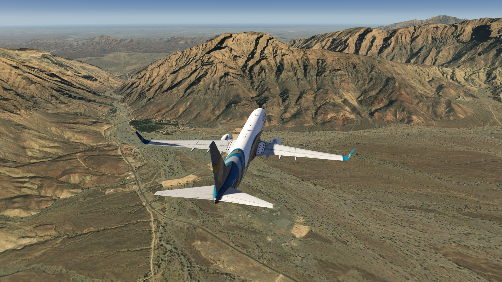
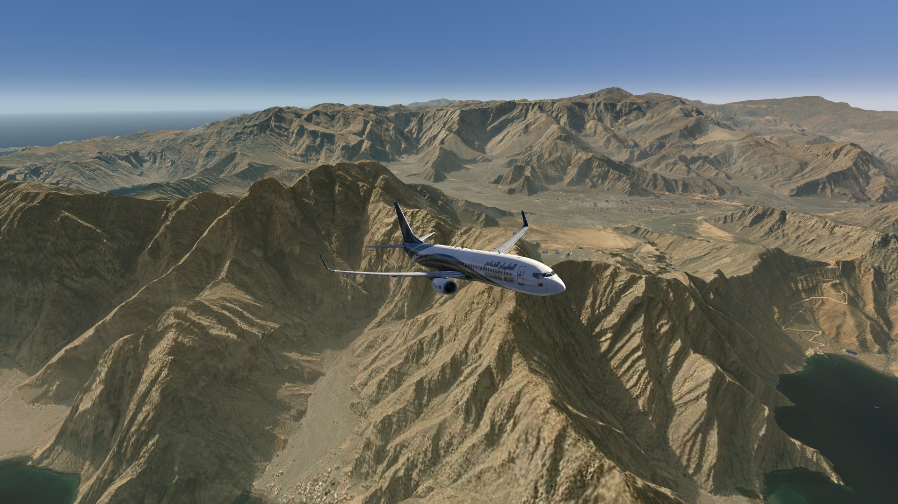
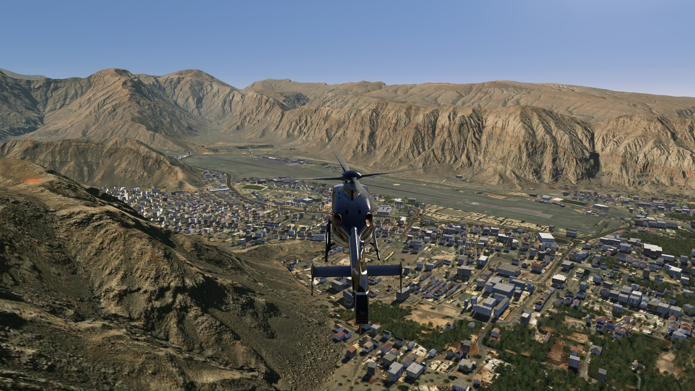
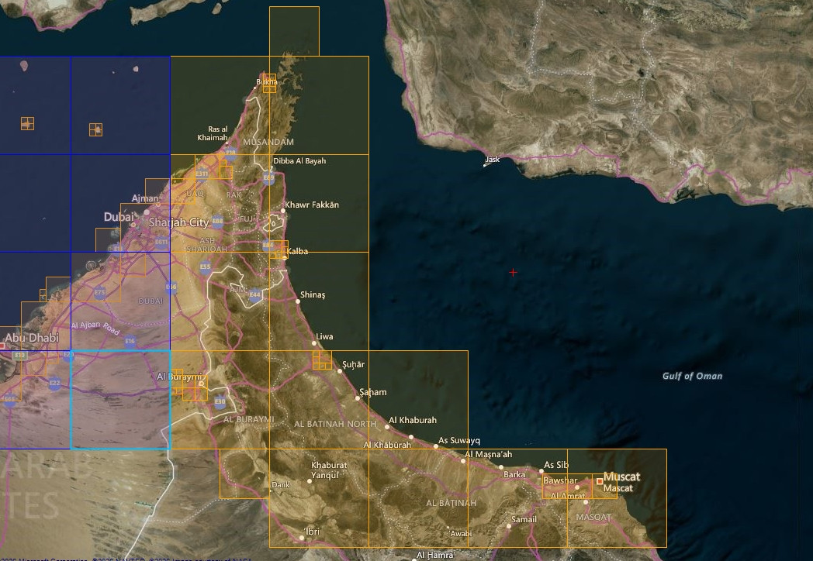

# Muscat Photo Scenery

## Description

Photo scenery in HD covering a large part of Oman and its capital, Muscat, as well as eastern part of UAE, going up to Khasab at the Strait of Hormuz.

There are 2 airports enhancements and elevation data for OOMS Muscat airport included.

FS4 Desktop
FSG Mobile

Photo Scenery
Airports
Elevation

v1.0

---

# Preview Images

  <a href="#!" class="lightbox-close">&times;</a>

  

  <a href="#!" class="lightbox-close">&times;</a>

  

  <a href="#!" class="lightbox-close">&times;</a>

  

  <a href="#!" class="lightbox-close">&times;</a>

  

---

# Coverage

  <a href="#!" class="lightbox-close">&times;</a>

  

---

# FS4 Desktop Downloads (zip)

<a class="download-button" href="https://drive.google.com/file/d/1pjhrHIpY6SytGMZYvwKinCZDFyq0W72R/view?usp=drive_link">
Download Images (2.11 GB)
</a>

<a class="download-button" href="https://drive.google.com/file/d/1jpPscjnUbKzX4RvKM5tqKFufL6n9Ch0W/view?usp=drive_link">
Download Data FS4 (913 KB)
</a>

---

# FSG Mobile Downloads (tme)

<a class="download-button" href="https://drive.google.com/file/d/1CziJqr0qQRaFz2ZeHICOuXlgrOcfZXkh/view?usp=drive_link">
Download Images (1.76 GB)
</a>

<a class="download-button" href="https://drive.google.com/file/d/1KmLwXHhm3f-wMbfGmEScbQBuSL2l9YF8/view?usp=drive_link">
Download Data FSG (716 KB)
</a>

---

# References

- ArcGIS Maps © 

---

# Credits

- nickhod for AeroScenery (creating photo-sceneries)

---

# Installation

- [FS4 Desktop Installation](../install/fs4.html)
- [FSG Mobile Installation](../install/fsg.html)

---

# License

- [License Information](../license/license.html)