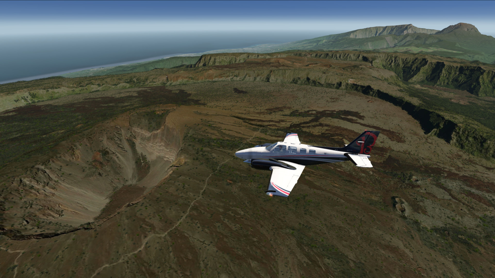
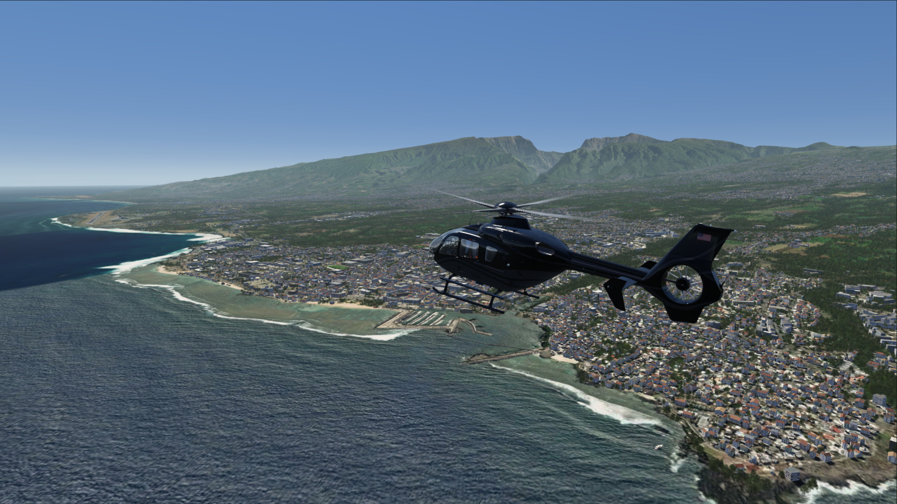
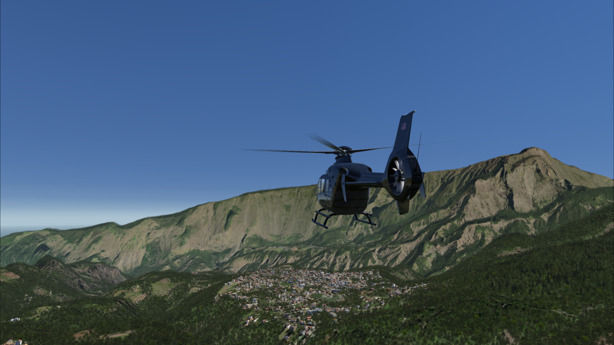
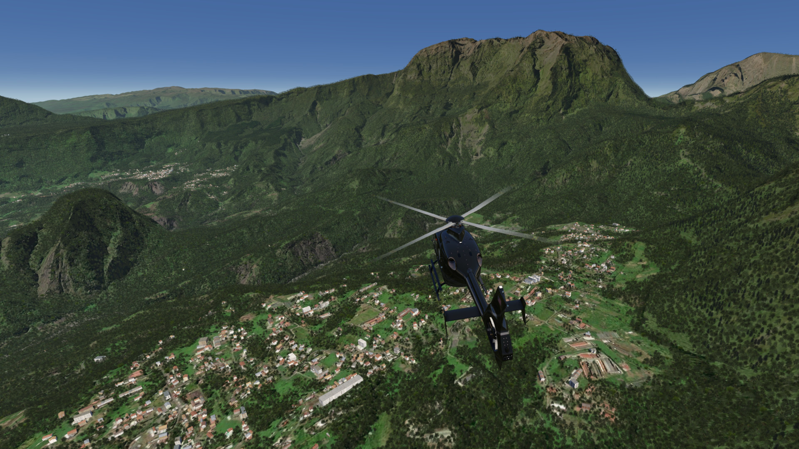
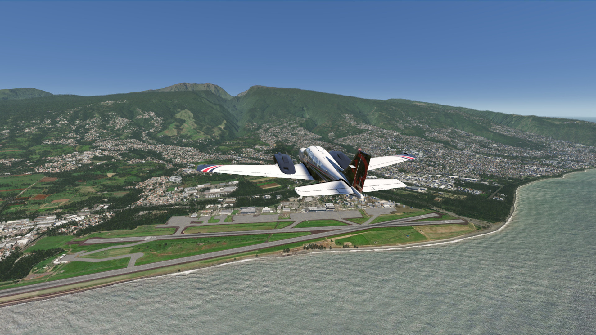
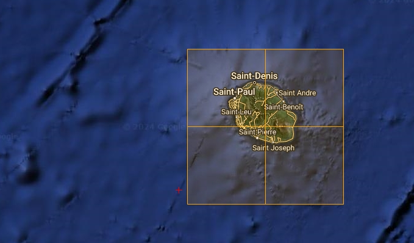

# La Reunion Photo Scenery

## Description

HighRes Photo scenery covering beautiful La Reunion island. There is also an enhanced Elevation Mesh covering the whole island.

FS4 Desktop
FSG Mobile

Photo Scenery
Elevation Mesh

---

# Preview Images

  <a href="#!" class="lightbox-close">&times;</a>

  

  <a href="#!" class="lightbox-close">&times;</a>

  

  <a href="#!" class="lightbox-close">&times;</a>

  

  <a href="#!" class="lightbox-close">&times;</a>

  

---

# Coverage

  <a href="#!" class="lightbox-close">&times;</a>

  

---

# FS4 Desktop Downloads (zip)

<a class="download-button" href="https://drive.google.com/file/d/1yAjx_0BQ1sAHYKPzCSNVqwWizu-25yEN/view?usp=drive_link">
Download Images
</a>

<a class="download-button" href="https://drive.google.com/file/d/18HpuK9EiAq3wr021QT_tav-gwnO68-Vp/view?usp=drive_link">
Download Data FS4
</a>

---

# FSG Mobile Downloads (tme)

<a class="download-button" href="https://drive.google.com/file/d/1SpG-3QgZUkGkYwwdj_Lax3rz40bthQtk/view?usp=drive_link">
Download Images
</a>

<a class="download-button" href="https://drive.google.com/file/d/1xMUkjSIxp0iIJeoRzXd3T1DmDRaUVmLS/view?usp=drive_link">
Download Data FSG
</a>

---

# References

- ArcGIS Maps © 
- OpenTopography - Copernicus Global 30m data © 

---

# Credits

- nickhod for AeroScenery (creating photo-sceneries)

---

# Installation

- [FS4 Desktop Installation](../install/fs4.html)
- [FSG Mobile Installation](../install/fsg.html)

---

# License

- [License Information](../license/index.html)