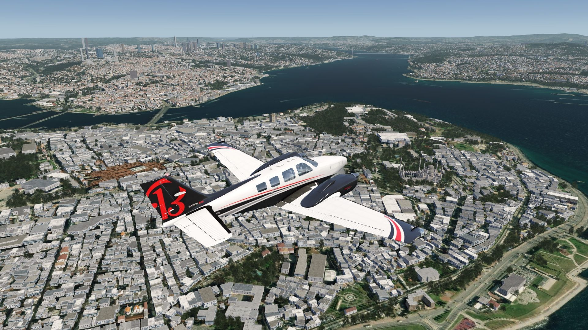
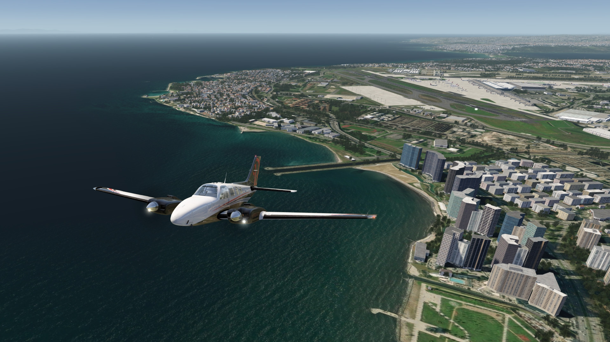
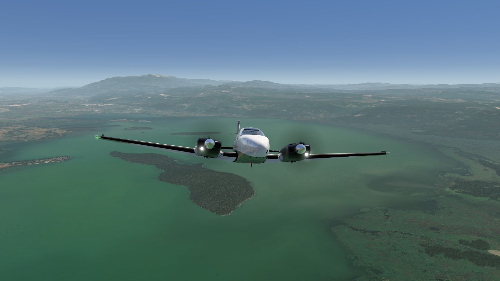
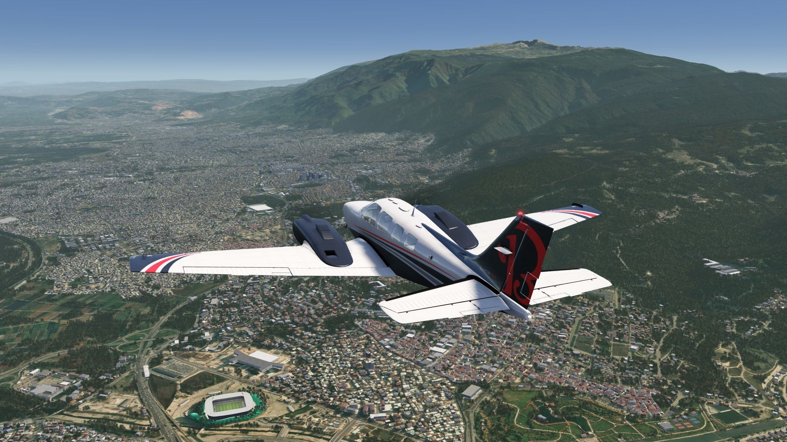
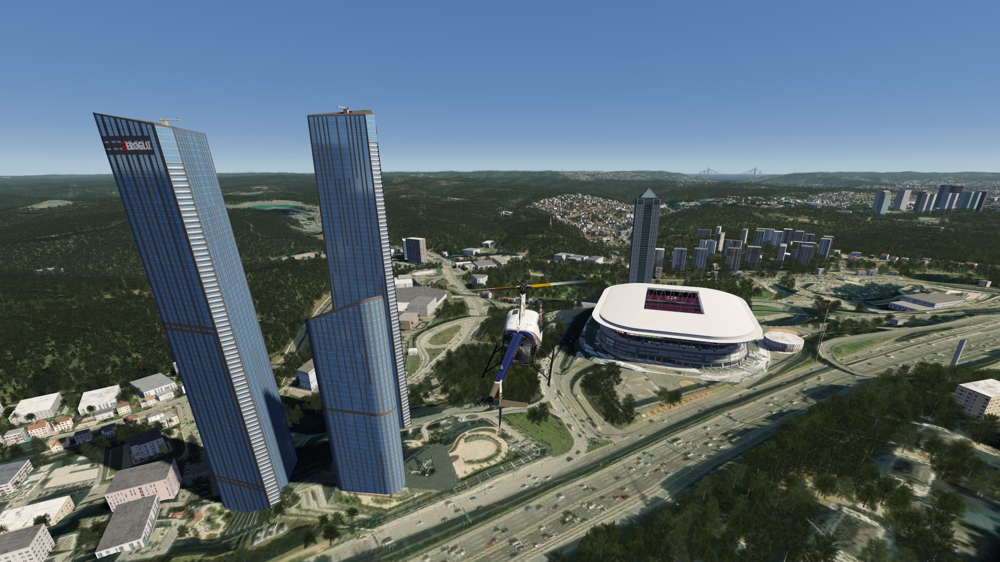
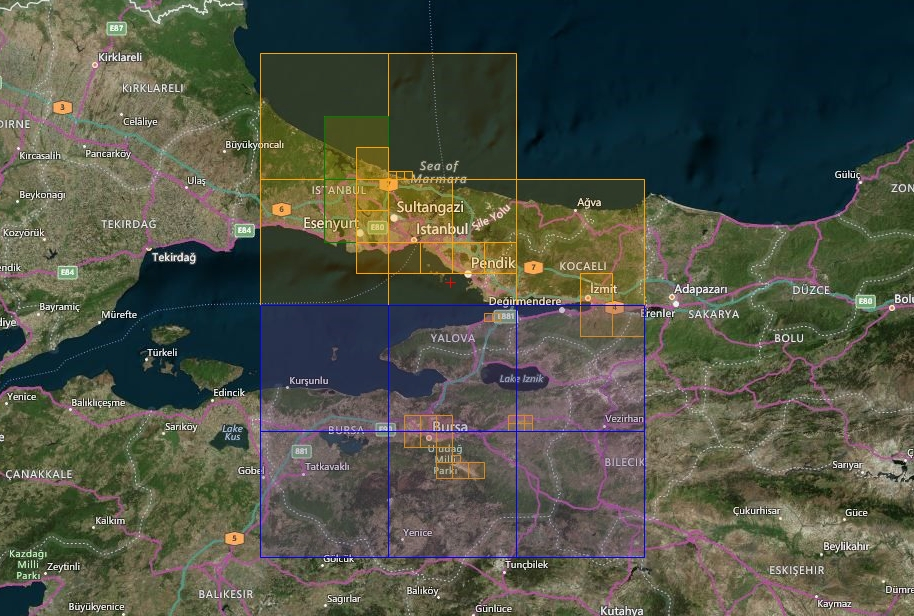
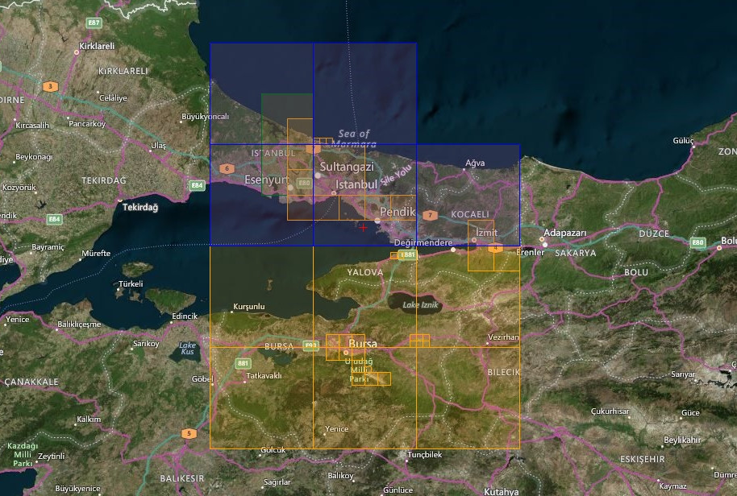

# Mauritius Islands Scenery

## Description

...

## Included Regions

### Part 1
- Istanbul
- Pendik
- Izmit

### Part 2
- Bursa

FS4 Desktop
FSG Mobile

Photo Scenery
Airports
POI's
Elevation Mesh

v1.0

---

# Preview Images

  <a href="#!" class="lightbox-close">&times;</a>

  

  <a href="#!" class="lightbox-close">&times;</a>

  

  <a href="#!" class="lightbox-close">&times;</a>

  

  <a href="#!" class="lightbox-close">&times;</a>

  

---

# Coverage

  <a href="#!" class="lightbox-close">&times;</a>

  

  <a href="#!" class="lightbox-close">&times;</a>

  

---

# FS4 Desktop Downloads (zip)

<a class="download-button" href="">
Download Images - Part 1
</a>

<a class="download-button" href="">
Download Images - Part 2
</a>

<a class="download-button" href="https://drive.google.com/file/d/1A4shfuQdhuTh34STeCnfuRS_ICvANIPy/view?usp=drive_link">
Download Data FS4
</a>

---

# FSG Mobile Downloads (tme)

<a class="download-button" href="">
Download Images - Part 1
</a>

<a class="download-button" href="">
Download Images - Part 2
</a>

<a class="download-button" href="https://drive.google.com/file/d/1Zqmy8wrH8HLJN9OIxscDCIRCHhu6s2Ce/view?usp=drive_link">
Download Data FSG
</a>

---

# References

- ArcGIS Maps © 
- OpenTopography - Copernicus Global 30m data © 
- SketchUp 3D Warehouse (3dwarehouse.sketchup.com)

---

# Credits

- nickhod for AeroScenery (creating photo-sceneries)
- Arno Gerretsen for ModelConverterX (converting-tool)
- to all the authors of the models used

---

# Installation

- [FS4 Desktop Installation](../install/fs4.html)
- [FSG Mobile Installation](../install/fsg.html)

---

# License

- [License Information](../license/index.html)