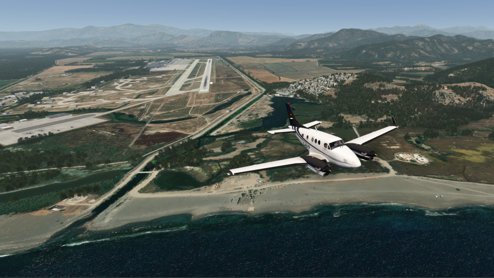
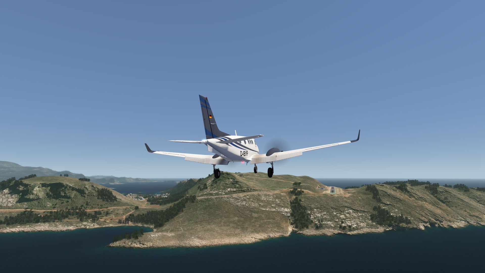
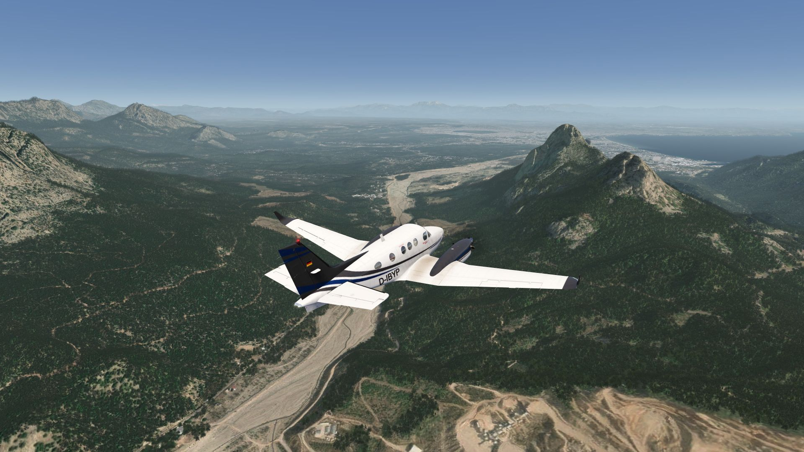
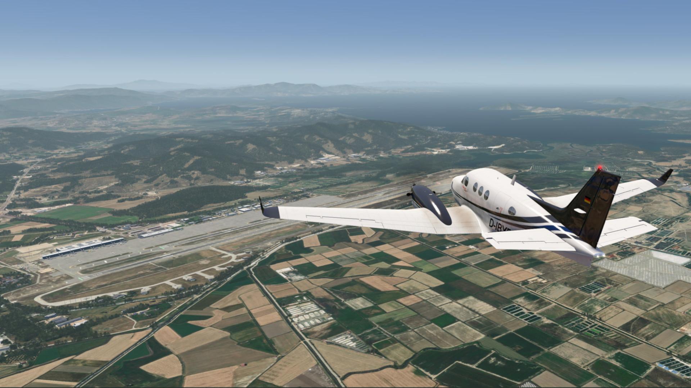
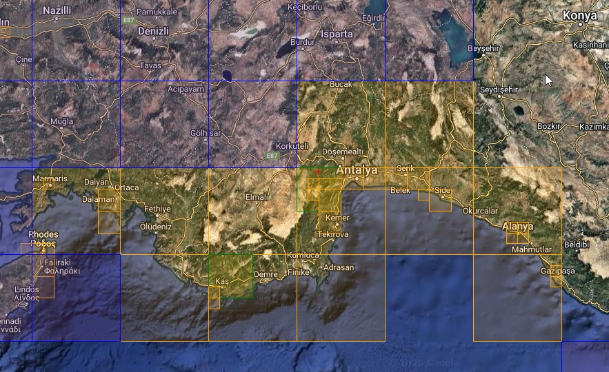
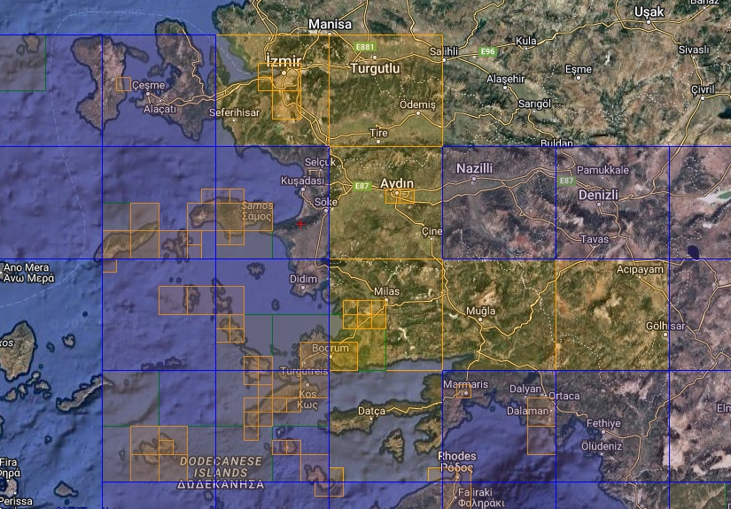

# Turkish Riviera Photo Scenery

## Description

This scenery covers the city of Antalya , Izmir and Bodrum as well as the coastal area with its sandy beaches from the eastern part of the Turkish Riviera, from Dalaman in the west to Mugla in the southern west and to Izmir in the north.

The airport of LGKJ Kastellorizo, small greec island, is also included in addition to IPAC's three airports.

Elevation data are also included for improvement of coastal sections and in particular as fix for the airport of Kastellorizo island (GR).

## Included Regions

### Part 1
- Antalya

### Part 2
- Izmir
- Bodrum

FS4 Desktop
FSG Mobile

Photo Scenery
Airports
Elevation

v1.0

---

# Preview Images

  <a href="#!" class="lightbox-close">&times;</a>

  

  <a href="#!" class="lightbox-close">&times;</a>

  

  <a href="#!" class="lightbox-close">&times;</a>

  

  <a href="#!" class="lightbox-close">&times;</a>

  

---

# Coverage

  <a href="#!" class="lightbox-close">&times;</a>

  

  <a href="#!" class="lightbox-close">&times;</a>

  

---

# FS4 Desktop Downloads (zip)

<a class="download-button" href="https://drive.google.com/file/d/1oyLXoSaVbhXNT2UBvb31xBjuhEfjU7FZ/view?usp=drive_link">
Download Images - Part 1 (1.86 GB)
</a>

<a class="download-button" href="https://drive.google.com/file/d/1rJuVFabNb91-gSLsvh_TZu5BIukgkjFZ/view?usp=drive_link">
Download Images - Part 2 (1.97 GB)
</a>

<a class="download-button" href="https://drive.google.com/file/d/10AipxYqfEcetZiNXUDJuHGpkulFNGr8B/view?usp=drive_link">
Download Data FS4 (23.9 MB)
</a>

---

# FSG Mobile Downloads (tme)

<a class="download-button" href="https://drive.google.com/file/d/1OEN4EM0DsYoCHv2J6GhupEi9K6lL39AK/view?usp=drive_link">
Download Images - Part 1 (1.6 GB)
</a>

<a class="download-button" href="https://drive.google.com/file/d/1SK6WrATQke8Uiod31axozXB-6Y_AFr4l/view?usp=drive_link">
Download Images - Part 2 (1.33 GB)
</a>

<a class="download-button" href="https://drive.google.com/file/d/1I-Nw83YATgTaNeJRm7d5sp1t4Gf_8RCP/view?usp=drive_link">
Download Data FSG (23.3 MB)
</a>

---

# References

- ArcGIS Maps © 
- OpenTopography - Copernicus Global 30m data © 
- SketchUp 3D Warehouse (3dwarehouse.sketchup.com)

---

# Credits

- nickhod for AeroScenery (creating photo-sceneries)
- Arno Gerretsen for ModelConverterX (converting-tool)
- to all the authors of the models used

---

# Installation

- [FS4 Desktop Installation](../install/fs4.html)
- [FSG Mobile Installation](../install/fsg.html)

---

# License

- [License Information](../license/license.html)