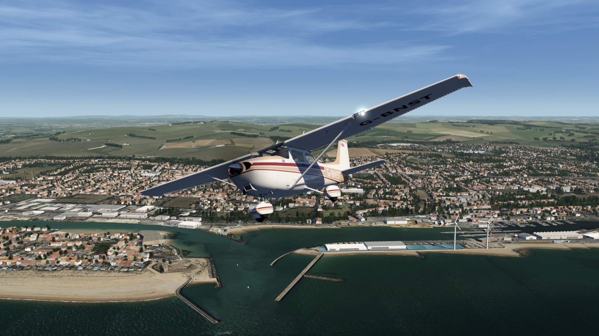
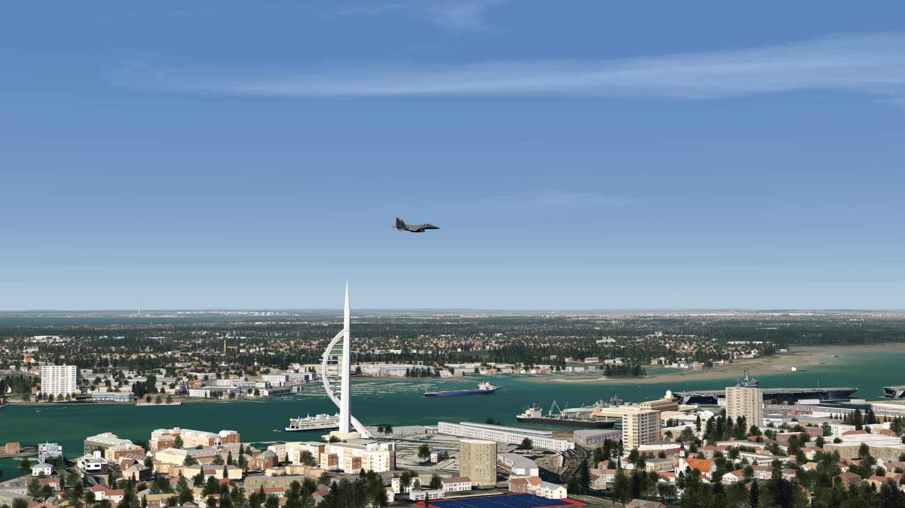
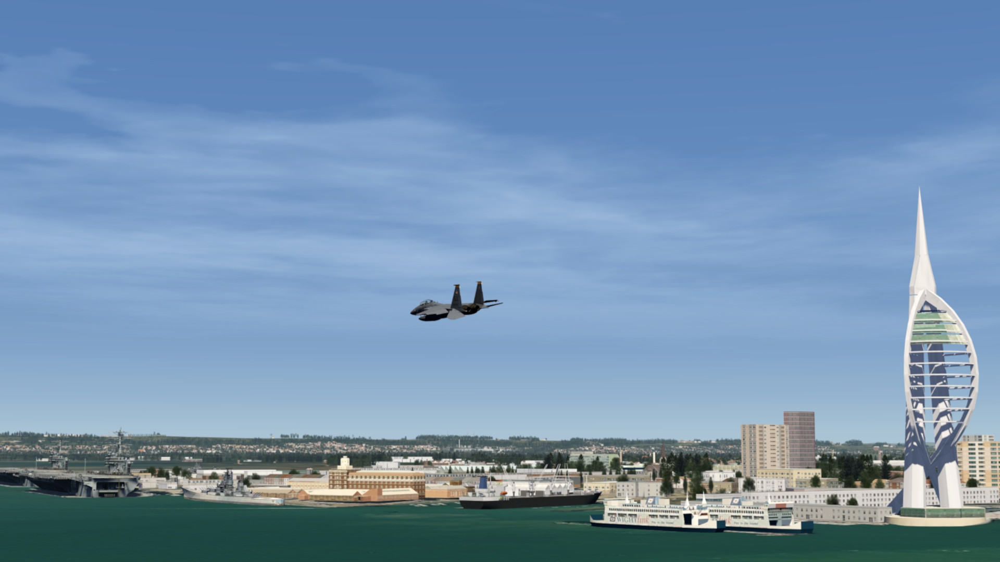
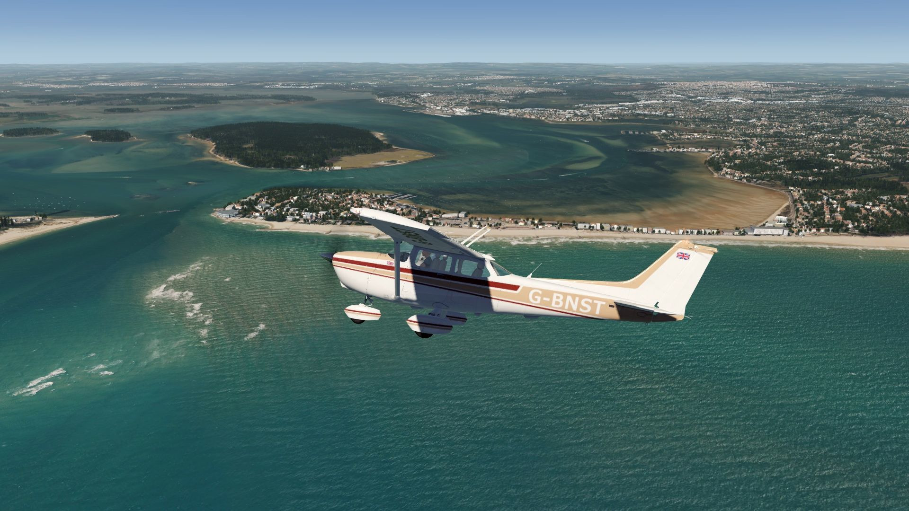
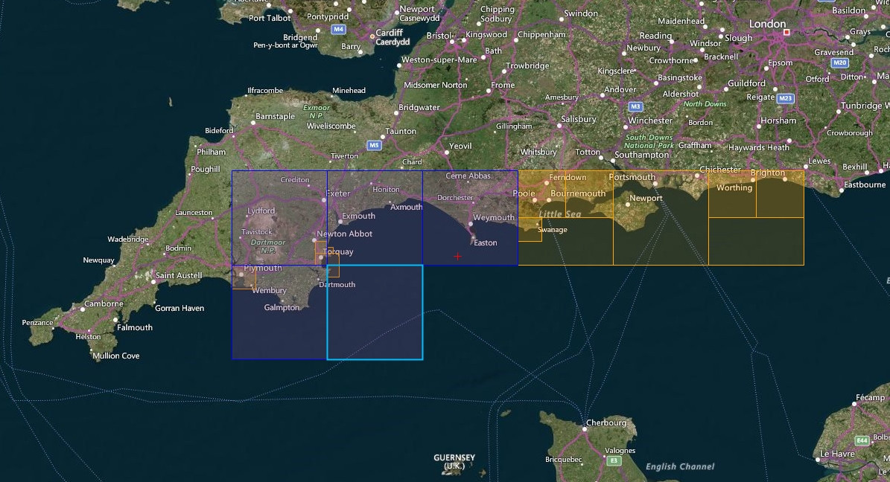
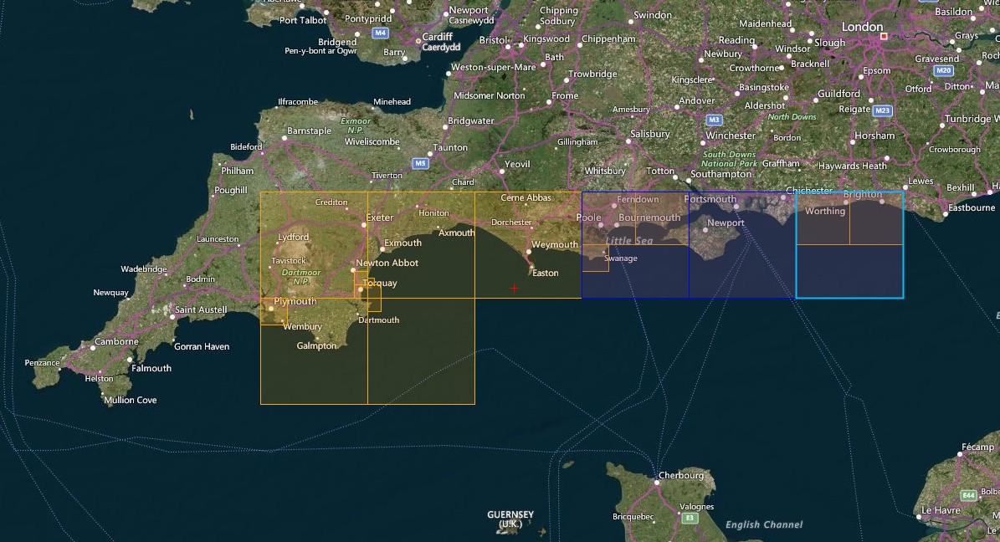

# Portsmouth, Isle of Wight and South Coast Scenery

## Description

Portsmouth, the Isle of Wight and large parts of the South Coast of England, and the surrounding area, covering the area from Plymouth situated in the west to Brighton in the east.

A number of helipads like on the The Needles lighthouse on the Isle of Wight, as well as missing small airports have been added. There is also an elevation fix for some parts of the coastline.

## Included Regions

### Part 1
- Portsmouth
- Isle of Wight
- Bournemouth
- Brighton

### Part 2
- Plymouth
- Torquay
- Exeter

FS4 Desktop
FSG Mobile

Photo Scenery
Airports
POI's
Elevation

v1.0

---

# Preview Images

  <a href="#!" class="lightbox-close">&times;</a>

  

  <a href="#!" class="lightbox-close">&times;</a>

  

  <a href="#!" class="lightbox-close">&times;</a>

  

  <a href="#!" class="lightbox-close">&times;</a>

  

---

# Coverage

  <a href="#!" class="lightbox-close">&times;</a>

  

  <a href="#!" class="lightbox-close">&times;</a>

  

---

# FS4 Desktop Downloads (zip)

<a class="download-button" href="https://drive.google.com/file/d/1cMdEy6V-El79WGn9_hHX1bDuFOIC-LMH/view?usp=drive_link">
Download Images - Part 1 (3.09 GB)
</a>

<a class="download-button" href="https://drive.google.com/file/d/1uiPsZuhS62rdPbhdVkkhvupqUAKZoPLm/view?usp=drive_link">
Download Images - Part 2 (3.04 GB)
</a>

<a class="download-button" href="https://drive.google.com/file/d/1_Ja9qIOMjS_dseERQBTs_P2rtEuj6ldb/view?usp=drive_link">
Download Data FS4 (28.7 MB)
</a>

---

# FSG Mobile Downloads (tme)

<a class="download-button" href="https://drive.google.com/file/d/1EOS_f3eypphE0SnpZp8MhxEzMiH7xQ8E/view?usp=drive_link">
Download Images - Part 1 (855.3 MB)
</a>

<a class="download-button" href="https://drive.google.com/file/d/1j0UDNL_KbZ3HPYQ5kUXzRE51HqL5ZpSE/view?usp=drive_link">
Download Images - Part 2 (802.6 MB)
</a>

<a class="download-button" href="https://drive.google.com/file/d/1gmd5HQxJ68TWSCPTsAgWG7y8gB73aAr5/view?usp=drive_link">
Download Data FSG (28.8 MB)
</a>

---

# References

- Bing Maps © 
- OpenTopography - Copernicus Global 30m data © 
- SketchUp 3D Warehouse (3dwarehouse.sketchup.com)

---

# Credits

- nickhod for AeroScenery (creating photo-sceneries)
- Arno Gerretsen for ModelConverterX (converting-tool)
- to all the authors of the models used

---

# Installation

- [FS4 Desktop Installation](../install/fs4.html)
- [FSG Mobile Installation](../install/fsg.html)

---

# License

- [License Information](../license/license.html)