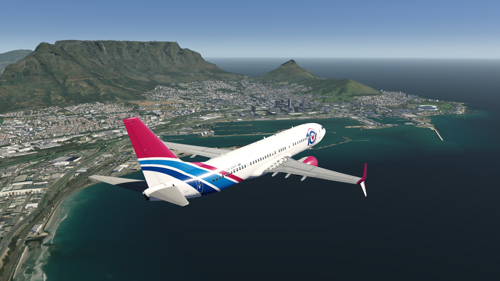
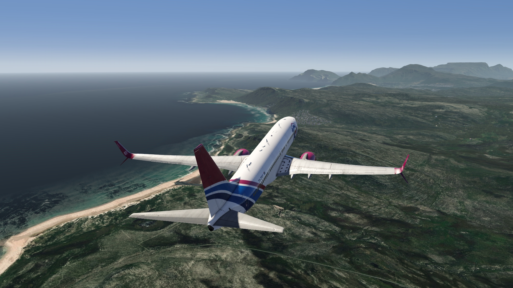
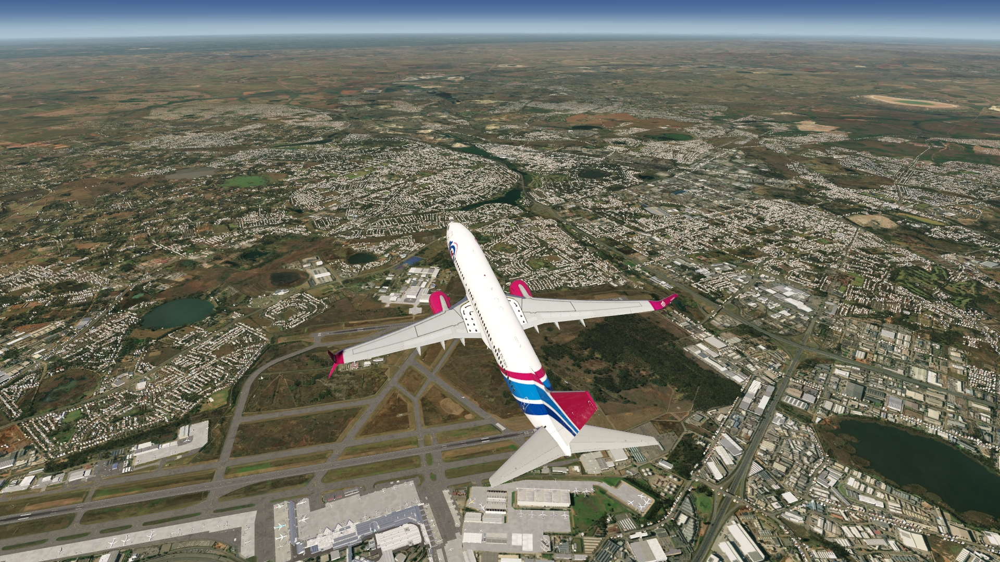
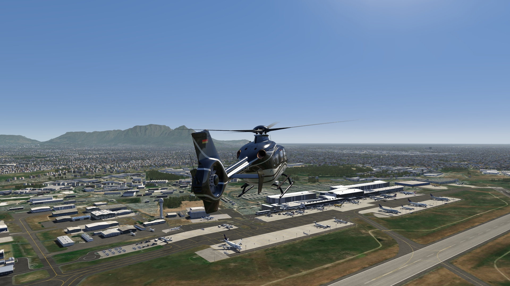
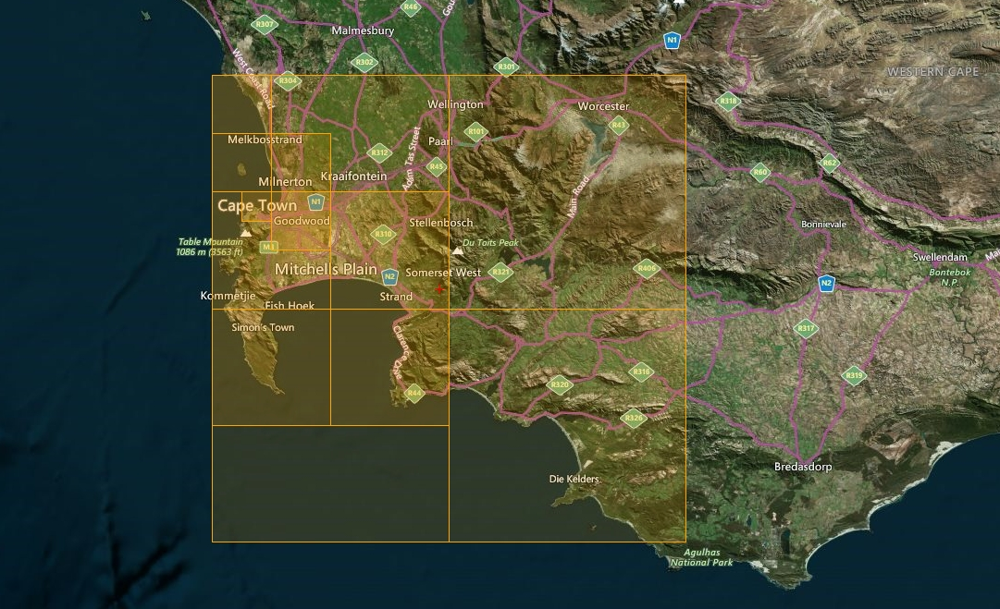

# Cape town photo scenery ZA

## Description

High resolution photo scenery covering enlarged area of Cape Town in South Africa.

The stadium and cable car stations are added as POIs. To depict the shape of Table Mountains as realistically as possible, the elevation data has been adjusted manually.

FS4 Desktop
FSG Mobile

Photo Scenery
POIs
Elevation Mesh

---

# Preview Images

  <a href="#!" class="lightbox-close">&times;</a>

  

  <a href="#!" class="lightbox-close">&times;</a>

  

  <a href="#!" class="lightbox-close">&times;</a>

  

  <a href="#!" class="lightbox-close">&times;</a>

  

---

# Coverage

  <a href="#!" class="lightbox-close">&times;</a>

  

---

# FS4 Desktop Downloads (zip)

<a class="download-button" href="https://drive.google.com/file/d/1UhmWxkxx_EE81W9fauKAx_wA_0tsiS-x/view?usp=drive_link">
Download Images
</a>

<a class="download-button" href="https://drive.google.com/file/d/16zz9GFROQ3OwjPzN_xO52HyT1lWP2Pey/view?usp=drive_link">
Download Data FS4
</a>

---

# FSG Mobile Downloads (tme)

<a class="download-button" href="https://drive.google.com/file/d/1bCQ22vJGhANifOcInQufw4TM-Xj0UIkq/view?usp=drive_link">
Download Images
</a>

<a class="download-button" href="https://drive.google.com/file/d/1qw2oyboFuO7HQBxFccLb6YyQQQqfhmLG/view?usp=drive_link">
Download Data FSG
</a>

---

# References

- ArcGIS Maps © 
- OpenTopography - ALOS World 3D 30m data © 
- SketchUp 3D Warehouse

---

# Credits

- nickhod for AeroScenery (creating photo-sceneries)
- Arno Gerretsen for ModelConverterX (converting-tool)
- to all the authors of the models used

---

# Installation

- [FS4 Desktop Installation](../install/fs4.html)
- [FSG Mobile Installation](../install/fsg.html)

---

# License

- [License Information](../license/index.html)