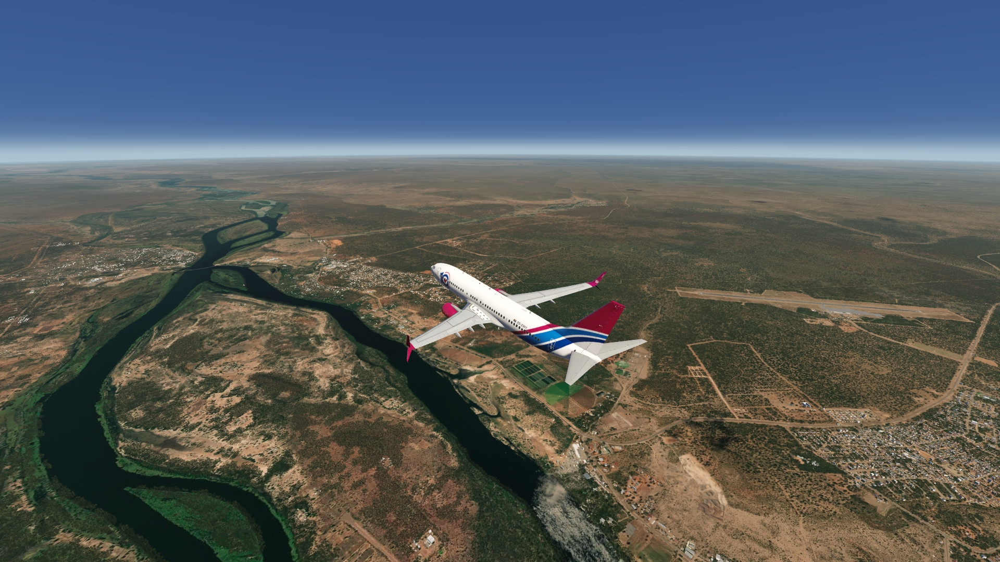
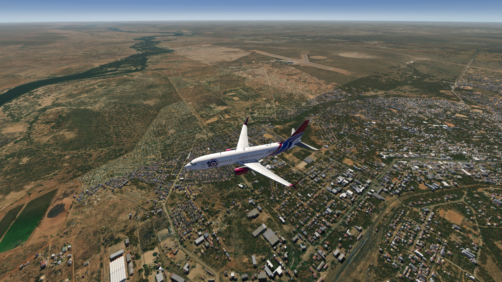
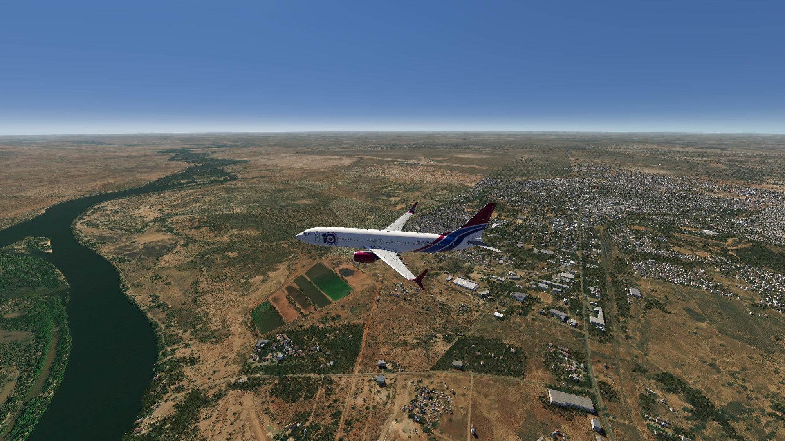
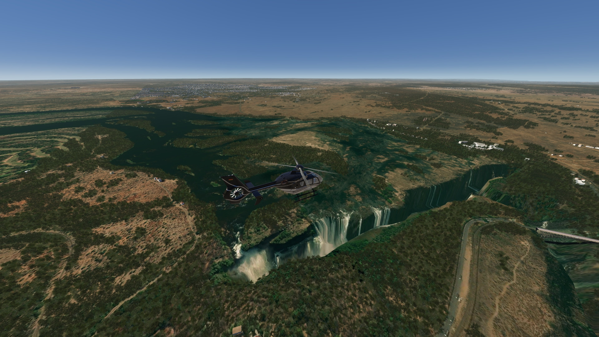
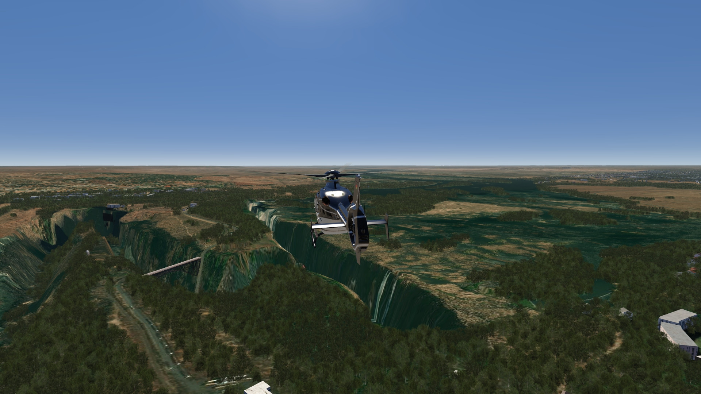
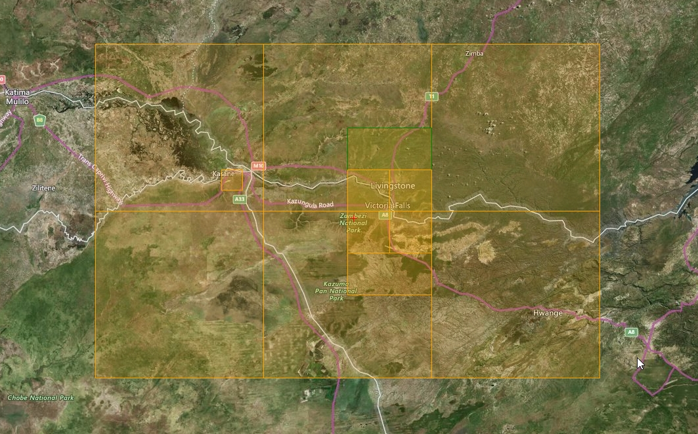

# Victoria Falls Scenery

## Description

Take a trip to the spectacular Victoria Falls. Photo scenery in HD covering the Victoria Falls and the surrounding area.

A 3D model an elevation data is implemented for the Victoria Falls.

## Note
To add currently missing pushback parking positions to FVFA Victoria Falls airport, install the add-on created by @Wingberry. It includes approximately 150 airports worldwide. FVFA Victoria Falls has been added.

FS4 Desktop
FSG Mobile

Photo Scenery
POIs
Elevation Mesh

v1.0

---

# Preview Images

  <a href="#!" class="lightbox-close">&times;</a>

  

  <a href="#!" class="lightbox-close">&times;</a>

  

  <a href="#!" class="lightbox-close">&times;</a>

  

  <a href="#!" class="lightbox-close">&times;</a>

  

---

# Coverage

---

# FS4 Desktop Downloads (zip)

<a class="download-button" href="https://drive.google.com/file/d/10-osqHu17nlkzpJQh0UDDdy_qKKbtyb_/view?usp=drive_link">
Download Images
</a>

<a class="download-button" href="https://drive.google.com/file/d/1hsGdWPJs9S1z2i9DBlg72O-FmRDxjCUu/view?usp=drive_link">
Download Data FS4
</a>

<a class="download-button" href="https://drive.google.com/file/d/1ku_-84UnYqSGEI20oV3rFmEvams3JIja/view?usp=drive_link">
Download Airport Pushbacks (by @Wingberry)
</a>

---

# FSG Mobile Downloads (tme)

<a class="download-button" href="https://drive.google.com/file/d/10ctlSsrAuPtbzl5hBkEdW_GZYnnMfviG/view?usp=drive_link">
Download Images
</a>

<a class="https://drive.google.com/file/d/1Zy-mJE2k256AwZ49qwdFEH90Zd4hcQne/view?usp=drive_link">
Download Data FSG
</a>

<a class="download-button" href="https://drive.google.com/file/d/1jYWX_NTUNu5iXeJVvqHD-mKuKEUqMCNR/view?usp=drive_link">
Download Airport Pushbacks (by @Wingberry)
</a>

---

# References

- Bing Maps © 
- OpenTopography - ALOS World 3D 30m data © 
- SketchUp 3D Warehouse (3dwarehouse.sketchup.com)

---

# Credits

- nickhod for AeroScenery (creating photo-sceneries)
- Arno Gerretsen for ModelConverterX (converting-tool)
- to all the authors of the models used
- @Wingberry for additional pushback add-on

---

# Installation

- [FS4 Desktop Installation](../install/fs4.html)
- [FSG Mobile Installation](../install/fsg.html)

---

# License

- [License Information](../license/license.html)